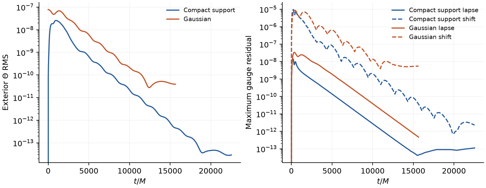

# Compact direct-constraint pulse and incoming-trace controls

These are local, eight-rank **nonlinear AthenaK** vacuum controls. They retain
the existing `zero_rate` boundary, G=1 gauge, sixth-order volume differences,
RK3, kappa1=0, shift eta=.02, lapse damping=.01 and the radial sponge from
512 to 1792 M with maximum rate .001/M. They do not test the new linear
exterior-memory boundary prototype.

The domain is [-2048,2048]^3, with 32^3 cells, eight **16^3** blocks and
spacing 128 M. This is coarser than the 64^3 GPU direct-Theta test and is not a
replacement for its missing final validation. There is no black hole,
refinement or matter feedback; M is a reference unit.

## Initialization and source change

The optional input `outer_sponge_test_theta_pulse_profile = compact` uses

```
q = (r - r0) / width
Theta = A * exp(1 - 1/(1-q*q))  if |q| < 1
Theta = 0                     otherwise.
```

Here r0=0, width=512 M and A=1e-6. This centered monopole is smooth and has
exactly zero boundary support. Width is the support radius for the compact
profile; it is the Gaussian standard deviation for the existing Gaussian
option. Consequently the profiles differ in the interior as well as their
tails; the comparison is not a pure subtraction of boundary initial data.
The global smoothness statement does not apply to arbitrary shell/dipole
parameters at the coordinate origin.

The default Gaussian expression and the evolution equations are unchanged.
No small residual is reset, clipped or frozen by this diagnostic addition.
The direct Theta seed deliberately violates constraints and changes
physical K=Khat+2*Theta; it is not a pure outgoing constraint wave.

## Actual outcomes

The main compact and Gaussian runs were limited to eight application minutes.
Both stopped **cleanly on walltime**, short of their 50000 M targets. They
must not be described as target-completed stability tests. Every final rank
file passed matching metadata, finite full-payload and ghost-inclusive metric
positive-definiteness checks; histories have zero invalid-metric counts.

| Seed | Actual final time | max absolute Theta | Exterior Theta RMS |
|---|---:|---:|---:|
| Compact, A=1e-6 | 22540.8 M | 7.13e-14 | 2.91e-14 |
| Gaussian, A=1e-6, sigma=512 M | 15648 M | 1.65e-10 | 3.91e-11 |

The compact signal decreases for many crossing times and reaches a small
oscillatory late level. Its final maximum is near a face, but that does not
localize the earlier injection. A finite interval is not an asymptotic
stability theorem. Gauge residuals are plotted alongside constraints to avoid
judging only by Theta. The current sampled interval does not show the original
large exponential mode.



Exterior RMS is sqrt(Theta-norm/Volume), using the existing history-only
radius-512 mask and proper volume. Core L2 is sqrt(Theta-int2), an integral
norm rather than RMS. The mask does not excise or alter the physical fields.
The compact exterior initially has exactly zero Theta; zeros are not visible
on the logarithmic axis. `final-profile.json` additionally records proper
volume, other field maxima and spatial locations from full checkpoints.

## Incoming trace: retention is not the whole explanation

At the fixed face cell (1984,64,64) M, the compact initial incoming C1 is
exactly zero, including the complete initial stencil and ghost footprint.
By 5004.8 M it has acquired about 1.955e-13 and remains near that value through
22540.8 M. The Gaussian begins with C1=5.40272e-10 and ends at5.41637e-10,
only .253% above the initial value. Thus nonzero initial tails are retained,
but they cannot explain every acquired signal.

A separate compact A=1e-7 run reaches the 6000 M target. At the exactly matched
5004.8 M checkpoint, its C1 is .00990922 times the A=1e-6 result: approximately
quadratic rather than linear scaling. The half-timestep case also reaches 6000 M; its near-matched 5001.6 M trace
is .999402 times the coarse value at 5004.8 M. The small time offset prevents
a formal convergence estimate, but the trace is largely unchanged. The
[trace comparison](trace-comparison.md) records actual sample times and the
result without equating near-matched times with a convergence study.

C1 is a characteristic state function with evolving coefficients, not a
proven nonlinear Riemann invariant or the physical constraint norm. Its
quadratic drift alone does not establish a numerical defect. The identity
for its moving-basis terms and possible post-RK projection jumps is recorded
for further diagnosis. Cancelling these terms would not change the earlier
unstable linear roots, and the solver was not modified to erase this trace.

## Compiled regression and reproduction

Run `tst/regression/z4c_compact_theta.py` from the repository root with `--exe`, `--output`, `--launcher` and optionally
`--reference-exe` pointing to the prior executable. It checks:

- Exactly supported initial Theta, no other seeded residual, and zero in the
  physical ghost layers plus seven inward layers used by composed stencils.
- Exact zero preservation and valid full/ghost metrics after three cycles.
- Nonzero physical response and its approximately linear amplitude scaling.
- Bitwise 1/2-rank parity for the same block layout.
- Default/explicit Gaussian and old/new executable parity, including all
  MHD, magnetic and Z4c payload bytes rather than metadata headers.
- Rejection of an unknown profile string.

The regression and additional read-only checks passed. `regression/` records
inputs, result JSON and the reviewed full-payload/stencil checks. It contains
no raw checkpoints. The immutable local executable, source and exact input
hashes are recorded separately.

To recollect completed runs without launching anything, use Python with
NumPy/SciPy/Matplotlib:

```
python3 collect.py /path/to/raw/compact-theta-long
python3 plot.py
```

`collect.py` requires completed execution records and validates all eight rank
files for every requested case. It refuses incomplete runs. It does not submit
jobs, continue checkpoints or change simulation state.
