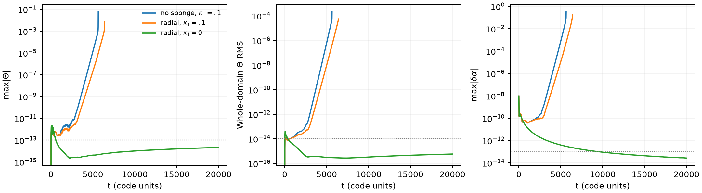
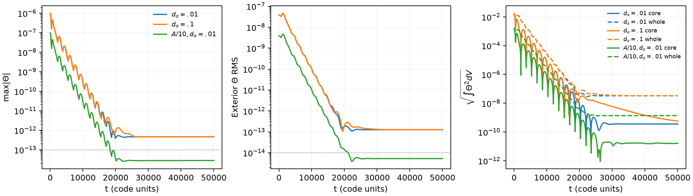
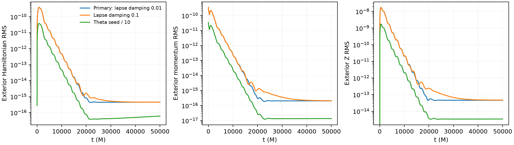

# GPU sponge controls: completed results

**The three direct-Theta controls reached their actual 50000 M targets**, with
finite fields, valid ghost metrics and application/PBS exit 0. Renewed Aurora
access recovered their final output; earlier records saying the finals were
unavailable are now historical. The previous large exponential Theta runaway
is absent in this tested interval, but **small gauge and Hamiltonian drifts
remain**. These results do not establish asymptotic or production stability.

A wider sponge alone was insufficient: with `kappa1 = 0.1`, the matched
lapse-pulse baseline failed at 5650.2 M and the wide-sponge case at 6420 M.
The successful long controls set `kappa1 = 0`; their other settings and
limitations are recorded below.

These are independent flat-background vacuum diagnostics, not the TDE run,
a black-hole interior, matter evolution or AMR validation. No production job,
input, checkpoint or monitor was changed. M is the reference production mass
unit; these boxes themselves have `bh_mass = 0`.

## Actual outcomes

| Job and case | Configuration | Verified outcome |
|---|---|---|
| 8842172 / baseline | No sponge; `kappa1 = 0.1`, `eta = 2`, lapse damping 0.1 | Invalid-state failure at **5650.2 M**, cycle 9417 |
| 8842172 / radial_k01 | Wide radial sponge; same damping | Invalid-state failure at **6420 M**, cycle 10700 |
| 8842171 / radial_k0 | Same sponge; `kappa1 = 0`, `eta = 2`, lapse damping 0.1 | **Reached 20000 M**, cycle 33334; application/PBS exit 0 and all eight final rank files passed |
| 8842248 / theta_primary | Gaussian Theta amplitude 1e-6; `kappa1 = 0`, `eta = 0.02`, lapse damping 0.01 | **Reached 50000 M**, cycle 15626; application exit 0 and all eight final rank files passed |
| 8842248 / theta_lapse01 | Independent fresh Gaussian Theta amplitude 1e-6; lapse damping 0.1 | **Reached 50000 M**, cycle 15626; application exit 0 and all eight final rank files passed |
| 8842283 / theta_amplitude | Independent matched primary with Theta amplitude 1e-7 | **Reached 50000 M**, cycle 15626; application exit 0 and all eight final rank files passed |

Job C's PBS exit was 0 with 36m15s allocation usage; D's was 0 with 18m12s.
Application-reported elapsed times for the three perturbed C/D cases were
1046.704, 1055.778 and 1053.016 seconds. These are **time-target completions**,
not walltime stops. Each corresponding three-cycle zero gate stayed exactly
zero through 9.6 M, including all residual and ghost entries.

All six C/D final case/gate cohorts were independently rechecked after access
was restored: matching time/cycle and metadata across eight ranks, finite
complete payloads, positive lapse/chi and positive-definite metrics including
all ghosts. See [final recheck](validation/final-recheck-renewed-access.json).
The checkpoint also matches the final application record. A/B's two failures
were independent fresh starts and were not restarted; their earlier valid
5000.4 M checkpoints do not validate their failed endpoints.

[Current collected status](status-latest.json) records the successful query
at 21:09 UTC on 2026-09-20. PBS `etime` is eligibility time, not completion
time. [Access history](collection-access.json) links the superseded partial
status and preserves the old cached records separately.

## Wider sponge with positive constraint damping

Over 4000–5000 M, whole-domain Theta RMS grew exponentially with
`gamma = 0.006704/M` without the sponge and `0.005747/M` with it
(R² 0.999998 and 0.999989). Widening delayed failure without curing it.
At 5000.4 M, respectively 99.684% and 99.707% of proper-volume Theta² lay
within 256 M of physical faces. Active Theta peaks were at (-32, 224, 2016) M
and (288, 224, 2016) M, 32 M from the +z face. These are locations of late
amplification, not the first injection.

First printed primitive failures were fourth physical ghost cells at
(32, 32, 2272) M and (2272, 96, -1952) M, with negative determinants.
The [failure excerpts](failure-excerpts) distinguish these from later active
fatal checks. The wrapper recorded exit 143 after MPI abort; PBS job B exited 1.

The `kappa1 = 0` lapse case ended at 20000 M with maximum |Theta| 2.129e-14
and whole-domain RMS 5.835e-16. From the late checkpoints at 5000.4 to 20000 M,
maximum |delta chi| decreased from 1.970e-9 to 6.501e-10, and the conformal
metric residual from 1.233e-9 to 3.662e-10. Near-noise Theta in this gauge-pulse
control motivated the separate direct-constraint tests.



## Direct-constraint response through 50000 M

| Final quantity | Primary, lapse damping 0.01 | Lapse damping 0.1 | Theta amplitude / 10 |
|---|---:|---:|---:|
| Maximum absolute Theta | 4.58480e-13 | 4.59390e-13 | 2.80345e-14 |
| Exterior Theta RMS | 1.25828e-13 | 1.26980e-13 | 5.26301e-15 |
| Exterior Hamiltonian RMS | 4.47913e-16 | 4.46369e-16 | 6.01105e-17 |
| Exterior momentum RMS | 2.05166e-16 | 2.08968e-16 | 1.36233e-17 |
| Exterior Z RMS | 4.55223e-14 | 4.67719e-14 | 3.40836e-15 |
| max lapse residual | 2.63367e-12 | 1.06348e-12 | 1.41687e-12 |

The primary's exterior Theta RMS changes by only -0.0072% over 40000–50000 M;
the stronger lapse damping changes it by +0.264%, and the smaller pulse by
+0.0665%. Its final Theta plateau does not show the former large runaway.
Increasing lapse damping to 0.1 does not materially lower the plateau:
its exterior Theta RMS is 0.916% larger than the primary's.

**Completion and a Theta plateau do not imply that every field has saturated.**
Over the same final 10000 M, primary Hamiltonian RMS rises 0.73%, while the
smaller-amplitude case rises 20.66% to 6.01e-17. The latter has a descriptive
log-slope of 1.87e-5/M (R² 0.9998) over that window. Maximum lapse residual
rises 35.8% in the primary and 49.7% in the smaller-amplitude case; both remain
around 1e-12. Stronger lapse damping instead reduces its lapse maximum during
this interval. These very small trends are retained in the data and require
further localization, precision/amplitude scaling and longer tests. They are
not dismissed as machine noise or extrapolated into a proved asymptotic mode.
[Successive-window measurements](final-cd-comparison.json) retain absolute
values, ranges, slopes and their diagnostic scope.





The smaller pulse does not yield an exactly one-tenth plateau: its final
Theta RMS is 0.04183 times the primary, and its maximum is 0.06115 times.
The separate [incoming-state audit](../../theta-propagation/INCOMING_TRACE.md)
finds both retained Gaussian initial boundary data and an acquired trace
whose amplitude dependence is approximately quadratic in these two tests.
That is more specific than calling the entire plateau roundoff; it does not
identify the exact nonlinear/RK/projection operation that acquired the trace.

## Spatial localization and normalization

New C/D profiles validate 33 complete eight-rank cohorts at 5000 M intervals,
including initial/final states. Across 68 historical and newly collected
profiles, independently integrated checkpoint Theta² and volumes agree with
simultaneous histories within 6.52e-16 relative. All selected cohorts pass
finite-payload and ghost-SPD checks. Older C profiles at finer saved intervals
remain available; no unchanged data were discarded.

At 50000 M, Theta peaks are at (32, -32, 2016) M in the primary and small-pulse
cases, and (32, 32, -2016) M with stronger lapse damping: all are 32 M from a
physical face. More than 99.96% of Theta² is outside r = 512 M, within the
candidate layer. About 69–72% lies beyond r = 1792 M; 44–48% lies within
256 M of cube faces. Those overlapping regions must not be added together.

The final logged exterior Hamiltonian maxima are 9.28288e-15 at
(-32, 2016, 32) M, 9.28610e-15 at (32, 32, -2016) M, and 1.45008e-15 at
(-1888, 2016, -224) M, respectively. They too lie 32 M from a face. The primary
lapse maximum is near a corner at (-2016, -1824, 2016) M; the small-pulse maximum
is near an edge at (-2016, 2016, 160) M. The stronger-damping lapse maximum is
in the core at (32, 32, 32) M and is decaying. These are final-state maxima,
not first-injection locations.

A history-only radius-512 M mask partitions diagnostics without modifying
fields. `Theta-norm / Volume` is **exterior proper-volume RMS squared**;
`Theta-int2` is the **core** Theta² integral. Core curves plot the square root
of that integral, not core RMS. Whole L2 uses the sum of the two integrals.
The mask is not physical excision. Evolved Gamma residuals are distinct from
the physical Z constraint. Vector/tensor checkpoint maxima use coordinate
Euclidean/Frobenius norms, not physical metric norms.

## Exact setup and reproduction

All jobs used one Aurora node, eight GPU MPI ranks, allocation `MHDTidal`, and
one-hour PBS limits. The immutable repaired executable SHA256 is
`a6c3af79571819fba5dc2252ceb9abacb31279feec440f2c542e342dfee43639`.
The cube is [-2048, 2048]³ with 64³ active cells, eight 32³ blocks and spacing
64 M. It evolves residual spacetime with no forced metric override, no matter
feedback and no AMR. All cases use sixth-order volume derivatives, G1
background-adapted gauge, original `zero_rate` boundary, linear ghost
extrapolation and KO coefficient 0.5. The experimental radiation boundary
is not selected in these jobs.

The radial sponge is zero within 512 M, then rises with the C² quintic profile
`s^3 (10 - 15 s + 6 s^2)`, where `s = clamp((r - 512)/1280, 0, 1)`.
It reaches rate 0.001/M at 1792 M, before the nearest face at 2048 M.
It continuously relaxes residuals; it is mitigation under test, not a
validated constraint-preserving boundary closure.

A/B use dt = 0.6 M and a compact C-infinity lapse bump of amplitude 1e-8,
center (128, 64, 0) M and support radius 256 M, wholly inside the protected core.
C/D use dt = 3.2 M following short timestep comparisons, and the regular seed
`Theta = A exp[-r^2/(2 * 384^2)]`, with A = 1e-6 or 1e-7. This Gaussian has
nonzero boundary tails; 30.93% of initial Theta² overlaps the ramp. C's two
application caps were 28 and 25 minutes; D's was 55 minutes. All three reached
their time target before those caps.

[Exact submitted inputs and PBS files](jobs) preserve the real output cadence:
A/B restart every 5000 M; C/D restart every **1000 M**, full Theta binary output
every 64 M and constraint binary output every 128 M. Binary/restart output is
per rank. Archived PBS paths identify the actual jobs and are not a portable
resubmission tool.

The package contains lossless numerical histories in NPZ files with Unicode
column names (`allow_pickle=False`), profiles, validators, exact inputs, hashes
and figures. Raw restarts, dumps and full logs remain external. To check the
package and regenerate all five figures with NumPy/Matplotlib:

```sh
python scripts/validate_package.py
python scripts/recompute_final_windows.py --check
python scripts/render_package.py
```

These commands need no cluster access or raw dumps. Validate before rendering:
different Matplotlib versions may legitimately change figure bytes. The
[checkpoint validator](../check_minkowski_checkpoint.py) discovers the checkout
or accepts `ATHENA_REGRESSION_PATH`; it checks complete payloads, matching rank
metadata and all Sylvester metric minors. The [sparse collector](../collect_profiles.py)
accepts explicit run/output paths and never submits or restarts jobs. Its
header-only selection preserves full validation of selected cohorts.

The records establish completed, bounded vacuum tests with remaining small
drifts. They do not establish strong-field, matter, AMR, reflection-coefficient,
full-spectrum or continuum stability, and do not authorize production restart.
