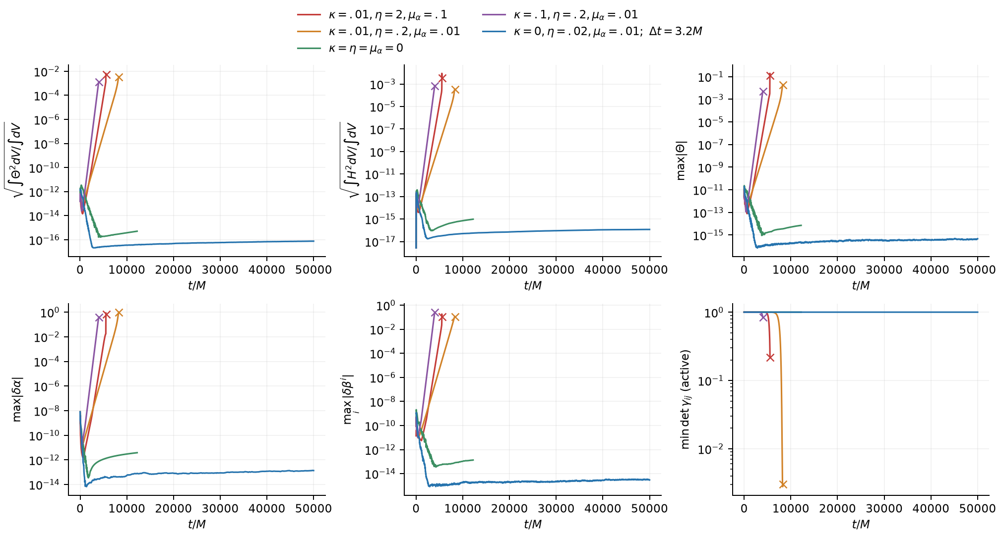

# Local source-damping controls

Collected: 2026-09-20T18:36:55.017997+00:00.

These existing runs use the fixed-stencil immutable MPI binary, G1 background-adapted gauge, sixth-order spatial derivatives, linear residual ghost extrapolation and no outer sponge. The domain is a displaced weak-field trumpet patch, x,y=1536–2048M and z=−1280…−768M, with dx=32M. It contains neither the horizon nor the physical star; matter feedback is zero. All long runs use the same 1e−8 compact smooth lapse bump with support radius 64M and eight 8³ blocks on four MPI ranks. This is outer-region vacuum evidence, not a full TDE stability result. The compact lapse bump excites a gauge response and only indirectly seeds constraints; a separately controlled physical-constraint pulse remains necessary to test stronger perturbations.

| Case | (kappa, eta, lapse damping) | Status | Latest history t/M | Theta RMS | max abs Theta |
|---|---|---|---:|---:|---:|
| kappa01 | (0.01, 2.0, 0.1) | failed | 5530.200 | 0.0056962 | 0.12739 |
| all_weak | (0.01, 0.2, 0.01) | failed | 8280.000 | 0.0035569 | 0.019202 |
| no_damping | (0.0, 0.0, 0.0) | clean_stop_below_target | 12212.400 | 5.067e-16 | 7.15e-15 |
| gauge_weak | (0.1, 0.2, 0.01) | failed | 3980.400 | 0.0013422 | 0.0051452 |
| fast_weakfield | (0.0, 0.02, 0.01) | completed_target | 50000.000 | 7.5585e-17 | 4.7128e-16 |

The κ=0, η=.02, lapse damping=.01 weak-field control reached 50000M cleanly; all four final restart ranks match time/cycle and have finite payloads and positive full/ghost metric minors. Its late Θ values remain near numerical noise, so this is a clean bounded evolution, not proof of saturation, asymptotic stability or a full-domain TDE cure. The all-source-zero case stopped cleanly on walltime at 12212.4M, short of its 20000M target. All three nonzero-κ controls failed.

`fast_weakfield` uses dt=3.2M, target 50000M and a 40-minute wall cap. The other cases use dt=.6M, target 20000M and a 30-minute cap. A cap stop is not target completion. `running_or_unconfirmed` means no clean completion marker yet.



## Norm and growth definitions

Theta_rms=sqrt(Theta-norm2/Volume), H_rms=sqrt(H-norm2/Volume). History label Theta-norm is truncated; its stored value is the integral of Theta squared, not a norm. Volume is proper active-cell volume.

Displayed histories retain near-noise values. Growth fits require every sample in a sufficiently complete window to exceed the conservative analysis thresholds: Theta/H RMS1e−14, maxTheta1e−13, lapse/shift1e−11. These are analysis gates, not code clipping or universal measured roundoff floors. Early pulse decay may be fitted above the thresholds; small late secular drifts are displayed without claiming exponential growth or saturation.

| Case | Theta RMS window M | gamma /M | R squared |
|---|---:|---:|---:|
| kappa01 | 500.4–990.0 | 0.0042060174 | 0.9843282 |
| kappa01 | 1000.2–1990.2 | 0.0044982649 | 0.9997127 |
| kappa01 | 2000.4–3990.0 | 0.0052881517 | 0.9998661 |
| all_weak | 500.4–990.0 | 0.0029102408 | 0.9986506 |
| all_weak | 1000.2–1990.2 | 0.0030464681 | 0.9999995 |
| all_weak | 2000.4–3990.0 | 0.0030511701 | 1 |
| all_weak | 4000.2–6000.0 | 0.0030515125 | 1 |
| all_weak | 6000.0–7990.2 | 0.0031819563 | 0.9990177 |
| no_damping | 500.4–990.0 | -0.003080578 | 0.9345339 |
| no_damping | 1000.2–1990.2 | -0.0028306851 | 0.9764313 |
| gauge_weak | 500.4–990.0 | 0.0057910989 | 0.9990448 |
| gauge_weak | 1000.2–1990.2 | 0.0070370699 | 0.9999077 |
| gauge_weak | 2000.4–3980.4 | 0.0071165813 | 0.9999799 |
| fast_weakfield | 502.4–976.0 | -0.0060543266 | 0.9567379 |

## Failure localization and checkpoints

The initial invalid primitive messages do not contain an exact RK time or rank. Their surrounding stdout lines give only a logging-order bracket, which can be affected by MPI buffering. The exact active invalid-state diagnostics are a later and different measurement. Finite active histories with zero badmetrics do not validate ghost metrics.

**kappa01:**
First printed primitive failure: xyz=[1424.0, 1968.0, -1392.0]M, physical ghost depths=[4, 0, 4], determinant=-0.0015029116413622923; surrounding printed H times 5380.2 and 5390.4M. This is not a located first injection time.
Active invalid-state abort at t=5540.4M, cycle=9234; 4 rank events recorded in status.json.
Latest available checkpoint: t=5000.4M, cycle=8334; older than latest history=True. For failed runs, this checkpoint must not be used as the failure state.

**all_weak:**
First printed primitive failure: xyz=[1424.0, 1424.0, -656.0]M, physical ghost depths=[4, 4, 4], determinant=-0.0003206014503472354; surrounding printed H times 8120.4 and 8130.0M. This is not a located first injection time.
Active invalid-state abort at t=8290.2M, cycle=13817; 4 rank events recorded in status.json.
Latest available checkpoint: t=5000.4M, cycle=8334; older than latest history=True. For failed runs, this checkpoint must not be used as the failure state.

**no_damping:**
Final application log: wall clock limit, time=12212.4M, cycle=20354.
Latest available checkpoint: t=12212.4M, cycle=20354; older than latest history=False. For failed runs, this checkpoint must not be used as the failure state.
Checkpoint validation: passed=True, matching all 4 rank headers, 8 blocks, all payload finite=True, invalid full/ghost metric cells=0. Final checkpoint agrees with the final log time/cycle=True. This validates saved state only.
No invalid-state or primitive failure was recorded. The separate final checkpoint check validates full/ghost metrics at the saved endpoint; the active history alone cannot do that.

**gauge_weak:**
First printed primitive failure: xyz=[1424.0, 1424.0, -848.0]M, physical ghost depths=[4, 4, 0], determinant=-0.010705260509008108; surrounding printed H times 3900.0 and 3910.2M. This is not a located first injection time.
Active invalid-state abort at t=3990M, cycle=6650; 1 rank events recorded in status.json.
Latest available checkpoint: t=0M, cycle=0; older than latest history=True. For failed runs, this checkpoint must not be used as the failure state.

**fast_weakfield:**
Final application log: time limit, time=50000.0M, cycle=15626.
Latest available checkpoint: t=50000M, cycle=15626; older than latest history=False. For failed runs, this checkpoint must not be used as the failure state.
Checkpoint validation: passed=True, matching all 4 rank headers, 8 blocks, all payload finite=True, invalid full/ghost metric cells=0. Final checkpoint agrees with the final log time/cycle=True. This validates saved state only.
No invalid-state or primitive failure was recorded. The separate final checkpoint check validates full/ghost metrics at the saved endpoint; the active history alone cannot do that.

## Saved spatial checks

Independent reconstruction of the saved checkpoints reproduces coincident proper-volume Theta RMS histories within 7e−16 relative. At 5000.4M, kappa01 peaks 80M from a face at(1936,1616,−1200); all_weak peaks near the pulse center at(1776,1776,−1008), 240M from a face. Neither is the first injection time nor the later failure state. Per-rank ownership, coordinates and distance-bin integrals are in the checkpoint-profile JSON files.

## Independent timestep check

The separate stronger-pulse (1e−6) serial single 16³-block controls all reached 640M. Independent restart readback reproduces relative active residual L2 errors 0.000739528889 (dt1.6) and 0.006251014929 (dt3.2), versus dt.6. Their ratio 8.45 is consistent with third-order temporal error over this interval; this is neither spatial convergence nor long-time stability. This L2 combines residual variables and is not a physical energy norm. All three saved checkpoints are finite and have positive full/ghost metric minors. The recorded `checkpoint_dt` is not necessarily the final shortened integration step.

## Reproduce collection

No command here launches AthenaK. Run from this directory:

```
OPENBLAS_NUM_THREADS=1 python3 collect.py --study /path/to/raw/long-sponge-study --regression /path/to/checkout/tst/regression --validate-clean
OPENBLAS_NUM_THREADS=1 python3 plot.py
python3 report.py
```

The raw study directory, including checkpoints, is required for collection;
it is not included in this compact archive. `plot.py` reproduces the figure
directly from the packaged NPZ histories. `collect.py` imports the study
checkpoint checker and records raw history arrays, profiles from existing log
messages, growth windows, stopping markers and checkpoint availability.
`timestep_review.py` independently rereads the already-completed timestep suite.
`status.json` is authoritative for this completed collection. All five original
processes have ended; this package launches no continuations.
