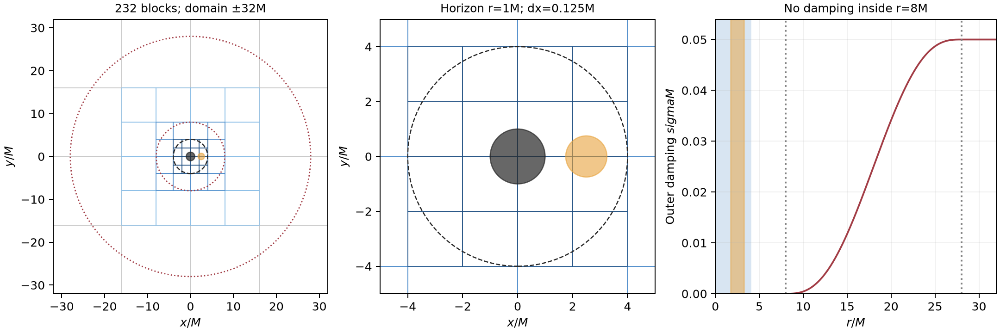

# Prepared strong-field vacuum discrimination

**Prepared and mesh-audited; the subsequently authorized local three-cycle zero/pulse preflight has now passed.** No long evolution, restart continuation or Aurora submission has been performed. See [preflight results](preflight/README.md). Assess the independent direct-Theta flat-space control before proceeding to longer strong-field trials. This is a centered Schwarzschild trumpet diagnostic with the production G1 bulk gauge retained; it is not a TDE run or a claim of strong-field stability.

The preferred mesh has **232 blocks of 16³ active cells**, a domain `[-32,32]³ M`, and `dx=.125M` throughout the entire sphere `r≤4M`. The coordinate horizon is `r=1M` (areal radius `R=2M`), giving **16 points across its coordinate diameter**. The horizon and this surrounding exterior region have no sponge or inner excision treatment.



## Actual mesh audit

The immutable CPU MPI executable is `/Users/hz0693/research/TDE/outer-boundary-fix-20260920/bin/athena-active-stencil-mpi`, SHA256 `67ff395e3c7af43425ef13fe4f0ebecef00256db9450f6ac912f5ab39620f1f8`. All ten inputs pass `-n` parsing. Both block sizes and the inset variant pass actual `-m` mesh construction with one and four MPI ranks. AthenaK exits before adding physics modules in this mode; these results do **not** validate problem-generator runtime guards, timestep, allocations, initial residuals or evolution.

The root grid is 64³. Static refinement requests cubes of half-width16,8,4M at relative levels1,2,3. No dynamic tracking or changing refinement is enabled.

| Layout | Blocks by dx (M) | Active cells | Cells including four ghost layers | Actual finest cube |
|---|---|---:|---:|---|
| 16³ preferred | 56 at1; 56 at.5; 56 at.25; 64 at.125 | 950272 | 3207168 | ±4M |
| 32³ same requested boxes | 56 at.5; 56 at.25; 64 at.125 | 5767168 | 11264000 | ±8M |
| 32³ inset15.99/7.99/3.99M boxes | Identical to32³ above | 5767168 | 11264000 | ±8M |

The 32³ inset test is exactly identical in output block geometry. This is whole-parent refinement alignment, not a removable edge-touch effect: to create finest children on both sides of the origin, the 32³ parent blocks of side8M must be refined, yielding finest coverage to±8M. The finest 16³ children have side2M and cover±4M. Both meshes have 64 finest blocks; their active-cell counts differ by8× at that level. The full 32³ mesh costs6.07× the active cells and3.51× the ghost-inclusive cells of16³, despite its better ghost/active ratio (1.953 versus3.375).

`mesh-audit.json` records each actual gid, owner, logical location, extent and spacing. Independent box checks verify that the mesh covers the domain with no overlapping interiors and that the finest leaves tile their bounding cube without gaps. That explicitly proves coverage of the entire protected sphere. The puncture does not coincide with any active or ghost cell center on these dyadic, even-cell blocks; the nearest finest center is at `sqrt(3)*.0625=.108253M`. The four-rank partition is exactly58 blocks/rank for16³ and44 blocks/rank for32³.

## Physics, seed and layer

- `bh_background=schwarzschild_trumpet`, `M=1`, spin0, centered at the origin; `R=r+1`, `alpha=r/(r+1)`, `chi=[r/(r+1)]²`. This stationary R0=M reference is not the stationary standard1+log trumpet.
- Original `background_adapted` residual gauge, `shift_Gamma=1`, `damp_kappa1=0`, `damp_kappa2=0`, `shift_eta=.02`, lapse-residual damping`.01`. Sixth-order volume derivatives (`nghost=4`), RK3, dissipation`.5`; repaired active-only boundary derivative stencil, original `characteristic_cpbc/zero_rate`, linear ghosts `extrap_order=2`.
- `excision_project_state=false`, `coord/excise=false`, inner rate/freeze/ramp all0. No residual clipping, resetting or inner sponge is introduced. A numerical floor atmosphere remains in the GRMHD container; `pure_background=true`, `zero_tmunu=true` and `zero_tmunu_feedback=true` remove its gravitational feedback. No physical star is present.
- Safe first perturbation: existing compact C-infinity **lapse-only** bump, amplitude1e−8, centered at(2.5,0,0)M, support radius.75M. It is exactly zero outside its support and throughout `r<1.75M`; it does not seed the puncture or horizon. There are912 nonzero active seed cells, all atdx.125M, and six finest cells between the support and the first refinement plane atx=4M. Geometry and constraints are initially unchanged by this gauge seed; this does not replace a controlled constraint perturbation.
- A direct-Theta input is deliberately not staged. The existing radial Gaussian shell has noncompact tails. Its unregularized `f(|x|)` has nonzero radial derivative at the origin for nonzero shell radius; the actual radius helper introduces a tiny1e−6 core regularization but still seeds the interior. The dipole option also adds angular dependence. A compact, regular constraint seed that avoids the puncture is needed for the later direct-Theta strong-field test; no C++ change is made here.

The candidate outer source is `rhs(delta u) -= sigma(r)*delta u` for every evolved residual. It starts at8M, rises over20M with quintic `SmootherStep`, and reaches `.05/M` at28M. Full damping remains to the outer faces at32M and into the corners. It is C2 at the shell endpoints and has zero rate throughout `r≤8M`, leaving a4M undamped margin outside the protected sphere. The ramp is at least20 coarse spacings wide (28 cells along an axis because part is refined). The proposed rate is a diagnostic choice: `max_rate × ramp_width=1`, comparable in dimensional attenuation to the much wider weak-field study, not evidence that this layer is optimal. No reflection or stability result has been inferred from the profile.

The explicit source safeguard is retained: `dt_source≤20M`. With CFL`.2`, the Z4c spatial estimate is `.025M` atdx.125M (`sigma*dt=.00125`), far below that source bound. The actual dynamical timestep must be measured after initialization because the fluid/other timestep logic may reduce it. A matched half-timestep input is included.

## Controlled input matrix

All inputs are fresh starts; none refers to a production or failed checkpoint. Except for listed differences, they preserve the same geometry and seed.

| Input | Difference from pulse_sponge |
|---|---|
| `zero_sponge` | Seed0, three cycles only |
| `zero_nosponge` | Seed0, three cycles, outer sponge off |
| `pulse_sponge` | Preferred weak source rates and radial layer |
| `pulse_nosponge` | Only outer sponge off |
| `pulse_kappa01_sponge` | Only kappa1=.1 |
| `pulse_kappa01_nosponge` | kappa1=.1, outer sponge off; pairs with pulse_nosponge |
| `pulse_original_sources_nosponge` | Original kappa1=.1, eta2, lapse damping.1, outer sponge off; combined historical reference, not a one-factor test |
| `pulse_sponge_halfdt` | Only CFL`.1` |
| `mesh32_pulse_sponge` | 32³ blocks; only a layout/cost comparison, physically larger fine region |
| `mesh32_inset_pulse_sponge` | 32³ plus inset boxes; geometry proved unchanged |

The nonzero-seed decks carry `tlim=1000M`. A sensible future order is: verify exact zero over all residual entries including ghosts/refinement transfers for the two three-cycle controls; run matched pulse_sponge/pulse_nosponge to100M, then300M if finite; inspect protected-core, horizon exterior, refinement-interface and sponge-region norms and signed profiles; use the kappa and half-step controls to separate effects; only then consider reaching1000M from independently validated clean checkpoints. Extending a finite near-noise history alone is insufficient. The flat direct-Theta gate and later compact strong-field direct-Theta control remain separate requirements.

The present `check_trumpet_checkpoint.py` explicitly supports uniform grids only. **Do not use it on these SMR checkpoints.** The separate `check_smr_trumpet_checkpoint.py` now reconstructs each block's coordinates with `2^(logical_level-root_level)` and has passed the authorized three-cycle preflight: common rank headers, exact leaf-coordinate agreement with this mesh audit, full/ghost metric minors, exact-zero residual payloads and deliberate rejection of an indefinite fine ghost. Its static-grid/format restrictions remain explicit. Output histories exclude the coordinate horizon for their exterior norm; diagnostics inside the horizon and at interfaces must be reported separately. Mesh-only checks cannot establish zero-preserving transfers.

## Resource estimate: debug only, at most two nodes

A candidate future allocation is **two nodes,24 MPI ranks (12/node), queue debug, project TidalMHD**, one-hour PBS walltime and application cap`-t 00:55:00`. No PBS job or submission command is created here. The requested allocation and GPU-rank mapping must be checked when the actual job is prepared. This work does not touch debug-scaling or the ongoing TDE job.

With232 blocks,24 ranks would receive9–10 blocks each (mean9.67). One node/12 ranks would receive19–20. Counts follow the equal-cost static partition; the mesh was actually constructed on1/4 ranks, not on Aurora. The former production target of roughly two blocks/rank would require far more than two debug nodes and is not the resource constraint for this diagnostic.

The only available nearby measured reference used four32³ blocks/four GPU ranks on one node:8334 cycles in497.24s (job8841948, **old original binary**, uniform displaced weak-field case). It delivered2.197 million active or4.291 million ghost-inclusive zone-cycles/s. Scaling its ghost-inclusive work to this mesh and optimistically scaling rank throughput gives the following **rough** intervals; the upper value applies an additional2× SMR/communication penalty, not a measured confidence bound:

| Allocation | 100M | 300M | 1000M |
|---|---:|---:|---:|
| 1 node/12 ranks | 17–33min | 50–100min | 166–332min |
| 2 nodes/24 ranks | 8–17min | 25–50min | 83–166min |

These estimates assume `.025M` steps,4000/12000/40000 cycles, and omit startup/I/O. Strong-field fluid work, small-block launch efficiency, network transfers and refined boundaries can invalidate the scaling. Thus300M is the plausible first one-hour two-node target;1000M should not be promised within that allocation. A two-node pilot must first measure actual seconds/cycle. Lowering node count is possible for the first100M test but is unlikely to finish300M within the one-hour cap under the slower estimate.

Primary Z4c/ADM/Tmunu arrays plus coarse Z4c alone require about4.77GB aggregate for16³. This excludes MHD, background-RHS cache, boundary/refinement buffers, mirrors and runtime overhead. Reserve a provisional2GiB/rank rather than treat that lower bound as a complete memory estimate, and check actual allocation before a long run. A full all-rank restart payload is approximately0.850GB; initial and final checkpoints alone total1.70GB. Inputs use per-rank restart files with an interval1000M, and the walltime stop must flush its endpoint. No binary slice output is enabled in this first vacuum diagnostic.

## Reproduce preparation without evolution

From this directory, with Python/NumPy/Matplotlib available:

```
python3 prepare.py
OMP_NUM_THREADS=1 OPENBLAS_NUM_THREADS=1 python3 audit_mesh.py --binary /path/to/immutable/athena
python3 summarize.py
python3 plot_plan.py
```

`audit_mesh.py` only invokes `-n` and `-m`. It does not initialize physics or run a single RK step. `summary.json` records exact geometry/seed counts, profile parameters, source guard, payload estimates and scaling assumptions; `input-manifest.json` hashes every prepared input.
