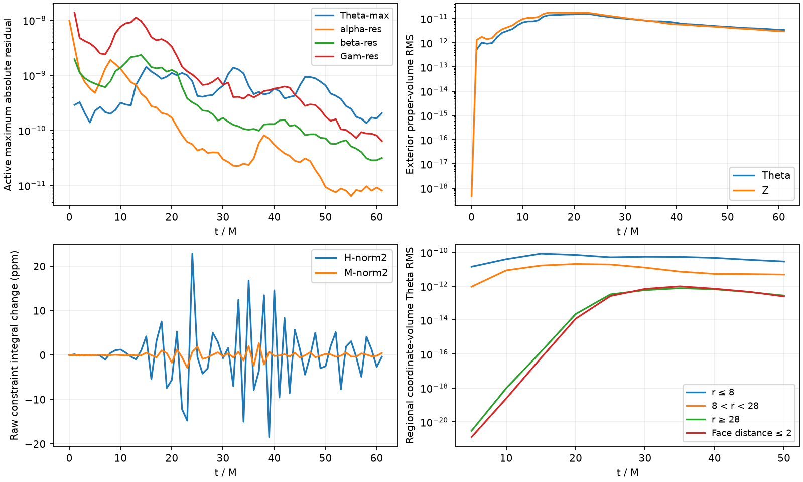

# Strong-field GPU control 8843091

Submitted2026-09-20T21:16:00Z after renewed Aurora access and final validation of the three direct-Theta flat-space controls through50000M. **This is a new vacuum diagnostic, not a production/star restart.** Production remains paused and unchanged.

PBS accountMHDTidal, queue`debug`,2nodes24MPI ranks,12/node,1hour. The job started at21:21:10Z. The initial fresh three-cycle gate passed exact zero with all24rank raw full/ghost metrics valid. The separate fresh compact-lapse pulse is running; its final stopping reason and stability are not yet established. Later status files and reports in this directory supersede this initial observation.

## Physics and mesh

Centered Schwarzschild R0=M trumpet, M=1, static refinement levels0–3 in a domain±32M. The232 blocks have16³ active cells, finestdx.125M and16cells across the coordinate horizon diameter. Actual24rank ownership is9blocks onranks0–7,10onranks8–23. This is static SMR, not moving AMR.

The existing background-adapted G1 gauge and characteristic`zero_rate` boundary are retained, with repaired active-only boundary differentiation and linear residual ghosts. Sixth-order volume differences, RK3, kappa1=kappa2=0, shift eta.02, lapse-residual damping.01. A radial C2 residual sponge starts at8M, ramps over20M, reaches rate.05/M at28M, and retains its source timestep safeguard. No horizon/interior freeze, state projection, inner sponge or excision is added. A numerical fluid floor is decoupled from spacetime. The compact lapse pulse has amplitude1e−8, center(2.5,0,0)M, support.75M. This does not use the new exterior-memory boundary prototype or a direct-Theta seed.

## Execution and diagnostics

The zero gate must finish exactly3cycles and validate every rank before the pulse starts. The pulse starts independently from initial data, targets1000M and uses`-t00:55:00`; no automatic continuation is enabled. The source executable SHA256 is`a6c3af79571819fba5dc2252ceb9abacb31279feec440f2c542e342dfee43639` and is never rebuilt or overwritten.

The observed early timestep is.025M. Cycle500→600 took18.3927s for2.5M, giving.1359M/s: extrapolated runtime to1000M is about123minutes, and about450M might fit within55minutes. These are early measurements; later evolution/output costs can change them. A clean walltime stop below1000M is not target completion.

Per-rank checkpoints every50M, active Theta binary output every5M and active constraint binary output every10M support spatial localization. Full/ghost metric validity is checked from restart files; binary constraint outputs exclude ghosts by default and cannot certify ghost validity. Raw initial Hamiltonian truncation near the horizon is already about1.33e−4 and must be separated from growth of evolved residuals.

## Exact launch provenance

`submission/` preserves the actual submitted input decks, PBS, helper code, readiness record, manifests and qsub response. Package SHA256 at submission:`b6e50a17289cd44ba517d0db657db4d1be3bdbf7555cde8f324b3220c3d02b62`. The PBS contains the original prepared-only comment; its read-only runtime guard accepted the separately reviewed READY record. Do not resubmit this archived package. `submit_once.py` uses a lock and persistent pre-submission state; uncertain submission is never retried blindly.

The earlier unsubmitted draft remains in`../aurora-next/`. Relative to that draft, the launched copy changes only output cadence/additional spatial diagnostics and a Python3.6-compatible three-axis cell product in the checkpoint reader. The committed draft reader receives the same compatibility fix after submission; the original prepared manifest is retained in`submission/prepared-package-manifest.json`. No floating-point evolution code is changed by these updates.

Remote submission:`/lus/flare/projects/MHDTidal/hzhu/tde_1e4_solar_review/outer-boundary-fix-20260920/long-sponge-study/strongfield-launch-20260920T2112Z`.

Remote run:`/lus/flare/projects/MHDTidal/hzhu/tde_1e4_solar_review/runs/strongfield_smr232_8843091`, subdirectories`zero` and`pulse`.

The validator compatibility change passes the existing private24rank synthetic-repartition regression, including exactzero/fullfinite/ghostSPD, missingrank, mixedcycle and deliberately indefinite fineghost rejection. Source eight-rank checkpoints remain unchanged. This parser test is separate from the actual24rank GPU zero gate. Aurora's Python3.6/NumPy1.19.5 also parsed a header-only compatibility fixture successfully; that fixture is never evolved and is not a restart checkpoint.

The archived`submission/remote-package-check.txt` is a historical check of an intermediate launch copy (hashb0c1a0aa…), before the Python3.6 reader fix. It is not the submitted-package verification. The actual PBS runtime guard checked the final package before the zero gate, and`remote-package-recheck.json` independently rechecks finalhashb6e50a17… after submission without changing files.

## Verified early response

The frozen [early-response packet](early-response/README.md) contains the actual24rank zero-gate validation, independent50M/cycle2000 checkpoint check, histories through61M,11 complete Theta snapshot cohorts through50M and the plot/script/provenance. All24 checkpoint ranks have finite full payloads and positive raw full/ghost metric minors; no invalid metric cell is found. This is not inferred from history reductions.

At61M, max|Theta| is2.058e−10, below its15M peak1.426e−9; residual lapse maximum is8.116e−12, down from9.789e−9 initially. Exterior proper-volume Theta RMS is3.403e−12. The first saved nonzero Theta maximum at5M is near a cubic refinement interface, at radius5.13M; later maxima move. This does not locate first RK-stage injection or establish an unstable mode.

The raw full Hamiltonian maximum remains near its initial1.33e−4 truncation value at r≈1.066M. Scalar norm differences are recorded, but are not mislabeled as the norm of H(t)−H(0). All11 active float32 Theta dumps agree with history maxima within3.51e−8 relative and have validated complete24rank geometry/payloads.

The newer47.5–60M throughput is0.1032M/s, slower than the earliest estimate above. It extrapolates to2.53hours remaining from60M to1000M, so this allocation is expected to stop well below target. Neither extrapolation is a stopping result. The job remains running at collection; no resubmission or production clearance follows from these early results.

