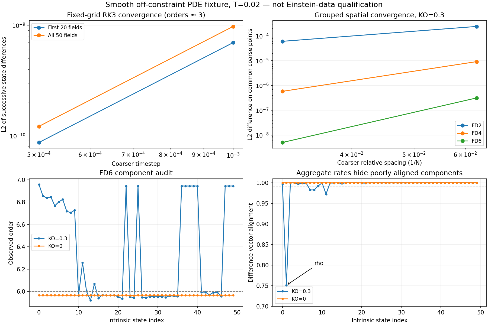

# Nonlinear smooth PDE convergence checkpoint

These runs evolve the unforced `intrinsic_smooth` fixture, with all 50 fields
active, non-diagonal geometry, nonzero K/A/C/Z and independent auxiliaries.
The initial data violate Einstein/reduction constraints. They are evolved by
the full implemented PDE, not frozen and interpreted as a stationary solution.
This is a numerical convergence test, not physical Einstein-data qualification.
No production equation or operator is changed in this checkpoint.

All runs use 2D periodic domain lengths (1,1.3), inactive width 1.7, blocks 8x8,
four ghosts, RK3, eta=2, kappa=1, lambda=alpha, amplitude 0.001, and T=0.02.
Initial w/rho have background one; other fields have zero background. Every
field has the documented smooth sinusoid with its field-dependent phase and
amplitude. Full-region 89-component histories are saved at initialization and
four equal physical times. Positivity/domain validation remains active at all
the usual stage/stencil checkpoints. Raw float64 restarts, signed differences,
health data and input hashes are retained outside Git with an artifact manifest.

## Temporal ladder

At fixed 16x16 cells and FD6/KO0.3, dt=(0.001,0.0005,0.00025) gives RK3 orders
2.998867 for the first 20 primary/curvature/GH fields and 3.000546 for all 50.
Difference alignment is 0.999997 and 0.999989 respectively. The frozen group
criteria were order >=2.7 and alignment >=0.99. Individual component orders
range 2.9953–3.0317 and minimum component alignment is 0.9913. Three process
runtimes total 0.735 seconds on the tested CPU build; setup/analysis is separate.

## Spatial ladders and the component-level limitation

FD2/4/6 use N=(16,32,64), dt=0.000125, KO=0.3. A finest-grid run at half dt
checks temporal contamination. Trigonometric interpolation compares all data
at the coarse cell centers, using the real Nyquist convention; an independent
exact-mode test has error 3.997e-15 (frozen tolerance 5e-13). This interpolation
is for smooth periodic diagnostics and is not an evolution transfer operator.

The frozen group gates (order >=p-0.6, alignment >=0.99, temporal contamination
<=0.05) pass for both groups at every order. FD4 all-field order is 3.9790;
FD6 is 5.9671 with alignment 0.99964 and temporal ratio 0.000381. Twelve process
runtimes total 90.718 seconds. These positive aggregate results alone cannot
support a per-field Richardson claim.

The component audit finds rho alignment 0.6949, 0.7118 and 0.7510 for FD2/4/6.
Several beta/Ahat components also fall below 0.99. The original KO=0.3 ladders
therefore fail to demonstrate aligned per-field spatial differences at these
resolutions. This negative evidence is retained, including all signed arrays;
it is not discarded because grouped norms converge.

## Matched KO control

A separate FD6 arm changes only KO from 0.3 to zero. It repeats the same three
resolutions and finest-grid half-dt control. All component alignments now exceed
0.9999718 and all component orders exceed 5.96594. Rho has order 5.96757 and
alignment 0.9999973; its temporal ratio is 0.00503. The largest component temporal
ratio is 0.03324. Four process runtimes total 29.747 seconds.

This supports competition between spatial error terms: FD6 has leading order-six
truncation, while this KO operator scales at order seven on a smooth field.
Changing their relative weight can rotate/cancel a component's leading error
at finite resolution. The control does not establish a complete additive
operation budget for that mechanism, does not make KO globally unnecessary,
and does not qualify the original KO=0.3 arm. Resolve its component convergence
before using Richardson estimates from that arm in physical qualification.



## Reproduction and scope

The exact CPU executable is the serial binary in
`intrinsic-diagnostic-task-001/source-manifest.json`, SHA256
`59c5087e4d556d271f5278a431c06770544ff742d7b7e0edff16b632065a0c81`.
The source is production commit `5d9de0d864cc998dd16869aaefa681b6c524b8ad`.
Compact evidence is in `intrinsic-smooth-convergence-001/`.

```sh
python3 -W error analysis/pc_gh_clean_reduction/check_intrinsic_time_convergence.py \
  --binary BUILD/src/athena --output NEW_TIME_RUN
OPENBLAS_NUM_THREADS=1 python3 -W error analysis/pc_gh_clean_reduction/check_intrinsic_space_convergence.py \
  --binary BUILD/src/athena --template NEW_TIME_RUN/dt0.00025/used.athinput \
  --output NEW_SPACE_RUN
OPENBLAS_NUM_THREADS=1 python3 -W error analysis/pc_gh_clean_reduction/check_intrinsic_space_convergence.py \
  --orders 6 --ko 0 --binary BUILD/src/athena \
  --template NEW_TIME_RUN/dt0.00025/used.athinput --output NEW_KO_CONTROL
python3 analysis/pc_gh_clean_reduction/analyze_intrinsic_convergence_components.py \
  --input NEW_SPACE_RUN/fd6-signed-differences.npz --output components.json
```

Physical/gauge-wave/manufactured-forcing tests, intrinsic nonconforming interfaces,
puncture/core and binary qualification remain open. This checkpoint makes no
legacy-versus-intrinsic stabilization claim and does not promote the full Gate 2.

## Completed CUDA diagnostic validation

The separate CUDA controller is terminal, exit zero. Its new in-process
89-component diagnostic passes six serial and six two-rank cases against the
independent global primary-jet oracle, with maximum normalized discrepancy
1.144e-13. Cadence, restart history/state and collision controls also pass.
Binary SHA256 is `239664395d9dc07f502a6cd287bab076ea4a87ebb24cf474471f9407f12e6ed9`;
all 338 production source files were verified against the local source.
Evidence, build log, launcher and remote raw-file inventory are in
`intrinsic-diagnostic-cuda-001/`. These are diagnostic correctness tests on one
A100 40 GB, not a CUDA repeat of the longer spatial/temporal ladders above.
