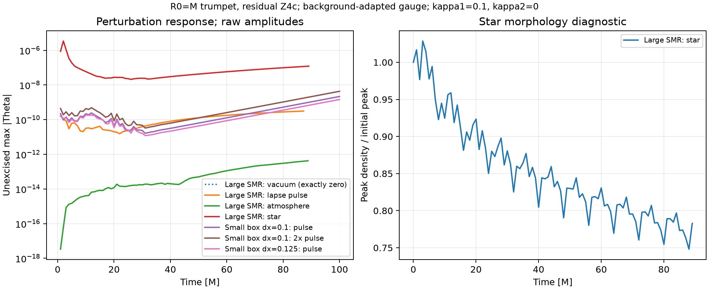
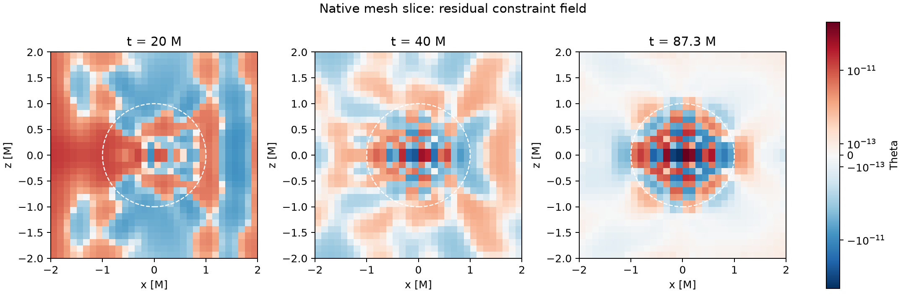
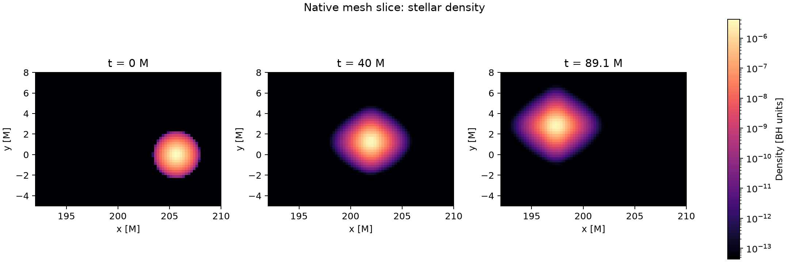

# Puncture residual-Z4c tests, 18 September 2026

Numerical implementation: `8b6942119b86b60c8d76d98d6e43e783b2de37a0`,
on `project/tde` in HengruiZhu99/athenak. Analysis/deck changes after that
commit do not change the executable. See `README.md` for the background,
gauge equations, physical parameters, and reproduction commands.

**Verdict:** exact-background preservation passes the exercised CPU/MPI/GPU
checks. A production-stable configuration has not been established. The
small-domain controls have a reproducible exponentially growing mode; the
large SMR controls stay finite but retain late Theta growth. No production
disruption run was promoted from these tests.

## Completed correctness checks

- Independent spherical ADM calculation: the implemented R0=M analytic
  trumpet satisfies the continuum Hamiltonian/momentum constraints and
  stationary metric/extrinsic-curvature equations exactly symbolically.
- CPU: all 12 uniform/SMR, vacuum/lapse/atmosphere, MPI 1/4 combinations
  passed. Active-cell results were bitwise identical across MPI counts.
  The three refined cases also matched the four-thread OpenMP execution.
- Aurora GPU preflight: 1-rank and 4-rank uniform vacuum plus 12-rank SMR
  vacuum passed three RK3 cycles. All audited residual-state, residual-RHS,
  and geometry differences were exactly zero, with zero bit mismatches
  and no nonfinite values. The respective balance-row counts were 14,700,
  58,800, and 183,700; geometry-row counts were 1,134, 4,536, and 13,608.
  These are stage checks, not long-time perturbation-stability evidence.

No new blanket synchronization, small-residual reset, clipping, or damping
parameter change was introduced. The puncture providers write distinct cells;
the existing immutable-stencil residual machinery is retained. These tests
provide repeatability evidence for the exercised paths, not a formal proof
that every untested execution configuration is race-free.

## Small-domain perturbation controls

Outer faces +/-2M, sixth-order discretization, CPBC zero-rate boundaries,
background-adapted lapse and shift, kappa1=0.1 and kappa2=0. A compact smooth lapse
seed of amplitude 1e-8 is centered at (0.75,0,0)M with support radius 0.5M:
`delta_alpha = epsilon exp(1-1/(1-q^2))` for `q<1`, and zero elsewhere,
where `q` is distance from that center divided by 0.5M. No inner
regularization, freezing, sponge, or coordinate excision is active.

| dx | End time | Final max abs(Theta) | 60--100M fitted growth rate | Assessment |
|---|---:|---:|---:|---|
| 0.1M | 100M | 2.16018e-9 | +0.0707267/M | Growing mode |
| 0.125M | 100M | 1.44944e-9 | +0.0703975/M | Growing mode |

Doubling the seed to 2e-8 at dx=0.1M gives final max abs(Theta)=4.31001e-9
and growth rate +0.0707143/M. The response is twice the original to within
0.25% throughout 60--100M. This is reproducible linear amplification, not
just a noisy tiny-residual maximum.

Both runs reached their simulation targets normally, not a walltime stop.
Both stayed finite with positive lapse/chi/determinant and zero bad-metric
counts. Nonetheless, Theta grew by about 17x over the final 40M: these
controls fail the perturbation-stability criterion. Refining from dx=0.125
to 0.1 does not remove the measured late growth. The raw physical Hamiltonian
and momentum histories include finite-difference error of the background;
their nearly constant baseline does not negate the growing Theta residual.

The floor fluid remains dynamically evolved but has zero gravitational
feedback in vacuum controls. Its substantial artificial accumulation on
the small domain cannot be used as a physical atmosphere result and cannot
source the vacuum gravitational mode through Tmunu.

## Earlier diagnostic not used for matter runs

The positive-lapse isotropic wormhole variant was held fixed by the residual
subtraction. It is not a stationary solution of the unmodified Einstein
evolution with that lapse, so it was replaced by the continuum-stationary
trumpet for all physical matter tests. Its lapse perturbation grew at about
0.393/M, and the vacuum/lapse runs were deliberately stopped near 40M;
neither reached 100M or stopped on application walltime. A wormhole
atmosphere test with density 1e-14 hit the CPBC matter-density validity limit
near 12M while its last recorded metric remained valid. This is a boundary
matter-limit rejection, not evidence of a metric blow-up.

## Aurora long controls

Job 8837569, MHDTidal/debug-scaling, four nodes, one hour requested walltime,
application `-t 00:55:00`. Each independent case uses one node and twelve
MPI ranks/GPU tiles. All four cases share the same 1268-block static mesh,
outer faces +/-256M, BH dx=0.125M (16 cells across the coordinate horizon),
and a dx=0.25M corridor covering the star through the 100M pilot.

All four applications exited with code 0 on **wall-clock limit**, with final
outputs flushed. None reached the 100M target. PBS records a finished job,
exit status 0, and used walltime 00:55:19.

| Case | Last time [M] | Final global max abs(Theta) | Empirical late log-slope [1/M] |
|---|---:|---:|---:|
| Zero vacuum | 87.8625 | exactly 0 | n/a |
| Lapse perturbation | 87.2625 | 3.11791e-10 | +0.01828 |
| Atmosphere | 88.8000 | 4.23769e-13 | +0.03810 |
| Solar-star model | 89.1000 | 1.21324e-7 | +0.02383 |

The slopes are least-squares fits to log(max abs(Theta)) over the last
approximately 20M, not demonstrated asymptotic eigenvalues. The large-domain
growth is slower than the small-domain exponential mode; the domains and
meshes differ, so this is not a CPU-versus-GPU comparison at fixed discretization.
The star's earlier initial-data transient peaked at 3.44357e-6 and then
decayed before the late increase. Its final value being below that early
peak is not evidence of long-time stability.

All histories and all variables in all 48 saved binary outputs are finite.
The bad-metric count is zero throughout, with positive lapse, chi and metric
determinant. The vacuum's monitored residual maxima remain exactly zero;
all 25 residual fields in all six saved vacuum slices are zero at output
precision. These visualization files use float32, whereas the stage audits
exercise the double-precision solver and compare bit patterns directly.

The star's integrated fluid mass changes by +1.27843e-10 relative. Its peak
density ends at 78.2866% of its initial value; stellar structure accuracy
therefore requires a resolution/convergence check. The density-peak track
stays within 0.1372M of the prescribed geodesic in the six saved slices,
less than one 0.25M cell; this is a sampled peak, not a center-of-mass measure.
At the final time it is at (197.375,2.875)M in the orbital plane, still on
level 7. This is an early infall pilot, not a full disruption or periapsis passage.

Mean measured costs are 36.5--37.6 seconds/M per one-node case; the final
measured windows slowed to 50.0--51.2 seconds/M. Extrapolating this exact mesh
to 1000M gives about 10.1--10.5 hours using the run average or 13.9--14.2 hours
using the late rate. Throughput was not steady, so neither is a guaranteed
runtime. The current stellar refinement corridor is only designed through
100M and would need redesign for a longer trajectory.

Detailed data: [GPU audit](results/gpu-audit.json),
[all output checks and peak locations](results/gpu-output-audit.json),
[star track](results/star-track.json),
[local audit](results/local-audit.json),
[amplitude comparison](results/amplitude-linearity.json), and
[exact inputs, histories, job record and binary hashes](results/aurora-8837569).

## Spatial interpretation

At 20.025M the lapse-control slice has its largest abs(Theta)=1.98620e-11
at (-1.9375,0.0625,0.0625)M, coordinate radius 1.93952M, level 8. This is
the last fine cell before x=-2M; the neighboring block is level 7, with
dx=0.25M. The point is outside the trumpet horizon r=1M. This is a
slice maximum at a specified time, not a global three-dimensional maximum
or a first-injection diagnosis. Its adjacency to a refinement interface
motivates a controlled interface test, but does not establish causation.

The current experiment has no sponge. Neither these locations nor the
earlier Kerr-Schild diagnostics establish a sponge origin for this mode.
Small uniform domains also grow, so refinement cannot be assumed to be
the only mechanism.

In the final GPU slices all three perturbed cases peak in the nearest
puncture cells at r=0.108253M: lapse at (0.0625,0.0625,-0.0625), atmosphere
at (-0.0625,0.0625,-0.0625), and star at (-0.0625,0.0625,0.0625)M.
Those are slice locations, not asserted global 3-D argmax locations. In
particular the star slice peak is 1.19341e-7, slightly below the global
history maximum 1.21324e-7. Signed profiles show a sign-changing pattern
across the puncture; using only absolute-value plots would conceal it.

The independent 4-thread uniform-grid profile run reached 50M. All 22 user
history columns agree exactly with the earlier 2-thread run at the 50 shared
sample times through 49.0125M, even with stage diagnostics enabled. The
visualization binaries store float32 values, so their amplitudes are rounded;
the histories and stage audits are the authoritative higher-precision values.
Its global 3-D Theta peak moves from r=1.03645M at 10.0125M, to r=0.81729M
at 20.025M, to the closest puncture cells at r=0.108253M by 40.0125M and
50M. The large SMR lapse and star slices likewise peak at r=0.108253M at
40.0125M. The early interface-adjacent peak does not identify the late
dominant mode's location.

The profile audit also separates initial operations. With the intentional
nonzero lapse seed, Theta is zero before the first RHS evaluation. At step
time zero, RK stage 1, its volume RHS first becomes nonzero, with maximum
9.06802e-13 in code units at (0.3125,-0.0625,-0.0625)M. The boundary RHS operation then
has maximum 9.87372e-13 at (1.9375,-0.0625,-0.0625)M, and the RK state
maximum is 3.70264e-14 there. Projection/recasting leaves that Theta maximum
unchanged. These refer to the seeded perturbation, not to a failure of the
exact-zero background test. Initial volume forcing, boundary modification,
and late amplification are distinct observations.

At that first stage, the geometry audit records bitwise equality of full and
background R, AA, K, and Ht, while Theta and its advection are zero. Therefore
the initial Theta volume forcing is specifically the implemented term
`0.5 * (alpha_full Ht_bg - alpha_bg Ht_bg)`, algebraically
`0.5 delta_alpha Ht_bg`. The continuum background Hamiltonian vanishes, but
its discrete value does not. This identifies a coupling of the intentional
lapse perturbation to background constraint truncation error; it is not an
unexplained failure to subtract identical inputs. It identifies the first
Theta source, not a complete explanation of its later exponential growth.

## Remaining diagnosis

Removing the inner regularization does not by itself establish stability.
The background-preserving discrete equilibrium and the linear response to
nonzero perturbations must be treated separately. A useful next comparison
starts with the linearized Theta operator and this background-constraint
coupling, followed by the adapted gauge against a compatible
full-minus-background 1+log gauge. At first order the latter contains
`delta_beta . grad(alpha_bg) - 2 Khat_bg delta_alpha` in addition to the
implemented adapted lapse terms. That is a concrete operator difference,
not an identified cause of the measured instability. The boundary treatment
must be made compatible for an honest gauge comparison; simply switching
the input would not constitute such a test.

The implementation tested here uses the stationary R0=M analytic trumpet,
not the standard stationary advective-1+log trumpet, and not the high-spin
Kerr coordinate construction in [Liu et al.](https://arxiv.org/abs/1001.4077).
No conclusion that all puncture or trumpet formulations are unstable follows
from these controls.
