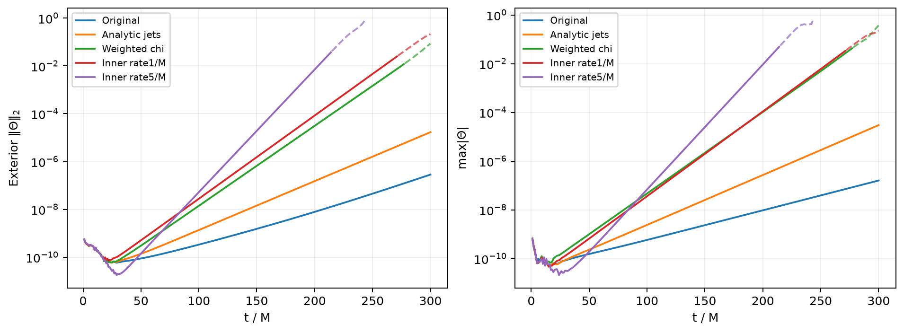

# Isolated formulation and inner-damping pilots

All three tested prototype families increased perturbation growth. None is a stability fix or suitable for promotion. Their source remains uncommitted in separate detached worktrees based on `ed34472a5a5f8e9f1961bdd82d872a3f157d65f9`; production executables, inputs and Aurora jobs were not changed by these tests.

The compact evidence is under [evidence/prototypes](evidence/prototypes/package-manifest.json). It includes source/binary hashes, derivative and stage validation, growth windows, spatial profiles, and [one combined comparison](evidence/prototypes/batch-constraint-growth.png). No executable or raw snapshot is included.

## Matched configuration and results

These are local CPU vacuum controls: domain `[-2,2]^3 M`, one `16^3` block, `dx=0.25M`, sixth-order discretization, RK3, `dt=0.075M`, background-adapted gauge, `kappa1=0.1`, `kappa2=0`, `shift_eta=2`, KO coefficient `0.5`, characteristic CPBC with the `zero_rate` boundary source, and **cubic** residual ghost extrapolation (`extrap_order=4`). Initial lapse residual amplitude is `1e-8`, centered at `(0.75,0,0)M`, with width `0.5M`. Horizon coordinate radius is `1M`. There is no matter feedback or outer sponge. Only the named prototype operator differs from its companion.

Growth rates below fit exterior Theta L2 over **100–200M**, before the first recorded ghost failures. The original companion is an existing longer run, restricted here to the common 300M window.

| Operator | Growth rate /M | E-fold time M | Last exterior Theta L2 | Stopping state |
|---|---:|---:|---:|---|
| Original derivatives, no inner source | 0.0315024 | 31.74 | 2.84277e-7 at 300M | Comparison window; original later aborts at 675M |
| Analytic trumpet derivatives | 0.0471315 | 21.22 | 1.69294e-5 at 300M | Target reached; finite, but growing |
| Analytic derivatives + weighted chi | 0.0770107 | 12.99 | 0.0864053 at 300M | Target reached with invalid ghosts |
| Inner residual damping 1/M | 0.0801399 | 12.48 | 0.213963 at 300M | Target reached with invalid ghosts |
| Inner residual damping 5/M | 0.118156 | 8.46 | 0.776450 at 243M | Active invalid-state abort at 244.05M |

No prototype stopped on walltime. Analytic and weighted runs used two OpenMP threads and took 190.95s and 194.59s; inner rates 1 and 5 used one thread each, concurrently, and took 478.61s and 401.09s. The 200–300M analytic-derivative growth rate remains 0.0471576/M. Later nonlinear flattening in failed inner controls is not saturation evidence.

Dashed plot portions begin at the lower bound of the first ghost-failure bracket. They show subsequent numerical damage, not valid physical evolution. The batch JSON separates `comparison_end_M` from actual final history and stopping time. The original comparison ends at 300M, but its actual final history is at 674.025M and its active-state abort is at 675M; its 1000M target was not completed.

## Analytic stationary-trumpet derivatives

Default-off `<z4c>/test_trumpet_analytic_derivatives=true` is restricted to analytic residual evolution, chi exponent -4, and the centered direct Schwarzschild trumpet with `R0=M=1`. An on-demand six-scalar derivative object evaluates the stationary background. Full gradients and Hessians are finite differences of the residual plus analytic background derivatives. Full advection uses `L_full_beta(delta) + full_beta · grad_exact(background)`, with the same full shift in both terms. Background advection uses the background shift. Nonlinear field response and matter sources remain active, and both RHS-term diagnostic recomputations use the same selected geometry.

This changes geometric feedback. The background-adapted gauge already differentiates residuals directly and is unchanged. Projection, boundaries, dissipation, mesh transfer, and the ordinary finite-difference constraint monitor are unchanged. Thus the ordinary Hamiltonian history still includes its original background discretization error. No state reset, clipping or freezing is used.

Independent tests compare the compiled derivative header against 70-digit symbolic Cartesian derivatives at seven points, including an off-axis point at `r≈8.6e-4M`. Maximum error relative to local derivative scale is `7.90e-16`. Zero residual is bitwise preserved through all three RK stages, including saved ghosts. On the original grid the analytic background has `max|H|=7.49e-16` and maximum stationary **geometric** RHS `6.76e-16`; standard gauge RHS is excluded because this slice is not stationary under ordinary 1+log. A near-puncture grid reaches `r=0.0433M` with residuals below `3.6e-15`. Its boundary lies inside the horizon, so that specific audit used Sommerfeld after CPBC correctly rejected its characteristic speeds; the matched pulse retains CPBC.

Initial lapse-induced Theta RHS falls from `3.57e-11` to `1.10e-24`; genuine Theta response is retained. Initial pure-matter RHS at zero residual is bitwise unchanged, and the Theta source agrees with `-8 pi alpha E` to `5.29e-23`. Removing that initial fixed-background truncation source nevertheless accelerates the growing mode. At 300M the global Theta peak is at `r=0.2165M` and its exterior peak at `r=1.8833M` on the outer active face. These late maxima do not identify first injection.

## Inner RHS-only residual damping

Default-off `<problem>/test_puncture_inner_residual_sponge=true` is restricted to the same centered direct trumpet vacuum, with `pure_background`, `zero_tmunu`, and `zero_tmunu_feedback` enabled, `coord/excise=false`, `excision_project_state=false`, freeze radius zero, and ramp radius no greater than `0.7M`. It leaves the full evolution RHS active and adds only `-sigma(r)*delta_u` to all 25 residual fields. All non-RHS inner calls return immediately, avoiding the existing operator's fluid repair and state projection. No fluid-cleanup feature was added.

The pilots use `excision_freeze_radius=0`, `excision_ramp_radius=0.7`, and `excision_damp_rate=1` or `5`, with quintic smoother-step sigma and exactly zero source for `r>=0.7M`. The existing source timestep cap is `1/rate`: 1M or 0.2M, above the pilot timestep. A separate high-CFL check confirms the rate-5 guard binds at 0.2M. Zero residual remains exact through three RK stages. The source agrees with `-sigma*delta_u` to `1.78e-23`; exterior source updates and rate-zero restart payloads are bitwise unchanged from the original.

The layer is **not causally isolated**. Outgoing lapse characteristics become positive beyond `r=(sqrt(3)-1)/2≈0.366M`; outgoing shift characteristics remain positive throughout the interior. At this resolution the layer spans only 2.8 cells in radius, with a 1.2-cell horizon buffer, less than the three-/four-cell stencil reach. Only 88 cells receive damping. The pulse partly overlaps the layer. This rejects these underresolved rates and geometry, not every possible resolved interior treatment.

Rate 1 first records invalid fourth-corner ghost metrics between 271.05 and 272.025M; rate 5 between 214.05 and 215.025M, both at `(-2.875,-2.875,-2.875)M`. At 200.025M their global Theta maxima lie within the layer at `r=0.4146M` and `0.6495M`; exterior maxima lie just outside the horizon at `r=1.1388M`, unlike the original outer-face exterior maximum. Added inner damping excites a stronger near-horizon pattern; this does not locate the original no-sponge mode's origin. Neither pilot warranted a 1000M extension or an exterior-only pulse test.

## Weighted chi derivatives

Default-off `<z4c>/test_trumpet_weighted_chi=true` additionally requires the analytic-derivative option. The evolved state remains `delta_chi`. A read-only accessor computes `q=delta_chi/chi_bg`, including ghosts, and applies the analytic product rule to `chi_bg*(1+q)` for first, second and full-shift advective derivatives. All other derivatives retain the analytic-jets operator. Gauge, boundaries, projection and physical equations remain unchanged; no q state, clipping or reset is introduced. Dividing by small `chi_bg` can amplify discrete noise, and residual boundary conditions still act on `delta_chi`.

Twenty compiled helper cases, including mixed quadratic q, off-axis near-puncture points, and a full shift different from the background, match independent 70-digit symbolic product derivatives to `1.37e-15`. Three-stage zero preservation, genuine Theta response, initial matter response and RHS-term consistency pass. Nevertheless the pulse grows faster still and first records invalid fourth-corner ghosts between 277.05 and 278.025M. The active-cell history remains finite with zero bad-metric count through 300M; that does not clear the ghost failure. At 200.025M the global peak is at `r=0.4146M`, with an outer-face exterior peak at `r=1.8833M`.

## Validation limits and retained patches

All prototype evolution is CPU OpenMP on one block. There is no prototype MPI/GPU, AMR, physical-star, or long-time exact-zero validation. Matter checks cover only initial response/one RK cycle. Prototype first-error times are log brackets; the earlier exact-stage ghost diagnostic was not compiled into these isolated baseline-derived executables. Target completion and finite active histories do not imply valid ghosts or perturbation stability.

The complete, uncommitted source patches remain outside the task branch:

- Analytic-only: `/Users/hz0693/research/TDE/athenak-trumpet-jets/review/trumpet-jets/prototype.patch`.
- Inner source only: `/Users/hz0693/research/TDE/athenak-inner-sponge/review/inner-sponge/prototype.patch`.
- Weighted plus analytic: `/Users/hz0693/research/TDE/athenak-trumpet-jets/review/weighted-chi/prototype-with-jets.patch`.
- Weighted incremental: `/Users/hz0693/research/TDE/athenak-trumpet-jets/review/weighted-chi/weighted-only.patch`.

Both new derivative headers are included in the exported patches. The exact analytic-only source and binary were archived under `review/trumpet-jets/analytic-jets-baseline/` before the weighted extension; its manifest's original build path is historical. [The package manifest](evidence/prototypes/package-manifest.json) records exact patch paths and hashes, preserved binary location, and byte-for-byte evidence provenance. No experimental source is copied into this evidence package.
