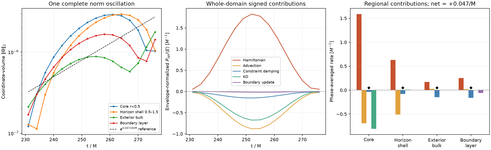
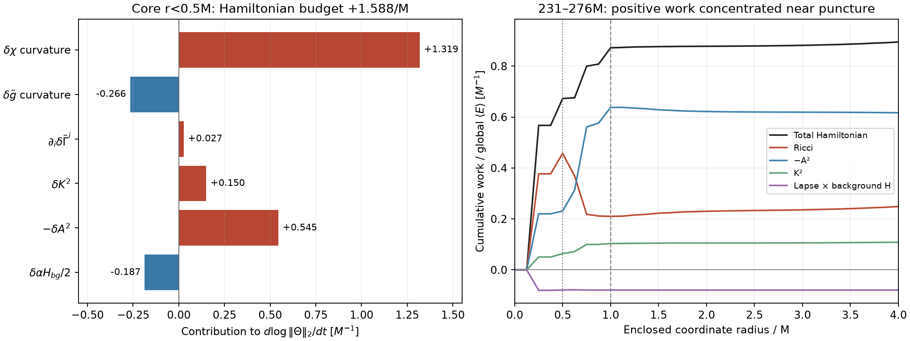

# Where the late residual mode obtains Theta energy

The original vacuum trumpet control is **not stable**. A wider box removes immediate boundary-stencil injection, but later develops an oscillatory growing mode. Five interior-norm peaks give gamma = 0.047244/M (e-folding time 21.17 M). The first run stopped cleanly at its 25-minute cap at 229.35 M, short of 1000 M; a validated diagnostic continuation reached 276.075 M. Finite histories, zero bad-metric counts and a fully scanned finite checkpoint do not establish stability.

The audited configuration is box [-4,4] M, dx = 0.25 M, eight 16³ blocks, sixth-order spatial derivatives, one process/two OpenMP threads, background-adapted gauge, kappa1 = 0.1/kappa2 = 0, KO = 0.5, characteristic zero-rate boundaries and cubic ghosts. Excision and sponge are disabled; matter feedback is zero. The lapse pulse has amplitude 1e-8, center (0.75,0,0) M and support radius 0.5 M. The executable is an immutable pre-change copy; its SHA256, input hash, settings and checkpoint validation are in [the phase evidence](evidence/upstream-phase-budget.json).

## Three distinct observations

1. **Initial seed:** before the imposed pulse, active and ghost residuals are exactly zero. With only lapse perturbed, identical full/background Hamiltonians still produce `delta-alpha * H_background_discrete / 2`. Its first volume peak is 3.57347e-11 at (0.625,0.125,-0.125) M. Independent evaluation predicts it within 6.1e-9 relative error. The small [-2,2] M box also has immediate boundary injection because the differentiated-RHS boundary stencil overlaps the pulse; the wider box does not.
2. **Late amplification:** the231–276M operator audit finds positive Hamiltonian work concentrated near the puncture. The eight nearest cells at r = 0.216506 M supply 60.7% of the **net signed global Hamiltonian contribution**; r < 0.5 M supplies 72.0%. The initially identified lapse/background-H term is now damping, so it is not the late amplifier.
3. **Ghost failure:** cubic extrapolation can eventually generate a non-positive-definite ghost metric. The [separate metric-input replay](evidence/metric-input-event.json) identifies that failure before primitive recovery; the stellar campaign's outer-ghost failure is another observation. Neither identifies the initial seed or proves that its growing mode is identical to this vacuum core mode.

The representative late work peak is (0.125,0.125,0.125) M, rank 0, **global block ID 7**. All eight blocks belong to rank 0. Snapshot metadata report **absolute logical level 1 with root_level = 1**, hence **relative refinement level 0**; this is a uniform grid with no refinement interface. Earlier diagnostic CSVs may use relative levels. Do not interpret logical level 1 as an added refinement level. Near-equal peaks occur among the eight sign-related nearest cells.

## Full-phase budget and upstream fields

Use coordinate-volume E=sum(Theta² dV) and P_op=sum(Theta RHS_op dV). Rates below are integral(P_op w dt)/integral(E w dt), with w = exp[-2 gamma (t - 231 M)] and gamma fitted independently from the earlier peaks. No time derivative of a proper-volume metric weight is included. Sixteen RK stage 1 samples span one 45 M norm/energy oscillation, approximately half a signed-mode period.

Whole-domain rates are volume +0.397859, KO −0.340385, boundary update −0.010242, yielding +0.047232/M. In the core, volume +0.856371 and KO −0.809121 yield +0.047250/M. Regional gains can include transfer across the region, and a negative direct boundary term does not prove spectral stability of the complete boundary condition.

The implemented H=R+(2/3)K²−A², K=Khat+2Theta, gives the following core Hamiltonian decomposition:

| Source of core Hamiltonian work | Rate, M^-1 |
|---|---:|
| delta-chi curvature | +1.318652 |
| Conformal-metric curvature coupling | −0.266342 |
| Evolved-Gamma divergence | +0.026706 |
| K² perturbation | +0.150257 |
| −A² perturbation | +0.545474 |
| delta-alpha H_background/2 | −0.186591 |
| **Total Hamiltonian** | **+1.588156** |

The remaining volume contributions are Theta advection −0.692551 and explicit constraint damping −0.039233/M. Direct conformal-metric Laplacian/connection terms are negligible in this phase average. The positive chi response contains substantial cancellation: residual Laplacian +1.603718, background-gradient coupling +2.552326, background-coefficient response −2.837393/M. The shear contribution is chiefly delta-A (+0.594507), offset by inverse-metric response (−0.049033). This points toward a coupled core chi/A/gauge balance, rather than an isolated direct Theta-advection source.

The conformal connection definition constraint Q=Gamma_evolved−C[gtilde] is substantial: its core weighted norm is 2.63 times the evolved-Gamma norm. Nevertheless its direct Ricci divergence contribution is **−0.426677/M**, offsetting metric-defined C divergence +0.453383/M. Resetting Gamma=C is therefore unsupported as a cure by this audit. That composed divergence is measured only where stored stencils fit: max|coordinate| <= 3.375 M. Core/horizon/exterior-bulk masks are complete; partial boundary/global divergence entries are explicitly labeled in [the upstream evidence](evidence/upstream-hamiltonian-budget.json).





## Verification, limits and reproduction

Independent reconstruction of the C++ Hamiltonian source agrees within **4.39e-14 maximum absolute error** across all saved cells/times. Full-state overlapping block ghosts agree exactly. Field-linearization phase remainders are below 7e-10/M in the core. No source changes or extra evolution were made for the upstream audit.

At 3 M cadence, raw unweighted trapezoid closure is imperfect: 14% globally and43% in the core, relative to the endpoint energy change. Removing the independently measured envelope reduces closure errors to 0.10%/0.33% of initial E; Simpson versus trapezoid changes the normalized net rate by less than 1.1e-5/M. These are component-norm diagnostics, not a covariant energy or a multi-field eigenvalue proof.

Analytic background derivatives are not a demonstrated cure. The adapted gauge already differentiates residuals directly; analytic jets change geometric feedback. An earlier **Kerr–Schild/frozen-core** analytic-jet prototype preserved zero exactly but retained gamma≈0.132/M growth over 30–60 M and stopped at 64.2 M. A separate matched **trumpet** prototype subsequently reached300M with gamma200–300=.047158/M and exteriorThetaL2=1.693e-5, worse than the original small-box control. Its initial discrete Hamiltonian seed vanished, but the later growing mode remained. These are different backgrounds/configurations. See [CONTROL_RESULTS.md](CONTROL_RESULTS.md) for KO, timestep, damping and refinement outcomes; no blanket reset or production change follows from this budget.

The two JSON files retain signed E/P sample series, phase rates, checks and provenance. Recompute any included rate directly, for example:

```python
import json
import numpy as np
from pathlib import Path
p = Path("analysis/tde_stability/evidence")
a = json.loads((p / "upstream-phase-budget.json").read_text())
b = json.loads((p / "upstream-hamiltonian-budget.json").read_text())
t = np.array(a["times_M"])
w = np.exp(-2 * a["envelope_gamma_per_M"] * (t - t[0]))
s = b["samples"]["core"]
rate = np.trapezoid(np.array(s["P"]["R_phi_delta_chi_linear"]) * w, t)
rate /= np.trapezoid(np.array(s["E"]) * w, t)
print(rate)  # 1.318652 / M
```

The 1.44 GB signed snapshots are retained locally under `review/stability-isolation-20260919/localization/wide16_phase_cycle`, not in Git. With those arrays, `analyze_phase_cycle.py` and `audit_upstream_hamiltonian.py` in the parent localization directory regenerate the full diagnostics; their hashes are recorded in the phase evidence. The tracked `inputs/vacuum_pulse.athinput` preserves this physical control, with additional output/default-disabled diagnostic options. Keep all experimental operator switches and sponge disabled when reproducing this baseline.
