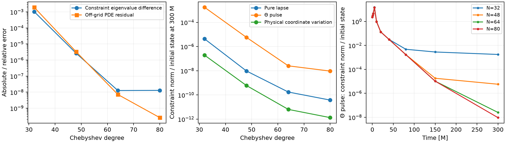

# Differential physical-constraint boundary: bounded radial pilot

**The differential Bjørhus target is a viable next implementation candidate.** Unlike the previous algebraic endpoint replacement, it removes the fast positive grid eigenmodes, recovers the damped constraint branch, and gives convergent, finite full-state vacuum transients through 300M. This is a linear spherical annulus result, not a validated three-dimensional or nonlinear boundary condition. Physical-constraint preservation is convergent here, not exact at finite resolution.

## Concrete equations and sign convention

The background, state and independently validated volume operator are unchanged from `../../stability-modes-20260919/constraint-lower-order/radial-volume`: current Z4c, background-adapted G2, `R0=M=1`, original `kappa1=.1`, `kappa2=0`, annulus `.2 <= r <= 4`. Evolve all eight state fields with their PDE rows; do not replace endpoint PDE rows with algebraic constraints.

At the **outer** endpoint the derivative is toward increasing r. Set

```
R = r+1; alpha = r/R; chi = alpha^2; b = r/R^2
c = alpha^2; v = c-b; lambda_in = b+c
sigma = .1*alpha
q = Gamma - h' - 3*h/r
C1 = alpha*Theta + chi*Gamma/2 + u'
C2 = 4*k/(3*alpha) + 2*Theta/(3*alpha) - 2*A/alpha - Gamma + h'

FTheta = alpha*H/2 + c*Theta' + alpha*chi*(q'+2*q/r)/2
         + (v/R - 2*sigma)*Theta
Fq     = 2*alpha*M + 2*alpha*Theta' + c*q'
         + (v/r - 2*sigma)*q.
```

H and M are the **physical** constraints, with the metric-defined connection and every variable-background coefficient retained. These F expressions are the continuum volume RHS forms of `Theta_t+v*(Theta'+Theta/R)` and `q_t+v*(q'+q/r)`. The exact identities established previously are `FTheta=alpha*C1'+LTheta` and `Fq=-chi*C2'+Lq`.

Let `dot(C1)_vol` and `dot(C2)_vol` be the incoming characteristic rates computed from the **immutable complete volume RHS**, including the time derivatives of u′ and h′. The differential boundary targets are

```
target_C1_rate = dot(C1)_vol - lambda_in*FTheta/alpha
target_C2_rate = dot(C2)_vol + lambda_in*Fq/chi.
```

Thus the principal normal derivative in each incoming evolution is replaced by its radiation-compatible value while retaining its lower-order volume terms. Keep the two independent incoming lapse/shift gauge rate targets zero, as in the existing `zero_rate` choice. Solve the existing nonsingular four-by-four incoming p-map for corrections to `(k_t,Theta_t,A_t,Gamma_t)`. All eight PDE rows remain evolution equations. This is exactly `p_only.build()`; it is not a direct assignment to Theta/Gamma or a reset of a small residual.

This formula is for this increasing-r outer-normal convention. Other face orientations, nonlinear coefficient derivatives, tangential terms, and covector transport in a Cartesian implementation require the separate three-dimensional derivation. Do not transplant the scalar 1/r terms into raw Gamma components.

## Inner gauge condition and finite-grid limitation

Physical constraints and both lapse characteristics leave the annulus at r=.2; one shift characteristic enters it. The pilot freezes that incoming gauge rate by correcting the inner Gamma RHS, as documented in the script. This is an artificial annulus condition; the production puncture has no such inner boundary.

The p-only correction alters some outgoing characteristic rates at finite resolution because the normal derivatives of metric/gauge RHS are held fixed. That fact alone does not invalidate this differential discretization: the measured endpoint full-PDE defect and actual physical-radiation residual converge to zero for resolved smooth modes. Nevertheless, exact outgoing preservation or exact finite-grid physical-constraint preservation is **not** claimed. The original rank-deficient attempt to impose both actual Theta/Gamma radiation rates and both gauge rates by local p-only overwrite is still invalid; these differential targets are a different construction.

## Spectrum and independent continuum check

All finite eigenvalues of the full eight-field matrix were inspected. No high-frequency positive branch grows as N², unlike the previous algebraic endpoint closure.

| Chebyshev degree | Largest Re eigenvalue [1/M] | Constraint branch [1/M] | Off-grid relative full-PDE residual |
|---:|---:|---:|---:|
| 32 | +1.3750e-4 | -0.0717484655 | 1.94e-3 |
| 48 | +5.2151e-7 | -0.0727880016 | 3.33e-6 |
| 64 | +8.9693e-10 | -0.0727906808 | 7.14e-9 |
| 80 | +4.5519e-8 | -0.0727906805 | 2.60e-10 |

The independent constraint-only result is `-0.072790693446/M`. At N80 the difference is `1.30e-8/M`; the endpoint full-PDE relative defect is `3.91e-9`; actual dynamic Theta/q radiation relative defects are `2.40e-8` and `3.79e-7`. The off-grid test samples 512 points and differentiates the eigenprofile polynomial independently of its collocation equations.

Small near-neutral eigenvalues remain numerically positive, and the double-precision result does not prove strict negativity of the complete spectrum. The N80 fastest near-neutral eigenvector has physical constraint/state ratio `3.48e-8`; its value changes nonmonotonically near zero with resolution. The useful result is removal of the former fast grid instability and convergence of the physical branch, not an assertion that every mode has been proved damped.

## Transient tests and numerical cross-check

Three independent linear initial states use `f=[(r-.2)*(4-r)/1.9^2]^8`: a pure lapse pulse, a Theta pulse, and the exact constraint-free radial-coordinate variation derived in the earlier volume validation. The profile and its first seven derivatives vanish at the endpoints. The amplitudes are normalized to one for conditioning; linearity permits arbitrarily small amplitudes. No clipping, damping layer, projection onto the constraint surface, or resetting is used.

All runs remain finite through300M. The initially nonzero constraints show a transient increase before decaying. Final combined grid L2 constraint norm divided by initial state norm is:

| Degree | Pure lapse | Theta pulse | Physical coordinate variation |
|---:|---:|---:|---:|
| 32 | 4.32e-6 | 1.77e-3 | 1.94e-7 |
| 48 | 9.64e-9 | 5.77e-6 | 6.04e-10 |
| 64 | 1.75e-10 | 2.55e-8 | 6.42e-12 |
| 80 | 3.77e-11 | 9.40e-9 | 1.34e-12 |

These are repeated short matrix exponentials with subdivision .1M. Halving to .05M at N80 yields `1.92e-11,6.62e-9,8.50e-13`; the final state changes by at most `1.18e-4` relatively among these three cases. These small constraint values should not be assigned more precision than that cross-check supports.

A single direct `expm(A*300)` gave much larger, nonconvergent constraint contamination. The second-order matrix is strongly scaled/nonnormal (N80 one-norm about2.31e6). The mathematically identical short-exponential semigroup, repeated at two subdivisions, exposes that large-exponential numerical error. The original direct-exponential artifacts remain saved and are not used as evidence for physical secular growth or for the final accuracy claims.

At5M the Theta-pulse actual outer radiation defects decrease from `(4.48e-4,3.24e-3)` at N32 to `(1.09e-8,6.07e-7)` at N80. This is an enforcement/convergence check, **not** a measured zero physical reflection coefficient: finite-radius curvature scattering and the leading radiative approximation remain. Peak-radius histories for H/M/Theta/q are saved. Early numerical contamination can appear at either boundary; by1–5M the pure-lapse H maximum is at the outer boundary in the checked N64/N80 cases, decreasing with refinement. It is not justified to attribute all residual error to the artificial inner condition.



## Alternatives screened and limits

A first-order twelve-field reduction with full incoming right-eigenvector corrections was also built. Prescribing incoming normal derivatives removed the old fast grid branch but retained growing reduction-constraint modes. Directly enforcing actual Theta/q radiation rates with those full eigenvectors satisfied the physical radiation rows but generated order-one auxiliary `d-q′` errors and positive grid modes. Adding auxiliary reduction damping1,5,10 did not cure it. These trials remain as negative artifacts (`first_order.py`, `first-n32.json`, `physical-*.json`); they are not the selected candidate, and no such auxiliary damping is in `p_only.py`.

The selected pilot justifies an opt-in three-dimensional zero/pulse test with carefully derived Cartesian geometry and tangential terms. It does not validate the stellar problem, AMR, ghost treatment, a nonlinear constraint surface, or the vacuum gate for spinning evolution. The radial code changes only this separate analysis directory; no AthenaK source or jobs were changed here.

## Reproduction

NumPy, SciPy and Matplotlib are required. From this directory:

```
OPENBLAS_NUM_THREADS=1 OMP_NUM_THREADS=1 python transients.py
OPENBLAS_NUM_THREADS=1 OMP_NUM_THREADS=1 python transients_semigroup.py
OPENBLAS_NUM_THREADS=1 OMP_NUM_THREADS=1 python summarize.py
```

`p_only.py` is the selected boundary operator; `summary.json` is the compact numerical record. The report depends on the existing exact radial volume and constraint maps in the earlier analysis directory. The plotted figure was visually checked. `manifest.json` records reproducible source/evidence hashes and marks earlier exploratory artifacts.
