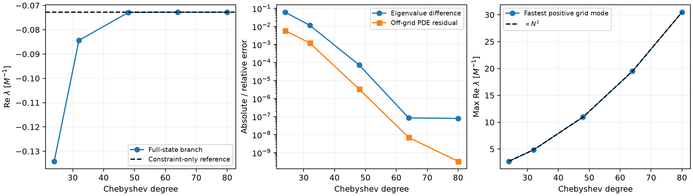

# Bounded spherical full-state boundary closure test

The continuum lift is consistent, and a damped physical-constraint eigenbranch is recovered from the full-state operator. **The tested endpoint discretization is not stable:** it also produces positive high-frequency grid modes whose growth increases approximately as the square of resolution. This is a failed numerical closure prototype, not an AthenaK boundary fix. No AthenaK source, production input, or job was changed.

## Exact scope and equations

This is the linear spherical vacuum sector on the annulus `0.2 <= r/M <= 4` of the analytic `R0=M=1` trumpet. It uses current Z4c, the background-adapted G2 gauge, `kappa1=0.1`, `kappa2=0`, and original coordinate damping `sigma=alpha*kappa1`. There are no matter, tangential, transverse-traceless, mesh-refinement, nonlinear, or discrete puncture effects. The inner boundary is an annulus boundary, not a claimed puncture regularity condition.

The state is `U=(u,h,k,Theta,A,Gamma,ell,s)`, where `u=delta chi`, `h=delta gtilde_nn`, `k=delta Khat`, `A` is the trace-free radial projection (so `delta Atilde_rr=A-2*K*h/3`), and `ell,s` are lapse and radial-shift residuals. The independent volume operator in `../radial-volume` supplies `U_t=A2(r)U''+A1(r)U'+A0(r)U`. Its gauge equations are exactly `ell_t=b*ell'-2*alpha*k` and `s_t=b*s'+2*Gamma-2*s`.

Let `R=r+1`, `alpha=r/R`, `chi=alpha^2`, `b=r/R^2`, `c=alpha^2`, and `v=c-b`. The physical radial connection constraint is `q=Gamma-h'-3*h/r`. Hamiltonian and momentum constraints include every trumpet coefficient and derivative, as implemented explicitly in `boundary_operator.constraints()` and independently verified in the volume derivation. The candidate outer conditions are

```
Theta_t + v*(Theta' + Theta/R) = 0
q_t     + v*(q'     + q/r)     = 0.
```

The distinct falloffs are geometric: `R*Theta` and `R*Z_hat=r*q/2` are the outgoing-amplitude variables. This remains a leading radiative approximation at a finite curved boundary, not an exact absorbing condition. Using the exact constraint propagation equations gives

```
FTheta = alpha*H/2 + c*Theta' + alpha*chi*(q'+2*q/r)/2
         + (v/R-2*sigma)*Theta = 0
Fq     = 2*alpha*M + 2*alpha*Theta' + c*q'
         + (v/r-2*sigma)*q = 0.
```

These are homogeneous in physical constraints. They do not set `C1` or `C2` to zero: physical mass and coordinate perturbations can have nonzero incoming full-state amplitudes while all physical constraints vanish. The exact identities `FTheta=alpha*C1'+LTheta` and `Fq=-chi*C2'+Lq` and all lower-order coefficients are documented in `../NEXT_BOUNDARY.md` and `../boundary-lift-identities.json`.

## Incoming gauge data and independent checks

Four conditions are needed at the outer boundary: two physical-constraint conditions and the existing independent incoming lapse and shift gauge data. At `r=0.2`, both physical-light directions and both lapse directions point out of the annulus, but one shift-gauge direction points into it. Therefore **one additional inner shift gauge condition is required**, for five in total. Coordinate speeds are saved in every spectrum JSON; at the inner boundary the shift speeds are approximately `-1.77188,+1.49410` while the physical-light speeds are `-0.16667,-0.11111`.

Gauge rows are the actual scalar characteristic rows from `z4c_Sbc.cpp`. Homogeneous frozen incoming amplitudes are equivalent to `zero_rate` for nonzero temporal eigenvalues on this stationary background. This comparison does not determine the zero-frequency integration constants. The full-state characteristic rows for both signs, including lapse, shift, C1 and C2, agree with the independently constructed principal operator to maximum relative error `1.41e-16` (`principal-crosscheck.json`). The five boundary rows have rank five.

The separate volume validation established exact symbolic `C L = L_constraint C` for all four physical constraints, and an independent Cartesian complex-step point-RHS check over 35 random radial jets had maximum relative error `7.67e-16`. Exact physical mass and radial-coordinate directions satisfy `H=M=q=Theta=0`. These validate the continuum volume and constraint maps, not the numerical endpoint replacement.

## Tested discretization and convergence

`full_spectrum.py` uses Chebyshev Lobatto collocation. It replaces the outer `k,Gamma,Theta,A` PDE rows and the inner `Gamma` row with the five differential boundary conditions, yielding five infinite generalized eigenvalues. This is deliberately a diagnostic trial of an endpoint closure; it does not preserve the discrete constraint intertwining identity by construction. All finite eigenvalues were inspected, not only a low-frequency filter.

| Degree | Re lambda of matched constraint branch [1/M] | Off-grid relative full-PDE residual | Maximum Re lambda of any finite mode [1/M] |
|---:|---:|---:|---:|
| 24 | -0.134139829 | 5.87e-3 | +2.72047 |
| 32 | -0.084371341 | 1.20e-3 | +4.85893 |
| 48 | -0.072862725 | 3.32e-6 | +10.96001 |
| 64 | -0.072790609 | 6.94e-9 | +19.49686 |
| 80 | -0.072790772 | 3.32e-10 | +30.47216 |

The independently resolved constraint-only branch is `-0.072790693446/M`. At degrees 64 and 80 the full-state branch agrees within `8.5e-8/M`; the eigenvalue error levels off even while off-grid and endpoint PDE residuals continue decreasing, so higher accuracy is not claimed. At degree 80 the replaced-endpoint full-PDE relative residual is `2.53e-9`, and independent dynamic radiation residuals are `7.8e-7` and `7.6e-6` relative. Off-grid checks evaluate the full eight-field polynomial and its analytic polynomial derivatives at 512 independent midpoint samples.

The fastest grid modes tell a different story. At degree 80 a representative fastest eigenvalue is approximately `30.4722-190.1306 i` per M. Their positive real parts satisfy `max(Re lambda)/N^2 -> 0.00476/M`. They obey the five imposed algebraic rows to roundoff but have an approximately `0.532` full-PDE defect at replaced endpoints and approximately `0.997` relative defect in the dynamic Theta radiation condition. Algebraic row satisfaction alone therefore does not establish the intended evolution boundary condition. Resolution worsens these modes.



## Interpretation and stopping point

This experiment supports a realizable smooth *continuum branch* for the physically weighted outgoing constraint condition. It does **not** establish a stable full-state initial-boundary-value discretization, continuum well-posedness, puncture regularity, or a cure for the measured three-dimensional instability. The positive high-frequency grid modes are not evidence that the finite-radius continuum condition itself is unstable: they retain large endpoint evolution defects as resolution increases.

An independent read-only inspection by the volume author found no characteristic-count or endpoint-index error and identified the same compatibility issue: `q_t` includes differentiated `h_t`, whereas arbitrary removal of endpoint momentum equations does not preserve that induced relation. A valid next implementation would need a coupled incoming-characteristic Bjørhus/SAT or compatible first-order reduction that preserves both the independent gauge data and the induced physical-constraint evolution, with a demonstrated discrete stability estimate or convergent full spectrum. No such three-dimensional implementation is inferred or supplied here. The bounded test ends at this identified numerical obstruction.

## Reproduction

With NumPy, SciPy and Matplotlib available, from this directory:

```
OPENBLAS_NUM_THREADS=1 OMP_NUM_THREADS=1 python check_principal.py
OPENBLAS_NUM_THREADS=1 OMP_NUM_THREADS=1 python full_spectrum.py --degree 80 --output full-areal-n80.json
OPENBLAS_NUM_THREADS=1 OMP_NUM_THREADS=1 python summarize.py
```

The committed diagnostic bundle should preserve all five `full-areal-n*.json` files, the independent `radial-volume` files and the constraint-only reference. `convergence.json` contains exact numerical values and limitations; `manifest.json` hashes this bundle and its direct derivation dependencies. Only local linear algebra was run; the plotted figure was visually checked.
