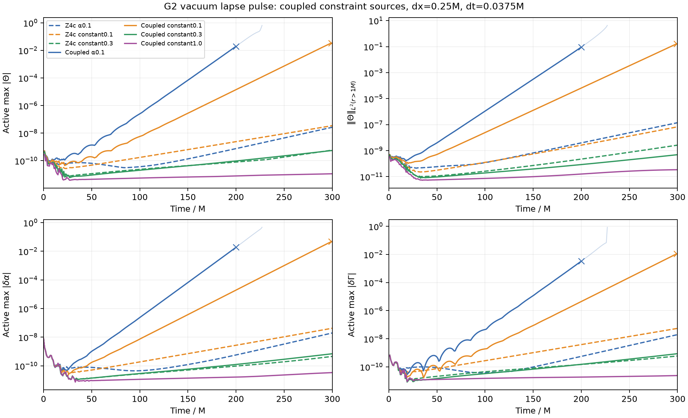

# Isolated coupled constraint-source prototype

This is a **default-off experimental formulation change**, not a validated stability fix. It restores the complete lower-order geometric constraint sources listed in [the upstream audit](../constraint-lower-order/AUDIT.md), together with the published CCZ4 Gamma damping factor. It retains the G2 background-adapted residual gauge and the existing spatial, boundary and projection operators. No production source, executable, checkpoint or Aurora job was changed.

The detached worktree is `/Users/hz0693/research/TDE/athenak-covariant-sources`, based on `1b93538a`. `prototype.patch` includes the separately developed lapse-adjusted damping option and this coupled source addition. The immutable pilot binary is `athena-covariant-sources`; source and binary hashes are in `manifest.json`. The separate `athena-covariant-modehook` additionally contains the previously reviewed complete-state import/export hook, saved as `mode-hook.patch`. Pilot runs use the binary without that hook.

## Operator and convention

Set `z4c/ccz4_covariant_sources=true` to enable the prototype. Its default is false. It requires `chi_psi_power=-4` and `use_z4c=true`; unsupported choices fail during setup. For `Q^i=Gamma_evolved^i-Gamma_metric^i` and `Z^i=chi Q^i/2`, the additions are:

```
delta Khat_rhs  = 2 Z^i d_i alpha
delta Theta_rhs = alpha tr_gamma(E)/2 - alpha K Theta - Z^i d_i alpha
delta Atilde_rhs = alpha chi E_TF - 2 alpha Theta Atilde
delta Gamma_rhs^i = -2 gtilde^ij Theta d_j alpha - 2 alpha K Q^i/3
                    + 2 Q^i div(beta)/3 - Q^j d_j beta^i
```

Here `E_ij = D_i Z_j + D_j Z_i - gtilde_k(i d_j) Q^k`, evaluated using the existing first derivatives through its equivalent expression without derivatives of Q. The same helper acts on full and background states, and its outputs are subtracted in the residual branch. Identical finite evaluations therefore cancel exactly. The physical trace is `chi` times the conformal trace, and the A trace-free projection uses the conformal inverse consistently.

The prototype also changes Gamma damping from the repository's `-2 sigma Q` to the CCZ4 publication's `-sigma Q` in standard, residual and diagnostic paths. This is deliberate: retaining the old factor would be a different hybrid. Khat and Theta damping retain their existing coefficients. `sigma=alpha*kappa1` with `damp_lapse_scaled=false`; `sigma=kappa1` with `damp_lapse_scaled=true`. The latter evaluates the bounded source product directly without division by a collapsed lapse. Matter and gauge sources are unchanged. Every geometric addition vanishes for Theta=Q=0; the new Gamma damping does too. This does not mean finite constraint perturbations remain unchanged.

## Validation

All source checks passed before the pulse pilots were started:

- `point_source_test.py` compiles against the actual C++ helper and compares 72 points against an independent physical-metric Christoffel construction of D_i Z_j. Maximum absolute error was 1.74e-18; the added source was exactly zero in the eight Theta=Q=0 cases. The maximum trace of the A addition was 9.22e-19.
- Exact vacuum with constant sigma=.3 stayed exactly zero in all 18 retained state/RHS arrays through three complete RK3 steps, including physical ghosts. The peer review also checked nine full/background input arrays for byte equality.
- With the covariant flag off, all 54 retained arrays matched the previous lapse-damping binary bitwise.
- A fresh atmosphere with rho=1e-14 and normal matter feedback had unchanged initial volume RHS bitwise, including nonzero Theta matter response (maximum 1.927e-13), and completed one finite step with the existing boundary matter gate unchanged.
- Matched enabled/disabled single-step probes from the finite 500.025M G2 checkpoint had identical full inputs. Their volume-RHS difference matches an independent physical-Christoffel calculation at every active cell to maximum 3.76e-16 (relative L2 3.86e-12). The chi, metric, lapse, shift and B differences are exactly zero. This includes all Khat, Theta, Gamma and A corrections and the Gamma damping-factor change.

`source-regression.json` and `point-source-results.json` retain the numerical checks. [PEER_REVIEW.md](PEER_REVIEW.md) records a separate read-only review. The first attempted matter probe used rho=1e-9 and was rejected by the pre-existing characteristic boundary energy ceiling 1e-12; its directory/log is retained. This source-validation configuration was rejected by the existing matter gate; no nonfinite-metric event occurred in that attempt. The successful probe reduced the test density; no gate was weakened.

The default-off code has one inherited comment referring to the original Gamma convention, but the enabled branches and this report explicitly record the 2-to-1 change. No equation ambiguity is hidden by the comment.

## Matched pulse experiments

Four independent fresh-start CPU controls use one 16^3 block in [-2,2]^3 M, dx=.25M, dt=.0375M, RK3, sixth-order derivatives, cubic ghosts, the zero-rate characteristic boundary, and a 1e-8 lapse pulse centered at (.75,0,0)M with support radius .5M. G2 has residual_lapse_f=1, background f=2, shift_Gamma=2, eta=2. Matter feedback, inner excision and outer sponge are disabled. Each run targets 300M with a 20-minute application wall cap, OMP2 and per-rank restarts every 100M.

The cases are `covariant_alpha01` (sigma=.1alpha), `covariant_const01` (sigma=.1), `covariant_const03` (sigma=.3), and the separately authorized damping-dependence control `covariant_const10` (sigma=1). `run_pilots.py` supports case names as arguments and refuses to overwrite an existing case directory. Only the last was added after the original three started. It does not cancel or alter those runs.

All four pilots have ended. `pilot-results.json` records actual attained times, process exit, checkpoint validity and incomplete fitting windows; `summarize_pilots.py` refreshes the comparison and fits. Rates below are least-squares slopes of log exterior Theta L2 over the stated saved times, not eigenvalues.

| Coordinate damping product | Last history time | First invalid metric / application outcome | Exterior Theta growth rate | Final active max Theta |
|---|---:|---|---:|---:|
| sigma=.1alpha | 227.025M | Ghost invalid at 199.7625M; abort at 228M | .113109/M, 100.0125–199.0125M | .646, after invalidity |
| sigma=.1 | 300M | Ghost invalid at 298.05M; exit0 at target | .079039/M, 200.025–298.0125M | .03675, after invalidity |
| sigma=.3 | 300M | Target reached; final checkpoint valid | .017526/M, 200.025–300M | 5.529e-10 |
| sigma=1 | 300M | Target reached; final checkpoint valid | .007886/M, 200.025–300M | 1.135e-11 |

The coupled sources worsen the first two profiles. Constant sigma=.3 reduces growth but retains a discrete growing mode, independently verified below. Sigma1 gives the smallest amplitudes of these controls, but its exterior norm still rises. Its fitted rates in 50–100, 100–200 and 200–300M windows are .005033, .007638 and .007886/M; the last fit has R²=.971 and does not establish either saturation or a single asymptotic exponential mode. The actual exterior norm at300M is 3.415e-11. Its active maximum grows more slowly (.003427/M over200–300M), so selected peak histories cannot substitute for an integrated constraint diagnostic.

Both failed profiles first log the fourth ghost corner at (-2.875,-2.875,-2.875)M, rank0, global block0, local block0, relative mesh level0, during stage1 C2P. The sigma=.1alpha first determinant is -2.1454e-8; for constant sigma=.1 the second principal minor is -.7931 even though the determinant is +.03449. These are the first *recorded invalid metrics*, after substantial earlier constraint growth; their coordinates do not identify the mode's origin. The t=200.025M sigma=.1alpha checkpoint and t=300M sigma=.1 checkpoint each contain eight indefinite ghost metrics despite determinant approximately one after projection. Positive determinant alone does not imply a positive-definite metric. Neither was restarted. The sigma=.3 and sigma1 final checkpoints pass the independent all-field finiteness and ghost-inclusive positive-definiteness check. See each case's `checkpoint-validity.json`.

The separate `covariant_const10_continuation` reached1000M from the validated exact300M checkpoint, using the same immutable source-only binary, physics and OMP2. It reached its simulation target with exit0 in1070seconds, before the25-minute application cap. The final checkpoint is finite with valid active/ghost metrics and no logged invalid-state or recovery event. Its max abs(Theta)=2.1471e-10 and exterior norm=6.9042e-10. The latter rises2.924 times over750–1000M (fitted gamma.0043653/M, R².99893), so this is not saturation. See `long-results.json` and `long-comparison.png`; the dotted line marks the300M restart. This report's original table and figure intentionally retain the fresh pilots'300M endpoint.

These are finite-resolution single-block CPU **vacuum-gravity** controls, not full-domain, MPI/GPU, matter or continuum stability results. Passive fluid still evolves while `zero_tmunu_feedback=true`; for example, sigma1 rhoMax increases from4e-24 to2.764e6 by300M. Its suppression from stress-energy feedback is essential to interpreting these runs. The one-step matter-response validation above demonstrates correct response at initialization, not long-term atmosphere stability.



A cross marks the first saved sample at/after the first invalid ADM report; subsequent values are faint and excluded from growth fits. The plotted exterior norm is the square root of the proper-volume Theta integral outside the actual trumpet horizon r=1M. The problem generator overrides the legacy input history radius. Raw Hamiltonian norms contain the stationary background's discretization error; small total-norm changes alone do not establish decay of perturbations.

The independent [complete-map analysis](modes/README.md) validates two sigma=.3 discrete growing branches, gamma=.0230762/M and approximately .009180/M. Signed physical H, M and Q reproduce their growing multipliers. A separate sigma1 search supports an oscillatory growing branch with gamma=.0017866/M, e-fold559.7M and period251.7M, confirmed by amplitude, one-step and physical-constraint tests. Its active eigen-residual is8.5e-5. A faster real candidate remains unconverged. A finite Krylov search is not a complete spectrum, and these are discrete global modes, not proof of continuum origin. Earlier sigma1 responses of the sigma.3 vectors were transient probes, not eigenvalues. No tested profile is a validated stability cure.

## Reproduction

Build the detached source with the same OpenMP CPU CMake options as the original pilot. Compile `point_source_driver.cpp` with the prototype's `src` include path, then run `point_source_test.py` with NumPy/SciPy. `run_validation.py` produces the matched snapshots; `check_validation.py` checks them. The helper tests use no Kokkos evolution. Both evolution scripts verify the immutable source-only binary hash and refuse existing case directories. `run_validation.py` no longer copies from the mutable build directory, which now contains the separate mode hook. Reproduction requires the stored source-only executable or a verified rebuild before running that script. `summarize_pilots.py` needs NumPy/Matplotlib. Keep BLAS at one thread.
