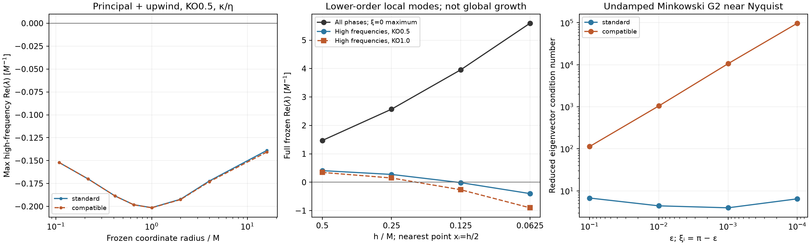

# Sixth-order tensor-symbol audit, G2 analytic trumpet

**No sampled high-frequency principal instability was found in the standard discretization.** The tensor-compatible alternative did not repair the local growing modes found after including background gradients and algebraic terms. A compatible-derivative implementation is therefore not justified as a demonstrated fix. All work here is offline Python; no source changes, evolution jobs, or Aurora actions were made.

G2 means residual_lapse_f=1, f_background=2, shift_Gamma=2, eta=2. The background is the same analytic trumpet, alpha=r/(r+1), chi=alpha², conformal metric=I. Its values and the actual sixth-order background derivative stencils are used where stated.

## What was tested

The full projected principal symbol contains **20 degrees of freedom**: chi, five determinant-compatible metric components, Khat, five trace-compatible A components, three Gamma components, Theta, lapse and three shift components. Scalar/vector/tensor couplings are kept in one matrix; a scalar Theta equation alone is not substituted for that system. Inactive B fields are excluded. The full local Jacobian additionally includes background A/K, derivative and algebraic couplings, and the exact tangent of the implemented metric/A projection, including the A_background:delta-g term in the trace constraint.

The standard first-derivative symbol is

    D_i = i [1.5 sin(xi_i) − 0.3 sin(2xi_i) + sin(3xi_i)/30] / h.

The diagonal second derivative is

    D_ii = [−49/18 + 3 cos(xi_i) − 0.3 cos(2xi_i)
            + cos(3xi_i)/45] / h²,

with mixed derivatives D_i D_j. The actual direction-dependent sixth-order upwind stencil and KO symbol `−diss sum sin(xi_i/2)^8 / h` are included in separate tests. RK3 is evaluated with its polynomial `1+z+z²/2+z³/6`, at dt=0.3h and/or 0.15h as recorded. These are local spectral amplification factors, not bounds on a nonnormal global evolution.

The comparator follows the tensor structure of Cao and Hilditch: retain the Laplacian, use the trace-free part of repeated first derivatives for scalar Hessians with the original Laplacian supplying the trace, and use repeated first derivatives for vector grad-div. Their analysis is for a linear constant-coefficient problem with gauge-dependent degeneracies; it is not a general trumpet stability theorem. See [Cao & Hilditch, arXiv:1111.2177, Eqs. 27–29 and 63–68](https://arxiv.org/pdf/1111.2177).

## Principal and flat-background verification

- An independently assembled Minkowski matrix from the transcribed point geometry agrees with the direct 20-variable principal matrix to 5.7e-14.
- Minkowski tensor/vector/scalar eigenvalues for the compatible comparator agree with the paper's characteristic branches to 3.6e-14.
- Removing background gradients/algebraic terms from the full local Jacobian recovers the principal matrix to 5.7e-14 at four trumpet points.
- A direct nonlinear finite-difference directional check verifies the full local Jacobian wiring, including advection and projection, to 1.4e-9 relative error at perturbation amplitude 1e-6 (3.2e-11 at 1e-7 in the core).

A 4912-wavevector first-octant principal scan, including Nyquist, covers fixed radii 0.108, 0.217, 0.415, 0.650, 1, 2, 4, 16M plus Minkowski. The largest pure-principal G2 real eigenvalue in the standard scan is 2.31e-13, consistent with numerical eigensolver error. Upwind+KO 0.5 makes the high-frequency subset dissipative at every tested trumpet point, with RK3 spectral amplification no greater than 1 at both tested timesteps. This finite sample is not a uniform diagonalizability proof or a bound as alpha tends to zero at the puncture.

With kappa/eta included, the Minkowski small-wavevector branch has tiny positive real parts of order 1e-9/M; they are retained in the evidence rather than rounded away. They are lower-order effects, not the identified high-frequency principal failure, and the tested finite-step RK3 amplification remains below 1.

## Fixed-point versus nearest-cell refinement

The **full local frozen Jacobian** has growing modes even though its principal part passes the sampled tests. At the fixed physical point (0.125, 0.125, 0.125)M, refining h=0.25, 0.125, 0.0625 gives maximum real eigenvalues 2.570, 3.463, 3.585/M, always at xi=0. The high-frequency maxima with KO 0.5 are +0.274, −0.0260, −0.4848/M. The compatible perturbation derivative replacement changes them little.

At the moving nearest-cell point x_i=h/2, a separate scan includes **35,937 phases over all sign combinations in [-pi, pi]^3** for each spacing, using the actual upwind stencil. The maxima match the original first-octant scan:

| h/M | r/M | Full frozen maximum | High frequency, KO 0.5 | High frequency, KO 1.0 |
|---:|---:|---:|---:|---:|
|0.5|0.433013|+1.468577|+0.408581|+0.345980|
|0.25|0.216506|+2.570009|+0.274731|+0.149731|
|0.125|0.108253|+3.957372|−0.014304|−0.264304|
|0.0625|0.054127|+5.595094|−0.399650|−0.899683|

Rates are in M^-1. “High frequency” means max|xi_i|>=pi/2. Actual upwind is included. The pure-principal/upwind/KO 0.5 matrix is dissipative throughout this nearest-cell sequence. The growing full-Jacobian maximum remains at xi=0, where KO vanishes. Its fastest eigenspace is predominantly transverse Gamma/shift and metric/shear, with Theta, chi and lapse essentially zero; scalar coupled branches have other growth rates. These local modes are **not** the measured global Theta mode. Freezing rapidly varying coefficients, especially at xi=0, cannot establish continuum instability, global nonconvergence, or the growth rate of an actual run.

For the full-Jacobian comparator, only perturbation derivative symbols are changed while the baseline background jets are held fixed. It is an operator diagnostic, not a complete proposed alternate evolution. In the principal-only tests this distinction does not arise.

## Why not implement the comparator now?

For G2 on Minkowski, the undamped compatible symbol becomes poorly conditioned as a diagonal wavevector approaches Nyquist: eigenvector condition numbers rise from about 113 to 97,000 as epsilon=pi−xi falls from 0.1 to 1e-4. Direct matrix-exponential checks also show large transient gains. The standard symbol stays modestly conditioned on that sequence. Exact Nyquist is a separate degeneracy and does not display the same conditioning. KO strongly damps these frequencies, so this is a warning about an unconditional theorem/implementation claim, not a demonstrated failure of a KO-damped run.

At sixth order, diagonal repeated first derivatives require a radius-six stencil; current ng=4 cannot provide it directly. An implementation would need a properly exchanged intermediate derivative or broader ghost support, with scalar Hessian and vector grad-div changes made consistently. Since the standard G2 symbol has not failed this audit, that engineering change is not currently a supported repair.

The actionable next step is the parent's full-step/global mode and matched resolution/domain studies. Those retain the coefficient variation, puncture behavior, boundaries and transfers discarded by freezing. Positive Theta work or positive local reaction eigenvalues alone must not be labeled a continuum principal instability.



## Reproduction and files

Run with Python, NumPy and SciPy; one BLAS thread is sufficient:

```
OPENBLAS_NUM_THREADS=1 python3 principal_symbol.py
OPENBLAS_NUM_THREADS=1 python3 verify_symbol.py
OPENBLAS_NUM_THREADS=1 python3 frozen_symbol.py
OPENBLAS_NUM_THREADS=1 python3 verify_frozen_action.py
OPENBLAS_NUM_THREADS=1 python3 nearest_cell_scan.py
OPENBLAS_NUM_THREADS=1 python3 all_signs_nearest.py
OPENBLAS_NUM_THREADS=1 python3 classify_nearest_modes.py
OPENBLAS_NUM_THREADS=1 python3 validate_small_growth.py
OPENBLAS_NUM_THREADS=1 python3 render_symbol_summary.py
```

`point_operator.py` is an independent NumPy transcription of the C++ geometric volume RHS. JSON files preserve every sampled maximum, location/wavevector, settings and verification error. `symbol-summary.png` was visually checked. The principal and original fixed-physical-point scans use the first octant; sign reversal/permutation symmetry covers the conformally flat principal spectrum. The nearest-cell full lower-order scan separately samples all wavevector sign combinations. Every scan is a finite set of phases, not a uniform spectral proof.
