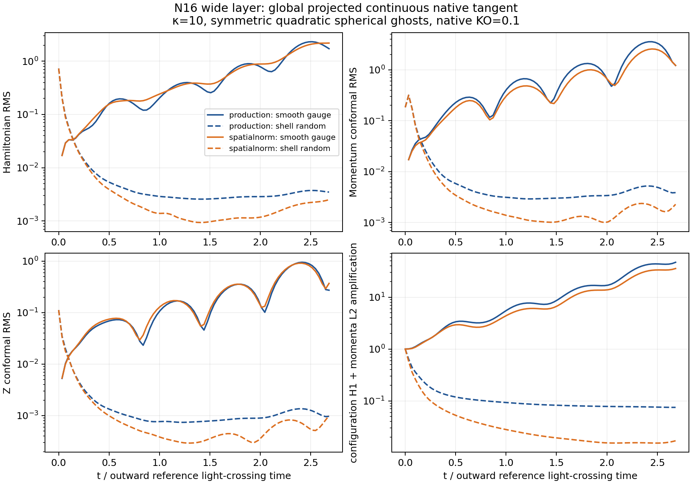

# Tensor constraint propagation and discrete gauge errors

This continues the private spatial-norm gauge investigation after `b37a20f2`.
The production evolution remains implementation `27c19d20`. No stable finite
angular pulse, regular nonlinear scri closure, or black-hole transition has
been established. The later black-hole requirement is explicitly a resolved
wormhole-to-trumpet transition with the **Minkowski hyperboloidal reference
retained throughout**.

The completed timestep and algebraic-projection controls reproduce the growing
constraints. An independent continuum audit corrects the interpretation of
primitive frozen Fourier eigenvectors. A separate discrete audit identifies a
bulk pure-gauge constraint source. The wider compatible derivative is a private
experiment; its early native errors are worse, and it is not adopted.

## Completed native controls

All rows use the same N24 Cartesian angular pulse: lapse amplitude .1, shift
amplitude .02, width .5, S=1, a=.5, geometry .05--.95, gauge .45--.85, kappa10,
degree-two cube-symmetric interior-ray ghosts, KO .1, and the private
spatial-norm gauge from the preceding report. Coordinate t=2 is about 2.68
reference layer crossings. H is the physical Hamiltonian scalar; M and Z use
conformal-metric contractions. Their history RMS values are unweighted over
active Cartesian cells, and are not a constraint-wave energy.

| Control | Initial actual dt | H at t=2 | M at t=2 | Z at t=2 | Run seconds |
| --- | ---: | ---: | ---: | ---: | ---: |
| Spatial-norm baseline | .000427734375 | 1.222186892 | 1.348372697 | .375766082 | 665.1 |
| Half actual timestep | .0002138671875 | 1.222127691 | 1.348560105 | .375743880 | 1380.758 |
| Algebraic projection every RK stage | .000427734375 | 1.222057361 | 1.348737925 | .375723809 | 727.809 |

The largest final relative change in H/M/Z is .0271%. Neither control repairs
the growth. This is a two-timestep sensitivity test, not a measured temporal
convergence order. Changing the global CFL number would not supply this test;
the pole timestep parameter was actually halved.

Each new pulse has 81 full-precision restart snapshots. Every active evolved
field is finite, lapse and chi are positive, the physical spatial metric is
positive definite, and determinant/trace errors remain below 1e-12. Initial
active double arrays match the baseline exactly. Final field differences are
compared at exactly t=2; intermediate history comparisons explicitly interpolate
between cadence outputs. The worst full-field absolute differences are .001288
and .002507 for the half-step and every-stage controls, respectively.
The receipts' historical `physical_metric_eigen_*` keys diagonalize
gtilde/chi, the Penrose spatial metric. Physical metric eigenvalues have an
additional positive Omega^-2 factor at each cell. Positivity is equivalent
on this strict-interior grid; the recorded numerical eigenvalues are conformal.

The stage control changes only the existing hyperboloidal active-cell
algebraic projection cadence. It retains the same ghost continuation and
differential constraints. Its t=.05 reference run has maximum double-array
drift 1.43e-14. A private executable reuses the 182 original objects except
for the recompiled task object; all original source, overlay, object and
library hashes are checked. It is not a production change.

Native BIN field output is binary32, while RST evolved arrays are binary64.
The checked reader validates the native ABI, header time/cycle/dt, field order,
shape, payload size, EOF and source hashes. Every active BIN field agrees
bitwise with the corresponding RST field rounded to binary32. Quantized BIN
differences can exceed the true drift when a value crosses a rounding boundary.
The previous BIN drift figures should be read with that precision limitation.
RST header dt is the mesh dt when written; finalization can update it after
the last clipped step.

A separate pulse with amplitudes .001/.0002 reaches t=2 in 714.678 seconds.
Its final H/M/Z are .00862970/.00546579/.00161061. Dividing by the .01 input
amplitude factor gives .862970/.546579/.161061, or .7061/.4054/.4286 times
the finite-pulse baseline. Thus growth persists at small amplitude, with
substantial amplitude sensitivity by t=2. This is not simple linear scaling
or acceptance of the required finite pulse. All 81 double snapshots pass the
same state checks. Initial geometry is bitwise identical to the finite pulse
and zero-pulse reference; gauge scaling residuals are at most 1.12e-16 after
subtracting the reference. This control changes no gauge, stencil or timestep.

## Full Cartesian tangent propagation

A separate N16, span2.2, h=.1375 fulltensor audit builds the actual native
Cartesian tangent, including analytic reference jets, interior-ray ghosts,
all centered/mixed/upwind derivatives and active-line KO. It has 1640 active
nodes, 32800 algebraically reduced20 variables and 36080 unconstrained22
variables. Dormant B fields are absent from this physical gauge. This uses
both the production physical-P gauge and the private spatial-norm gauge.

Let Lift embed the tangent algebraic constraints and P_ref differentiate the
native projection at the reference. Continuous propagation uses
J20=P_ref J22 Lift. The actual native final-only SSPRK3 one-step tangent is
P_ref R3(dt J22) Lift; these are distinct. Direct nonlinear one-step checks
agree with the latter within 4e-10 relative to the input. Native versus
every-RHS projected integration differences are small in the separately
checked t=.01 timestep control; the t=2 continuous histories are not described
as exact finite-step native histories.

Canonical Taylor exponential action and independent Arnoldi propagation
agree at all 81 times and both seeds to relative fullstate errors below
1.76e-13/1.48e-13. Native nonlinear RHS directional derivatives agree with
the generator within 5.01e-8 at their best amplitudes; direct native
projection/preparation/constraint diagnostics agree with the signed linear
diagnostic within 1.75e-9. Complete amplitude sweeps are retained.

For the smooth angular gauge seed normalized to unit Euclidean free20 norm,
t=2 H/M/Z RMS is 1.720467/1.217738/.272567 for production versus
2.192661/1.220403/.369710 for the spatial-norm gauge. Peak H occurs in the
bulk at r=.357235 for both. Euclidean field amplification is 106.52/91.97;
a defined configuration-H1 plus momentum-L2 component norm gives 47.10/35.73.
Neither is a proved symmetrizer or invariant tensor energy. A controlled
constraint-bearing shell seed decays to .07489/.01699 in the latter norm;
this is one realization and one grid, not a worst-case bound.

Thus smooth-gauge constraint generation is present in the full variable-
coefficient Cartesian tangent, not solely in a primitive frozen Fourier
analysis. This result supplies no boundary-only attribution, asymptotic
growth rate or convergence proof. Exploratory positive-real Ritz candidates
have relative action residuals above 1e-3 and are not accepted eigenvalues.



Each seed has unit initial Euclidean free20 norm. The horizontal axis uses
reference outward layer-crossing time; the last point is coordinate t=2.
The lower-right panel is the defined component/derivative norm, not an energy.

## Continuum subsidiary equations

Let K=P+2Theta, A=alpha/Omega be the physical lapse,
gamma=Omega^-2*gtilde/chi the physical spatial metric, and
Ztilde^i=gtilde_inverse^ij Z_j. The runtime convention is
kappa_input=alpha*kappa1. With w=-beta.dOmega/alpha, the unchanged C_Z4c=0
tensor kernel gives

```
Theta_t = beta.dTheta + alpha H/(2 Omega)
          + alpha Omega chi div_tilde Z
          - [3 alpha w + (2+kappa2) kappa_input] Theta/Omega,

Z_i,t = beta^j d_j Z_i + Z_j d_i beta^j
        + gtilde_ij Ztilde^k d_k beta^j - 2 alpha Atilde_ij Ztilde^j
        - [(2/3)alpha K + kappa_input] Z_i/Omega
        + alpha (M_i+d_i Theta)/Omega.
```

The extra shift-gradient Z term is part of this C0 kernel. The physical
extrinsic-curvature equation differs from vacuum ADM by

```
S_ij = A (Dphys_i Z_j + Dphys_j Z_i) + gamma_ij B/3,
B = alpha Omega Ztilde^i d_i chi + 2 alpha chi Ztilde^i d_i Omega
    - [6 alpha w + 3(1+kappa2)kappa_input] Theta/Omega.
```

Standard physical ADM Bianchi propagation of H/M with this explicit addition
closes the eight-constraint system. Independent full20 dual-number chain-rule
checks include nonflat coefficient gradients: seven radii, ten frequencies
through 256, radial/oblique directions, five coefficient-difference steps and
kappa5/10. The finest relative matrix error is at most 3.61e-9. The reported
fourth-order coefficient refinement eventually reaches second-difference
roundoff in some interior cases.

On the constraint-satisfying analytic reference used in this audit, pure
lapse/shift columns of H/M/Theta/Z vanish identically. Their continuum
time derivatives also vanish when coefficient gradients are retained. At
r=.95,k64, naive pointwise frozen QL instead gives a gauge constraint rate
5194.58; the coefficient-aware value decreases to 3.96e-7 at the finest step.
Consequently, a nonzero constraint residue on a primitive frozen eigenvector
does **not** identify a physical subsidiary eigenmode. Earlier primitive
Fourier results remain measurements of those local primitive generators.

The directly derived eight-constraint local generators have negative roots in
all 140 sampled kappa10 cases. Kappa5 has an outer positive local branch, for
example 32.4391+59.7916i at r=.98,k256. These are still frozen local operators;
neither conclusion supplies a global spectrum or a boundary energy estimate.

At principal order in a physical orthonormal frame, U=H+2divZ and
V=M+gradTheta reduce the constraints to four waves. Their positive nonzero-k
Fourier energy contains U²/4+|V|²+|gradTheta|²+|gradZ|². It is not the native
H/M/Z RMS. Lower-order terms remain unresolved in a uniform scri estimate.
For outer S1,a.5,kappa10, the isotropic source contributes
`+8r Theta/Omega²` to radial M_t. A naive M²+Theta² damping estimate cannot
absorb that uniformly using only O(1/Omega) damping. Adapted cross terms or
justified regularity/Hardy control would be required. No live Theta falloff
is imposed, and this is not a theorem excluding every possible energy.

## A finite-Omega covariant candidate

A separate identity gate derives the C_Z4c=1 additions from
[Appendix B of Vano-Vinuales, Husa and Hilditch](https://arxiv.org/html/1412.3827v2),
in the actual physical-P/physical-Theta storage. Writing each addition as
regular + pole/Omega + double_pole/Omega², its nonzero parts are

```
Delta P_regular     = 2 chi Ztilde^i (Omega d_i alpha-alpha d_i Omega),
Delta Theta_regular = -Omega chi Ztilde^i d_i alpha
                      -(alpha Omega/2) Ztilde^i d_i chi,
Delta Theta_pole    = -alpha Theta (K-3w),
Delta Atilde_ij,pole = -2 alpha Atilde_ij Theta,
Delta Lambda^i_pole = -2 Theta gtilde_inverse^ij d_j alpha,
Delta Lambda^i_double_pole = 2 alpha Theta gtilde_inverse^ij d_j Omega.
```

These mechanical Appendix-B additions produce the covariant physical
extrinsic-curvature and Theta equations, but retain the extra shift-gradient
term in Z_i propagation displayed above. A flat constant-Z, affine-shift
counterexample isolates that distinction: all listed C additions vanish,
while Z_t differs from covector Lie transport by gtilde_ij Ztilde^k d_k beta^j.
The printed Appendix-A covector equation lacks this term. Restoring covector
transport requires the separate derived regular connection addition
`Delta Lambda^i = -2 Ztilde^j d_j beta^i`. This is distinguished from simply
turning on the paper's C switch; no inference about author intent is needed.

All nine tensor identity/principal compile/run/check commands pass, including
Release and sanitizers. Across 384 nonlinear finite-Omega rows, termwise
normalized physical K_ij/Theta residuals are at most 1.30e-14/4.30e-12; the
metric/connection time-chain and repaired covector rates agree within 8.06e-13.
Near Omega=2.50e-5, the divergent physical tensor expressions also have absolute
cancellation residuals up to .0234375; those raw values are retained. All 360
actual full20 principal cases preserve the complete basis. The switch-zero
and Einstein-sector additions vanish exactly. No lapse/shift or physical-trace
stabilization is changed in this gate.

Arbitrary finite physical Theta gives a genuine double pole in Lambda_t.
The private helper exposes it and rejects Omega<=0. This finite-Omega identity
gate neither supplies a nonlinear scri limit nor determines an adequate
native timestep. Off-constraint stiffness, propagation, boundary behavior and
finite-pulse acceptance remain separate gates; no C1 production option is
introduced here and no stronger Theta falloff is imposed.

## A discrete bulk pure-gauge source

For the constant flat Cauchy background, write D_i=Dx4,
S_ii=Dxx4, S_ij=D_iD_j for i!=j, and delta_i=S_ii-D_i². The actual tensor
kernel and the discrete constraint functional give, for initial lapse a and
shift b disturbances,

```
M_i,t = D_i sum_(j!=i) delta_j a,
H_t   = -2 sum_i D_i sum_(j!=i) delta_j b_i,
Z_i,t = [(sum_j delta_j)/2 + delta_i/6] b_i.
```

The delta_i/6 term follows from the native diagonal grad-div stencil in the
connection equation. The initial exploratory assertion omitting it failed;
the original source, receipt and output are retained with the corrected gate.
For theta_i=k_i h,

```
delta_i = -16 sin(theta_i/2)^6 [2+sin(theta_i/2)^2]/(9h²)
        = -k_i^6 h^4/18 + O(h^6).
```

Thus even a constraint-free initial gauge perturbation can generate discrete
constraints in the bulk. Radial one-dimensional examples can conceal some
of these terms. Initial geometric KO/upwind contributions vanish for these
pure-gauge states; that statement does not cover subsequent dynamics.

Composing Dx4 with itself replaces diagonal second derivatives by the
radius-four nine-point stencil with coefficients
`[1,-16,64,16,-130,16,64,-16,1]/(144h²)`. Using it in both the RHS and the
constraint functional removes these constant-flat gauge columns to roundoff.
The actual full20 discrete gate checks 540 native
and 540 composed cases, including SPD/oblique metrics and the gauge transition.
The complete basis passes in 378 composed cases with nonzero modified
derivative covector, with residual below 8.53e-13; 162 zero-covector cases are
checked separately.
At nonzero Nyquist modes the primitive zero-derivative block is nilpotent,
not diagonalizable. Its bulk KO-damped Jordan propagator has a checked
uniform-h bound for the sampled backgrounds. This does not prove a complete
Nyquist eigenbasis or stability of the spherical boundary operator.

The private native experiment changes only evolution diagonal second jets,
allocates ng4, and plans all required radius-four ghost targets. Its original
constraint diagnostic loader is retained, so it is an RHS attribution test,
not an implementation of exact discrete Bianchi closure. Release and address/undefined
behavior sanitizer gates check every required target and every donor,
nonrecursion, cube symmetry, poisoned inactive data, quadratic reproduction,
actual RHS reads and fourth-order sine convergence. The reference RHS maximum
is 1.33e-15. Six affected native objects are recompiled; other objects and all
production sources remain unchanged.

Its native t=.05 reference double drift is 1.10e-14. The t=.02 finite pulse
is finite/positive/SPD, but its original H/M/Z diagnostics are
.00353628/.00603310/.00157545, versus .00311063/.00489405/.00119800 for the
baseline: all are worse. Constant-background compatibility does not remove
nonflat coefficient product-rule errors or justify the embedded boundary.
The completed N24 t=2 composed run takes 1022.347 seconds. Final H/M/Z are
1.15472407/1.40196798/.36504576: .94480/1.03975/.97147 times the same-grid
baseline. Theta increases by 31.8%. All 81 double snapshots remain
finite/positive/SPD, but constraint growth persists. This candidate is not
adopted.

The N36 composed run reaches t=.2 in 1022.653 seconds, with H/M/Z
.01355637/.00713494/.00209046. Against the unchanged N36 stencil at the same
exact endpoint, the ratios are 1.25942/1.02538/.92657. All nine double snapshots
pass state checks. Between N24 and N36, the spacetime resolution and pole
timestep both change; an early reduction alone does not measure pure spatial
order or establish long-time convergence. With ng4 versus ng3, coordinate
roundoff differs by at most 2.23e-16 and initial active fields by at most
1.18e-14, so these particular comparisons do not claim bitwise initial identity.

A second transfer test applies only the trace-free scalar Hessian and vector
grad-div substitutions described in [Cao and Hilditch, Eqs. 27--29](https://arxiv.org/pdf/1111.2177),
while retaining standard Laplacians. It fails the complete-basis gate for
the present coupled gauge. At W=.9, alpha=1 and modified derivative ratio
p²/ell²=7/17, the normalized scalar polynomial is
`(lambda²-1)(5lambda²-6)²(408lambda²-383)/10200`.
Exact ranks make both roots +/-sqrt(6/5) defective; actual native fourth-order
symbols and the smooth cutoff attain these parameters. The actual full20
kernel matches the reduced matrix within 2.01e-15. This constant-background
prescription is rejected as a basis/closure solution, without a native run.
The paper itself also does not claim a closed discrete constraint subsystem
after its Eq. 46. Neither this counterexample nor the composed experiment
settles the stability of alternative tensor discretizations.

## Inner wormhole-to-trumpet requirement

The Minkowski reference remains mass zero. Black-hole initial geometry must
come from its own derived foliation and constraint-compatible jets; neither
a black-hole reference target nor subtraction of a black-hole RHS is allowed.

Only the exact reference core has Omega=alpha_ref=chi_ref=1 and zero reference
shift, trace and connection. With W=0, nu_inner=0, Theta=0, its actual gauge is

```
alpha_t = beta.grad alpha - alpha(alpha+2) K,
beta_t  = beta.grad beta + (3/8)alpha² chi Lambda - eta_inner beta.
```

For a regular radial stationary cylindrical end with differentiated power/log
asymptotics, alpha~r^p, chi~c r², bounded nondegenerate gtilde,
Lambda=O(1/r), and beta^r~v r with p,v>0. The shift driver is o(r), leaving
`beta_t^r/r -> v(v-eta_inner)`. Default eta_inner=0 therefore excludes a
regular stationary endpoint in this class. Positive eta_inner=v removes that
leading obstruction, and lapse balance requires vp=2K0. These are necessary
local conditions, not a formation, existence, matching or stability proof.
Bounded metric components alone do not imply the required derivative bounds.

Independent complete local Schwarzschild jets pass vacuum H/M, stationary
geometric RHS, lapse balance, mass and sign checks in Release and sanitizers.
All 144 full20 principal pairs for eta_inner=0/.5 are bitwise equal; changing
this algebraic damping does not change the principal equations. Removing the
alpha²chi shift suppression by a constant Gamma coefficient would change the
principal system and encounters checked scalar defects.

For the actual cell-centered box [-1.05S,1.05S], the nearest radius is
1.05*sqrt(3)*S/N. N24 and N36 have no cell in the .05S exact core; N48 has
only its innermost eight-cell shell there. Later acceptance must resolve the areal-radius
plateau, proper distance, chi/r², lapse exponent, beta^r/r, full RHS decay,
constraints and mass/horizon invariants through the transition. Isolated lapse
collapse is insufficient. No standard published trumpet radius or isotropic
exponent is imposed on this spatially layered gauge.

## Reproducible evidence and source identity

The new [evidence archive](validation/hyperboloidal-constraint-propagation-experiments-20261009/README.md)
contains 371 byte-preserved source/input/log/receipt/plot files, 9,370,108 bytes,
plus its [catalog](validation/hyperboloidal-constraint-propagation-experiments-20261009/catalog.json).
Catalog SHA256 is `e2bfd7fbd646c68841dcbd8d99bbe941a20f12067bd9e0b17ffbbe9ce0c82a42`.
Every original frozen index is checked before copying. A read-only archive
verifier checks all copied sizes/hashes, finite JSON values and completeness.
Original failed source/assertion/compile receipts are retained unchanged.
Large binaries, objects, matrices and BIN/RST outputs remain local by metadata
and SHA256; no executable is committed.

All production source/CMake files remain byte-identical to implementation
`27c19d20696ea6dd4704032c51dfd026218f64f2`. Launch/collection HEAD is
`b37a20f2d7a8ccc42148f1a814a80b2957e17b53`; these identities are not conflated.
Native executable SHA256 values are

```
unchanged spatial-norm: dd1d189210abd4e094da339dd73e3014357924b343c9f08f658eaf8cd4ae172d
every-stage projection: 283dd6ffa52b66d5b9d322a8c6238abb6d4390727129e89a5eb154d442568e19
composed derivatives: e337453cae3553d05393478204f91131c620cb84c469e5c1a6fce3db073cfa16
```

Exact build/link and run arguments, interpreter/compiler versions, reused
object/library/source hashes, all completed histories and independent
full-precision reviews are in the receipts. Original regression results for
production implementation27 remain in the earlier validation report; no new
production modification is inferred from private experiments or this evidence
commit. Existing frozen archives are not rewritten.
