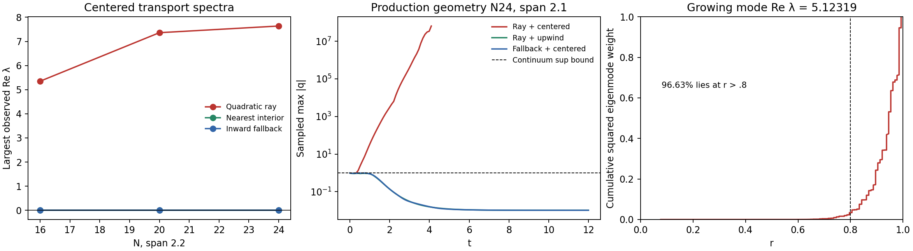

# Gauge compatibility and discrete boundary audit

Date: 2026-10-09. The active objective remains a stable finite Minkowski gauge
pulse, followed by single-hole evolution through the inner wormhole-to-trumpet
transition while retaining the Minkowski hyperboloidal reference throughout.
Neither stage has passed acceptance. This follows the
[transition refinement report](hyperboloidal-stability-followup.md).

The [evidence catalog](validation/hyperboloidal-gauge-boundary-experiments-20261009/catalog.json)
indexes frozen experiment sources, exact inputs, compiler commands, histories,
logs, field checks and hashes. Large executable, matrix and field outputs are
retained locally by hash. Every experiment uses separate scratch code; this
stage changes no production runtime equation, gauge or continuation default.

## Native negative controls

All comparisons use the wide .05–.95 reference, S=1, a=.5, N24, physical-P
lapse, preferred source off, κ=10, symmetric quadratic continuation, finite
angular lapse .1/shift .02 pulse and pole-CFL coefficient .03. Actual initial
dt is .000427734375. The control is the clean `27c19d20` runtime already
identified in the prior report.

The added shift numerator `S_beta=-eta*W*(beta-beta_ref)`, eta=10, preserves
the reference and principal symbol and makes all sampled outer frozen Fourier
roots negative. Its native t=2 run nevertheless ends with H/M/Z
1.266556/1.636471/.375338, versus control 1.199442/1.971771/.443509.
The ratios are 1.05595/.82995/.84629. All 81 saved active-field snapshots pass
finite/positive-lapse/positive-chi/SPD checks. Growing constraints and the
Hamiltonian deterioration reject this as pulse stabilization.
The [eta report](validation/hyperboloidal-gauge-boundary-experiments-20261009/eta10/native-summary.json)
retains the independent source, symbol and actual-array gates. Its executable
SHA256 is `bc242590902321d82798d3cfb03ca4ea29410d62bb3aac12d1a8a811cc06ce0b`.

Projecting the full continued ghost metric to determinant one and A to zero
trace improves some evolving derivative identities, but the native run aborts
when the strict guard rejects 14 invalid full ghost states. Its last saved
valid state is t=1.850297934, cycle 4329, H/M/Z
1.562339/.992251/.165519. The clean control interpolated to that exact time
has 1.565745/1.027189/.194586. All 75 saved projected active states remain
finite and positive with SPD metric. Both runs share the same bulk H spike
at r=.378886, with over 99.6% of squared H inside r=.9. The exact failed
stage time and offending matrices were not saved; the last valid checkpoint
and absence of the next scheduled output bound the failure interval.
This candidate is rejected. Its
[report](validation/hyperboloidal-gauge-boundary-experiments-20261009/ghost-projection/REPORT.md)
and [final receipt](validation/hyperboloidal-gauge-boundary-experiments-20261009/ghost-projection/final-report.json)
preserve those limits; its executable SHA256 is
`e9b15a545065f8fe998c2a3b3e7b7b43ac2af2dd584500489b496dc89217fbb3`.

The [clean radial budgets](validation/hyperboloidal-gauge-boundary-experiments-20261009/clean-control-radial-budgets.json)
cover all 82 saved broad/wide control constraint outputs. At wide t≈1,
r>=.9 contains 87.71% of squared M and 97.50% of squared Z; at t=2 the
fractions are 76.85% and 89.89%. H also develops bulk spikes. Binary constraint
outputs use float32 while native history uses double; norm comparisons have
maximum relative discrepancy `5.85e-9`, below float32 output precision.

## A discrete scalar boundary counterexample

The isolated outward transport equation is `q_t+x^i*q_i=0`, with the exact
native ray plans, interpolation, derivative stencils and interior KO=.1.
It diagnoses a boundary mechanism independently of the conformal lower-order
terms. Its exact solution is `q(t,x)=q(0,exp(-t)*x)`, whose maximum amplitude
is nonincreasing even though unweighted spatial L2 may grow geometrically.

Centered fourth-order derivatives with quadratic symmetric continuation have
positive discrete modes: largest observed real parts at N16/20/24, span 2.2,
are 5.34885/7.35992/7.63662. On the exact production N24 geometry, span 2.1,
a pair is `5.12319 +/- 5.33816i`, with 96.63% of squared mode support at
r>.8. A smooth pulse trips the 1e8 amplitude guard; its last recorded sample
exceeds 4.8e7. Constants remain preserved, so a
stationary constant check alone misses this defect.



The native upwind transport branch on those grids has the constant zero mode
followed by negative modes, and its pulse remains bounded through t=12;
production-geometry final Linf error is `8.98e-7`. Positive nearest-donor
extension or inward first-order derivative fallback removes the centered
positive modes in these tests, with strictly interior centered rows unchanged.
The all-domain first-order inward control with KO off is Metzler with zero
row sums, giving a maximum-norm contraction proof for that scalar operator.
Nearest-donor continuation still has finite overshoots, up to 1.20 for an
initial continuous supremum of one. These alternatives lower boundary order
and do not establish a coupled Z4c closure.

All constants agree within `1.83e-14`; assembled matrices match actual native
ghost filling and stencil actions within `7.11e-14`. Unsupported small grids
are explicitly rejected rather than weakening donor admission. The
[scalar report](validation/hyperboloidal-gauge-boundary-experiments-20261009/scalar-boundary/REPORT.md)
and [receipt](validation/hyperboloidal-gauge-boundary-experiments-20261009/scalar-boundary/summary.json)
retain 27 admitted cases, spectra, amplitude/energy controls and source identity.
This counterexample concerns centered scalar transport. It neither indicts
every native upwind branch nor proves the behavior of the coupled 20-field
system, mixed/second derivatives or the zero incoming scri characteristic.

## Mass data with the Minkowski reference retained

The best current Minkowski width starts at .05, whereas a M=.5 wormhole needs
its BH height to remain exactly Cauchy through the throat. A scratch data
construction therefore keeps the actual reference/compactification .05–.95
and gives the BH height a separate .30–.95 cutoff. Its physical metric,
curvature and Cartesian connection are derived from that BH height; every
reference gauge source still uses the original Minkowski fields.

The compact throat is r=.249407533, physical isotropic R=M/2=.25 and areal
radius 2M=1. The positive initial lapse there is .249407533. The
[geometry report](validation/hyperboloidal-gauge-boundary-experiments-20261009/black-hole-compatibility/report.md)
retains independent four-metric/ADM identities, consumed jets, mass checks,
four Release plus four sanitizer audits and an independent symbolic proof.
Initial H/M maxima are `2.04e-14/3.50e-15`; the geometric mass error is
`4.74e-10`. These are data and instantaneous equation checks, not a wormhole
transition or a native BH evolution. Machine-scale Omega assembly still loses
accuracy through cancellation, as documented in the receipts.

## Why initial null tangency is insufficient

Reserve `Q=(P-3*omega_n)/Omega` for the conformal trace. The distinct evolved
null numerator is

```text
N_raw = chi*gtilde_inverse^ij*Omega_i*Omega_j - omega_n^2,
omega_n = -beta^i*Omega_i/alpha.
```

Here beta_rad is the Cartesian shift contracted with the Euclidean radial
unit vector. For fixed mass-corrected BH geometry, let the initial gauge tails be
`alpha-alpha_ref=a1*Omega+...`, `beta_rad-beta_ref_rad=b1*Omega+...`.
The complete geometric/gauge equations give

```text
N_raw = 2/(a*S)*(a1+b1-M/a)*Omega + O(Omega^2),
dt N_raw|scri = 2/a^3*[(2-eta*a^2/S)*b1 -2*xi*a*a1 -4M/a],
beta_rad_dot|scri = S/a^2*(a1+b1+M/a)-eta*b1.
```

The original geometric jets are a1=-M/a, b1=2M/a. At S1,a.5,M.5,xi1.5,
the source-off null rate is +24 and eta10 changes it to -56. Altering only
gauge first jets to -4.5,+5.5 cancels that null rate but gives beta_dot=-47,
violating the eta pole's required fixed beta boundary value. Shift pinning
instead requires .2,+.8 and leaves null rate -75.2. Second-jet changes cannot
repair this first-jet contradiction.

The physical-P lapse numerator adds another necessary condition. On the
finite-Q, Theta=0 vacuum manifold with beta pinned, it factors as

```text
S_alpha = -(alpha-alpha_ref)*[(3*alpha+alpha_ref)/a
                              +xi*(alpha+alpha_ref)].
```

Positive lapse and xi>=0 therefore require alpha pinned too. For this fixed
initial geometry, preserving both gauge boundary values and the original
quadratic null falloff yields the original first jets and unique rates
`xi=1/a`, `eta=S/a^2` (2 and 4 here). Leading chi/g/P rates vanish as a
consequence of those equations; arbitrary evolved metric/A/Lambda deviations
are not assigned stronger falloffs.

Even that rate pair leaves `dt N_raw=-36*Omega+...` for the original complete
jets. A smooth outer addition `+.75*Omega^2` to the initial radial shift
cancels the next coefficient without changing the ADM data or boundary-value
rates. This satisfies only an instantaneous second-jet condition. The
[full compatibility report](validation/hyperboloidal-gauge-boundary-experiments-20261009/black-hole-compatibility/gauge-gate/report.md)
retains exact rational first/second-jet proofs, 100-digit factored limits,
104-row actual-kernel audits in Release/ASan/UBSan and their raw floating
counterexamples. Seven checks pass in 3.45 seconds; a preserved nonlinear
boundary manifold remains unproved.

Saved actual-kernel Fourier matrices with xi2/eta4 still have an outward
positive local root, Re≈35.079 at r=.98,k256. The archived preliminary matrix
controls document this separately from the BH compatibility gate. Further
work tests spatial-metric-responsive restoring sources and coupled boundary
operators. The earlier finite-Q counterexample still produces
`Omega*Q_dot -> 2*q` and `Theta_physical_dot -> -2*q` from the reference plus
`P-P_ref=Omega*q`, with initially zero Theta. The null/trace/Z regularity
conditions therefore remain unclosed for general evolved fields. Neither
local frozen roots nor the scalar boundary evidence alone settles native
finite-pulse stability or the later wormhole-to-trumpet goal.
