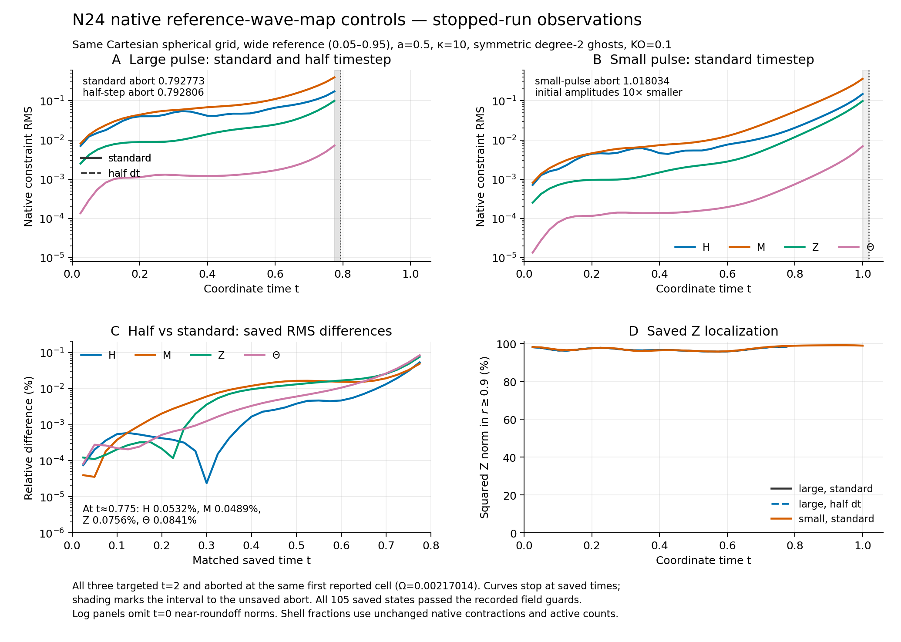

# N24 native wave-map controls: saved-state follow-up

This addendum records three failed N24 wave-map pulse runs and one completed N24 C0 control. Halving the wave-map timestep changes the matched saved constraint RMS values by less than 0.085% at the last common output, yet both large-pulse runs abort at almost the same time and first reported cell. Reducing the input pulse amplitudes by ten delays the reported abort to about t=1.018. These are finite native outcomes; they do not identify the cause or establish continuum stability or instability.

All four use the same centered Cartesian cube span 2.2, N24 active spherical mask (5,520 points), a=.5, geometry transition .05–.95, kappa=10, fourth-order derivatives, KO=.1 and symmetric quadratic ray continuation. The smallest active Omega is 0.00217013888888851. The input large lapse/shift amplitudes are .2/.1; the small amplitudes are .02/.01. The production profile is smooth with a vanishing scri tail, not a compact sub-scri pulse. The inputs retain the old gauge-cutoff parameters .45–.85. The wave-map overlay instead uses its pinned reference-wave-map helper globally; those cutoff parameters do not blend it with physical-P gauge. It keeps full C0 geometric evolution. The completed C0 control uses the public C0 gauge; it is not the earlier private spatial-norm global operator.

## Failed wave-map controls

The RMS column is H / Mcon / Zcon / Theta in the native diagnostic convention. Each row stops at the final saved binary64 restart, before its unsaved abort state.

| Run | Saved states | Last saved t | Reported abort t | Last saved RMS |
|---|---:|---:|---:|---|
| standard | 32 | 0.775 | 0.79277343749968521 | 0.17339563 / 0.39491314 / 0.099392226 / 0.007197742 |
| half | 32 | 0.775 | 0.79280598958281545 | 0.17330334 / 0.39472015 / 0.09931705 / 0.0071916878 |
| small | 41 | 1 | 1.0180338541661471 | 0.14876774 / 0.36306978 / 0.09842149 / 0.0069288057 |

The standard and half-step recorded timesteps are 6.51041666666553e-5 and 3.255208333332765e-5. At matched t≈.775, the absolute relative H/M/Z/Theta RMS differences are 0.00053226692 / 0.00048869694 / 0.00075635693 / 0.00084113319 (fractions). The reported aborts differ by 0.00003255208313024 time units, approximately one half-step. Both are failed processes; this close agreement is a timestep control through the sampled window, not a completed t2 timestep-convergence gate.

All three first report failure at xyz=(0.13749999999999996, -0.96250000000000013, -0.22916666666666674), Omega=0.0021701388888885099. Exact stderr records must be used for the failed, unsaved fields; no earlier restart is substituted for that state. In particular, the standard abort reports chi<0, the half-step abort reports alpha<0 and chi<0, and the small abort reports alpha<0. No floor, SPD repair or restarted continuation is introduced.

## Saved fields and localization

All 105 saved wave-map states passed the unchanged finite/positive/SPD/algebraic and native diagnostic gates. The independent manual check recomputed all 2,625 field-extrema pairs exactly; it did not independently recompute differentiated H/M/Z. Native diagnostic/history agreement is at most 2.7755575615628914e-17 in the root comparison. Passing these saved-state checks does not certify the later unsaved abort.

| Run | Min saved alpha | Min saved chi | Min conformal metric eigenvalue | Min Penrose metric eigenvalue |
|---|---:|---:|---:|---:|
| standard | 0.93874511 | 0.74936736 | 0.5617888 | 0.49978477 |
| half | 0.93874511 | 0.74936738 | 0.56203195 | 0.50007955 |
| small | 0.97868679 | 0.75996623 | 0.56788376 | 0.51532753 |
| C0 | 0.46731795 | 0.3424612 | 0.59068937 | 0.63459823 |

At the last saved state, the r≥.9 shell contains 0.98358409 / 0.98358076 / 0.98893359 of the summed squared native Z diagnostic for standard / half / small. This is a discrete localization fraction, not a physical energy or a boundary-cause certificate.

The figure uses only completed owner/manual saved JSONs, the root scalar comparison and exact failure stderr. Solid/dashed large-pulse curves separate standard/half timesteps; the small pulse has a separate panel. Curves stop at their last saved states; shaded intervals extend only to the reported aborts. Log RMS limits are [8e-6,.6], relative-difference percent limits [1e-6,.2], and the time axis is [0,1.06]. Near-roundoff t0 is omitted from the log panels without changing saved data. Figure source, input/runtime pins, exact logs, PNG/PDF and both visual reviews are retained separately.

## Completed C0 comparison

The original C0N24 native process returned zero at t=2; its completed wrapper and unchanged analyzer passed all 81 saved restart checks. At t=2, native H/M/Z/Theta RMS is 2.718733 / 2.8015061 / 0.65525886 / 0.060262799. All saved C0 fields remain finite with positive lapse/chi and SPD metrics; the corresponding minima appear in the table above. Maximum saved det/trace errors are 1.110223e-15 / 1.3873713e-15, and native/history diagnostic agreement is 1.7114911e-16. The ordinary saved timestep is 6.5104167e-05; its final 2.8252956e-12 step is clipped to land on t=2 and must not be described as a global timestep reduction.

Completion with sizable constraint norms is not stability acceptance, and an endpoint comparison between C0 t=2 and failed wave-map t≈.793 or 1.018 is not a matched-time accuracy comparison. No new evolution, source query or array decoding was performed to prepare this addendum.

## Evidence and scope

Failure capsules remain separate and unchanged:

- standard: `docs/validation/hyperboloidal-reference-wave-map-native-t2-wave-N24-failure-20261009/catalog.json`, SHA256 `604c95ee039caf4d05fc83d10cef06842beefe35b682f5138249e976b98b0e40`.
- half: `docs/validation/hyperboloidal-reference-wave-map-native-t2-wave-half-N24-failure-20261009/catalog.json`, SHA256 `31621ce63dc95641c03a3311c89c524b2c6d9acc2ed2fba88543a5e5b3459e6e`.
- small: `docs/validation/hyperboloidal-reference-wave-map-native-t2-wave-small-N24-failure-20261009/catalog.json`, SHA256 `44978fd4ec4e89030cc44fe5fc850fbc1ffc67f26531d2a5f5192e1b91c15b69`.

The fresh N24-controls archive is at `docs/validation/hyperboloidal-reference-wave-map-native-t2-N24-controls-20261009`, catalog SHA256 `3a84d6803831500d338c46cfee56951bb511ebbffae310e879461cc910672a42`; its one-shot collector completed successfully. Its fixed scope includes completed half/small partial observers, saved summaries/root comparison/manual checks, the figure, failed original case records and completed C0N24 native/readback/release evidence. Raw arrays, executables, objects, NPY/NPZ/JSONL and every file>1MiB are metadata-only. Exact logs are not normalized.

The later N32 large-pulse wave-map process failed at t=1.5837303635638276. Its separate failure catalog is `docs/validation/hyperboloidal-reference-wave-map-native-t2-wave-N32-failure-20261009/catalog.json`, SHA256 `e23e7fa5308b73058c696c585fd646f1cb1a172c7a08c08d838826aff0fbd158`. The separate N32 partial observations are outside this frozen N24-controls archive; no N32 diagnostic, grid trend or measured convergence order is asserted here. Omega_min is nonmonotone across these Cartesian resolutions. This N24 evidence does not supply a causal mechanism, CPBC/SBP proof, global energy bound, continuum eigenmode classification or production adoption.
