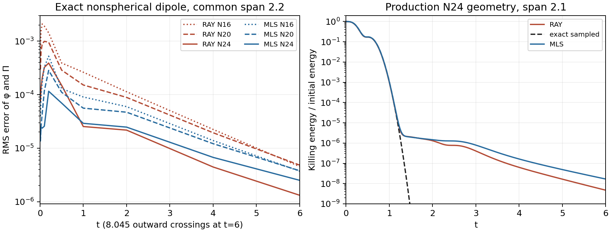

# Spatial-norm gauge and coupled wave audit

The active objective remains a resolved finite Minkowski gauge pulse, followed
by single-hole evolution through the inner wormhole-to-trumpet transition with
the Minkowski hyperboloidal reference retained. Neither stage has passed.
This follow-up to [the gauge/boundary audit](hyperboloidal-gauge-boundary-audit.md)
records a failed native gauge candidate and a more informative boundary test.
No production runtime or default changes here.

## Live spatial-norm gauge

Keep the physical-P lapse and complete coupled shift, with preferred source
off. Let G=chi*gtilde_inverse^ij*Omega_i*Omega_j and let Ghat be its reference
value. Add only the value-dependent shift pole numerator

```text
S_beta^i = -eta W [beta^i-beta_ref^i + C n_out^i (G-Ghat)/Ghat],
xi=1/a,  eta=rho*S/a^2,  C=(S/a)*(1-1/rho).
```

The actual implementation factors G-Ghat using chi and inverse-metric
differences. It divides by positive Ghat, and skips the normal construction
in the Cauchy gauge core. It introduces no division by a vanishing null norm,
Omega floor, BH source subtraction or imposed live-field falloff.

The private native case uses S=1,a=.5,rho=1.5: xi=2,eta=6,C=2/3. The geometric
layer is .05–.95; the gauge cutoff remains .45–.85. It retains kappa1=10,
symmetric degree-two ray ghosts, native derivative/KO operators and RK3.
All eight scaled actual 20-field leading matrices at a=.5,.75,1,2 and
kappa1=5,10 have 15 negative roots and five semisimple zeros. The independent
matrix error is at most 2.24e-9. At S=1, k=kappa1*a^2>1 and
1<=rho<=5/2 give a uniform sufficient Hurwitz interval for the nonzero scalar
block. Fixing eta=6 while changing a does not preserve this interval.
The complete principal extraction still passes all 360 cases (3.55e-15).

Actual frozen Fourier matrices have no positive sampled outer roots for the
wide a=.5,kappa1=10 case, but retain a +.491960 geometric root at r=.75,k=0.
At kappa1=5 an outer derivative-coupled root remains positive. These local
generators do not establish global continuum or discrete stability.
Independent four-dimensional Christoffel/source/Box identities pass on
nonflat off-constraint states. The added source generally changes Box(Omega).

There is also an exact necessary nonlinear value-branch result. Assume
positive lapse and G, null N_raw=0, finite Q, Theta_phys=0 at scri, and both
gauge pole numerators zero. With x=alpha/alpha_ref, y=beta_rad/alpha_ref,
z=sqrt(G/Ghat), d=1-1/rho, the equations reduce to

```text
y=-(d*z^2+1-d)=-x*z,   x^2*(2-z)=1,
z/[sqrt(2-z)*(d*z^2+1-d)]=1,   0<z<2.
```

For 1<=rho<=5/2 the last function is strictly increasing, so its only
solution is x=z=1,y=-1. Tangential shift components are fixed by their own
pole. This fixes G, not chi and the metric separately. The exact proof and
independent review are archived. It is a necessary value condition, not an
evolution-preservation theorem. The finite-Q counterexample persists:
at a=1, P-Pref=.01*Omega gives Omega*Qdot -> .02 and Theta_phys_dot -> -.02.

## Native outcome and refinement control

The private executable retains production source 27c19d20 with an explicitly
audited include wrapper. Its SHA256 is
`dd1d189210abd4e094da339dd73e3014357924b343c9f08f658eaf8cd4ae172d`.
All 369 recorded baseline source/input/helper files (365 src/CMake and four
auxiliary files) and four overlay inputs were verified
before and after the independent N36 run. Build source and launch HEAD
f615acf4 are recorded separately.

The N24 stationary reference reaches t=.05 with maximum actual-array drift
1.14e-13 and H/M/Z=8.48e-14/2.69e-14/1.25e-15. The finite angular pulse has
lapse amplitude .1, shift amplitude .02 and width .5. Its t2 result is:

| Gauge, N24 | H RMS | M RMS | Z RMS |
| --- | ---: | ---: | ---: |
| Production physical-P control | 1.199442 | 1.971771 | .443509 |
| Spatial-norm candidate | 1.222187 | 1.348373 | .375766 |

The candidate completes in 665.1 seconds and all 81 saved field snapshots
are finite with positive lapse/chi and positive definite physical spatial
metric. Final alpha/chi minima are .772240/.611262 and Penrose spatial-metric eigenvalues
range .650948–3.88644. Nevertheless its Hamiltonian error is 1.9% worse,
and all three constraint norms grow. It fails pulse stabilization acceptance.
Final H squared norm is 88.61% inside r=.9, while M/Z squared norms are
69.93%/91.41% outside .9. The largest individual H/M/Z errors are at r=.929108.
H is the physical Hamiltonian scalar; M/Z use conformal-metric norms. All
RMS averages are unweighted over active Cartesian cells and do not define
a physical energy.

An independent N36 candidate run reaches t=.2 in 820.991 seconds, with nine
saved positive/SPD snapshots. Matched physical-time history values are:

| Case at t=.2 | H RMS | M RMS | Z RMS |
| --- | ---: | ---: | ---: |
| Production N24 | .01917784 | .02891145 | .01124065 |
| Candidate N24 | .02277652 | .02737160 | .01303146 |
| Candidate N36 | .01076394 | .00695831 | .00225612 |

N24 values are interpolated from their recorded histories. The actual
initial timestep is .000427734375 at N24 and .000115104166667 at N36 despite
the same pole-CFL=.03. This is combined spatial/time refinement; it does not
establish a pure spatial order. Candidate and production N24 also finish
with 4676 versus 4679 cycles, so their comparison uses physical time.
t2 spans only about 2.68 outward crossings. No long-duration acceptance or
black-hole evolution follows from these runs.

## Black-hole initial compatibility

Independent full-tensor gates retain the Minkowski .05–.95 reference and
detached M=.5 wormhole height .30–.95. Original mass-dependent first jets
make the leading lapse, shift, G, null and exposed geometric pole time rates
zero for the new source. Original second jets still give
N_raw_dot=-29*Omega+... . Adding radial +(29/40)*Omega^2 in the .97–.99 collar
gives N_raw_dot=-92.7*Omega^2+... initially. The nonzero Lambda_dot=116/15
matches the evolving metric connection; Lambda and the mass shear are retained.

For general S,a,M,rho and regular lapse/shift restoring rates nu,eta_R, the
required additional radial coefficient is

```text
D = M*[M*(rho-8)+4*a^2*(2*eta_R-nu)+8*a*(4-rho)]/[4*S*a*(4-rho)],
delta_beta^i = SmoothCutoff*D*Omega^2*n_out^i.
```

D is dimensionless; nu and eta_R have inverse-length units. Eight parameter
sets, including a dimensionally scaled pair, pass independent exact,
100-digit, Release and ASan/UBSan checks. The original fixed case passes
five checks; the general gate passes four. The general formula has a true
second-jet obstruction at rho=4 except for a special vanishing numerator;
the admitted interval avoids it. These are initial compatibility tests,
not nonlinear closure, stationarity or wormhole-to-trumpet evolution.
Raw double-precision near-scri cancellation failures remain documented.

## Coupled conformal wave boundary test

The earlier positive centered scalar-transport spectrum does not determine
the mixed Z4c system. A two-field conformally covariant scalar wave now uses
the actual nonflat LayerReference, native upwind Lx advection, centered
Dx/Dxx/Dxy and native interior KO=.1. Both outward and nearly zero incoming
characteristic branches are retained. An independent exact Minkowski dipole
and curvature oracle check the continuous equation.

The unchanged symmetric quadratic ray closure has no positive eigenvalues
in the complete N16/span2.2 spectrum (3280 unknowns, largest real part
-.240637). A Cartesian quadratic local fit gives -.165664. Real Schur
backward residuals are below 2.9e-14. N20/N24 converged sparse LR8 modes
remain negative; these are found modes, not full large-grid spectral bounds.
All exact nonspherical dipole runs reach t6, about 8.05 outward crossings,
and decay. KO-off and timestep-halving controls support this finite-grid result.

At common span2.2, ray RMS(phi,Pi) errors at t=.2 decrease
.00142856,.00095467,.00038972 for N16/20/24. The local fit reduces crossing
errors, but worsens the production N24 late tail and has larger ghost-weight
L1. All strict interior rows remain identical. The sampled Killing energy
has small transient increases; no discrete contraction/SBP proof is claimed.
The local fit is not recommended as a production boundary remedy.



This wave has no evolved geometry, differential Z constraint or gauge pole.
Its bounded propagation narrows the earlier scalar counterexample without
establishing full Z4c stability. The next investigation compares the actual
global 20-field Cartesian tangent evolution and the continuum subsidiary
constraint equations, retaining spatial gradients of background coefficients.

## Evidence

The [catalog](validation/hyperboloidal-spatial-norm-wave-experiments-20261009/catalog.json)
preserves exact source, compiler commands, inputs, histories, audits and
failure receipts. Large matrices, eigenvectors, executables and binary/restart
fields remain local by hash. The archived sources are byte-faithful research
snapshots outside the production build; their raw formatting is preserved.
Neither the gauge candidate nor the local-fit closure is integrated into the
production runtime. The active goal still requires a stable resolved pulse
and the later inner wormhole-to-trumpet transition with the Minkowski reference.
