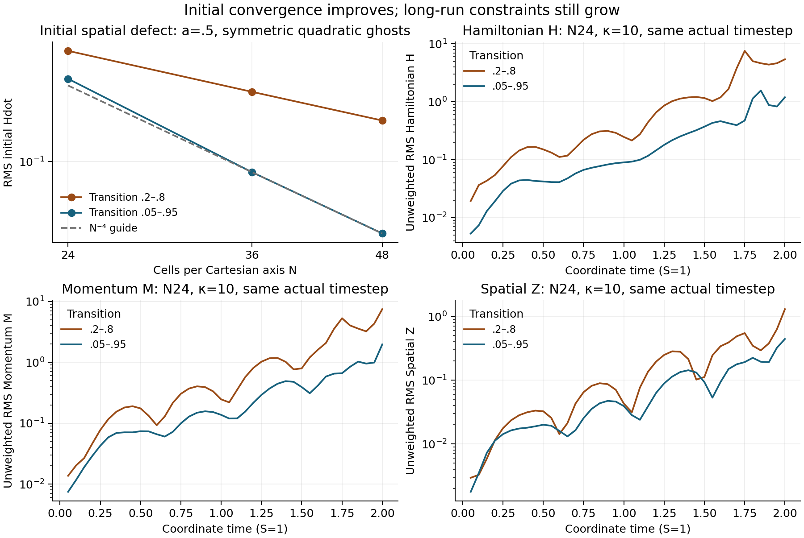

# Transition and boundary follow-up

Date: 2026-10-09. This continues the
[implementation validation](hyperboloidal-stability-validation.md). The active
goal remains stable finite Minkowski gauge pulses over multiple crossings,
followed by a resolved single-hole **wormhole-to-trumpet transition with the
Minkowski hyperboloidal reference retained throughout**. It has not been achieved.

The [follow-up receipt](validation/hyperboloidal-stability-followup-20261009.json)
retains exact native inputs, executable identities, histories, failure messages,
constraint budgets, original and corrected spatial probes, source snapshots
for the exploratory null-feedback candidate, and log hashes. All production
native runs use the clean `27c19d20` executable with SHA256
`5ba555211db81985274f8ebe789869b8f6300f638ac8dfd7ba7736b541160788`.
Later `2564570b` changes only the standalone tangent diagnostic's radial bins.
This stage changes no runtime gauge, reference or continuation defaults.



## Wider transition

The current production reference's smooth transition was scanned over 15
inner/outer radius pairs. With a=.5 and quadratic symmetric continuation, the
best initial Hamiltonian-tangent norms occur for .05–.95 and .05–.90.

| N | Original .2–.8 RMS Hdot | Wider .05–.95 RMS Hdot |
|---:|---:|---:|
| 24 | .797146 | .472414 |
| 36 | .370212 | .0822520 |
| 48 | .216247 | .0260927 |

The wider observed orders are 4.31 and 3.99. N48 improves by 8.29 times.
The continuum probe's sampled maximum Hdot residual is `4.58e-7`. It uses
analytic initial jets, finely differenced continuous RHS jets and signed small
time perturbations; it is not an exact symbolic source value. Initial native
Hamiltonian constraints remain about `6e-15`. At N48 the wider Mdot is .248037,
about 2% above .242945 for the original reference, whereas Zdot falls from
.00422480 to .00202778. Thus the improvement is strongest for H and Z.

The initial N48 wider peak Hdot moves to r=.129414. The corrected radial
budgets put 32.56% of squared Hdot, 92.96% of squared Mdot and 89.56% of squared
Zdot outside r=.95. After the narrower transition's bulk defect is reduced,
the outer continuation is a significant remaining error source.

Composite Simpson quadrature with 4096/8192/16384 intervals agrees to within
`5e-15`: the outward light crossing time is .74404643 for .2–.8 and .74576438
for .05–.95. Therefore t=2 is about 2.68 outward crossings for the wider
reference, not a long-duration stability acceptance.

## Actual finite angular evolution

These are the native lapse .1/shift .02 nonspherical pulses, width .5, RK3,
fourth-order spatial differences, physical-P lapse with preferred source off,
a=.5, S=1 and symmetric quadratic continuation. The wide κ=5 refinement
results at t=.2 are:

| N | H | M | Z |
|---:|---:|---:|---:|
| 24, interpolated history | .0165291 | .0418758 | .0249655 |
| 36, requested endpoint | .00595419 | .0112283 | .00435313 |
| 48, requested endpoint | .00284722 | .00296504 | .00104472 |

The H orders are 2.52 and 2.56. N24 uses pole-CFL coefficient .03, whereas
N36/N48 use .06; their actual initial timesteps are .000427734, .000230208 and
.000195117. Thus this is combined spatial/time refinement, rather than a
separate spatial convergence audit. These short finite-time orders differ from
the near-fourth-order instantaneous Hdot result. Fields remain positive and
the metric stays positive definite; long-time convergence has not been checked.

At matched smaller actual timestep `.000427734375`, widening alone at κ=5
reduces t=.5 H/M/Z from .155697/.238606/.093403 to
.0423128/.0996444/.0455074. Increasing κ to 10 on the wide reference gives
.0421603/.0738085/.0200254. κ=20 on the original reference yields
.164499/.171154/.0160617: stronger damping reduces Z but does not monotonically
reduce H.

Both κ=10 N24 runs reach t=2 with positive fields and metric eigenvalues, but
the original reference ends with H/M/Z=5.42760/7.47901/1.30183 and the wide
reference with 1.19944/1.97177/.443509. Their growing constraints fail the
stability objective despite completing the requested duration.

The pure-CMC κ=5 control fails at t=1.23158243 with negative lapse; its last
saved valid snapshot is t=1.20033540. The live speed bound and native failure
guard remain active; no invalid value was clipped.

## Continuation and height negative controls

Symmetric quartic continuation on the wide reference increases N48 initial
Hdot/Mdot/Zdot from .0260927/.248037/.00202778 to
.0409017/.331638/.00666152. Its N24 κ=5 native run fails at t=.267794 with an
invalid metric determinant near r=.992845. At the last valid snapshot
t=.250204, its H/M/Z are 46.4/90.2/56.5 times the quadratic matched-time
values. Increasing polynomial degree is not an accepted boundary remedy.

Alternative flat-metric height profiles, with compactification cutoff powers
1–4, pass their continuum geometry/jet audits but all increase Hdot RMS
relative to the original production reference. Power 4 lowers the peak while
increasing RMS H, M and Z; both effects are retained. Keeping the original
compactification and changing only its boost to `b=r*w^p/a`, p=1.5,2,3,
does improve the original broad Hdot, down to .070983 at N48 for p=3.
The wider unmodified production reference still has the smaller norm .026093.
These scratch height families were not adopted or evolved as native long runs.

## Exploratory source result

The receipt's `null_feedback_experiment` points to frozen source snapshots for
an independent preferred-source collar .85–.95 with σ=5, coupled to the
physical-P lapse. Its explicit assembly includes the added shift pole.
Independent source identities, reference fixed point, complete principal
matrix and frozen pole checks pass. The finite-Q counterexample to nonlinear
regularity closure survives.

The candidate's original-reference κ=5 native evolution fails near t=1.35;
its last saved snapshot t=1.35008 has H/M/Z about 30.7/77.5/34.5. With the
wide reference and κ=10, it reaches t=2 with positive fields but
H/M/Z=1.0863/1.7639/.31867. This improves the source-off control modestly and
still fails constraint acceptance. There is no production option for it.

Full 20-field frozen Fourier matrices include all value/first/second derivative
phase contributions. They reveal derivative-coupled positive local roots even
when the zero-jet poles are stable. For source off, r=.95, radial k=64 and κ=10,
Re(lambda)=25.31; the high-frequency value approaches about 35.33 at k=256.
The growing root approaches the fast outward light cone and has nonzero local
H/M/Z/Theta residues. The candidate reduces the wider worst sampled growth
toward about 5.35. These are pointwise frozen spectra, not global continuum or
native discrete eigenvalues; transport, variable coefficients and energy
weights matter. The source snapshots and selected mode residues preserve that
limitation explicitly.

## Diagnostic correction and reproduction

The original tangent probe assumed r1<=.9 when labeling radial bins. Its global
norms and rankings remain unchanged. Commit `2564570b` sorts and deduplicates
the bin edges, covering wide r1=.95 and duplicate r1=.9 correctly. Focused
Release/Debug CTests pass in .73/29.71 seconds. Six Release native probes and
two extra sanitizer probes check distinct contiguous bins, total active-cell
coverage and squared-norm fractions summing to one. Project lint passes.

Reproduce native cases with the receipt's exact inputs and the implementation
build recipe. Use fresh output directories with `run_layer_validation.py`.
The exploratory snapshots are source evidence for a private forced-include
target; restore their recorded scratch paths or adapt the absolute paths in the
build commands. Full local Fourier matrices are retained by hash and can be
regenerated from the archived audit source.

To regenerate the figure with numpy and matplotlib:

```sh
python tst/hyperboloidal/plot_stability_followup.py \
  docs/validation/hyperboloidal-stability-followup-20261009.json \
  docs/validation/hyperboloidal-transition-20261009.png
```

The next candidates are algebraically consistent ghost continuation and outer
shift restoring terms. No long black-hole evolution, trumpet transition or
complete nonlinear scri closure is claimed by this follow-up.
