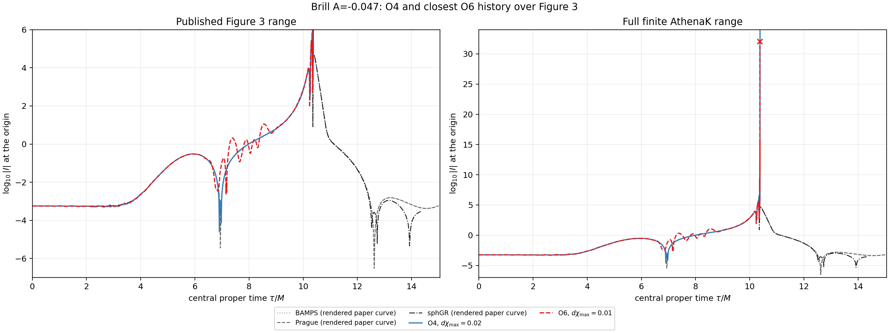
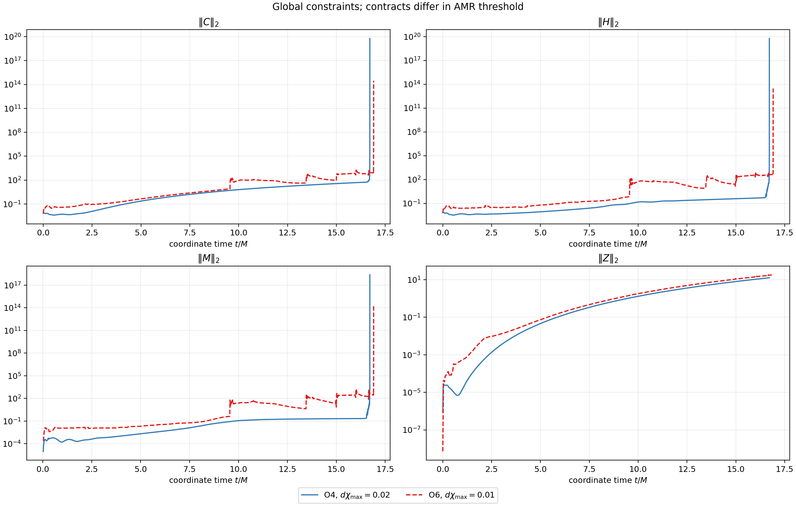
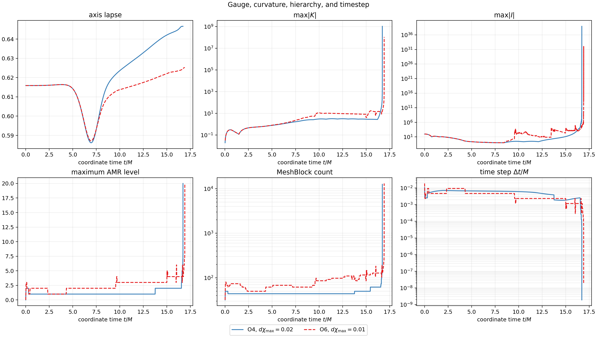
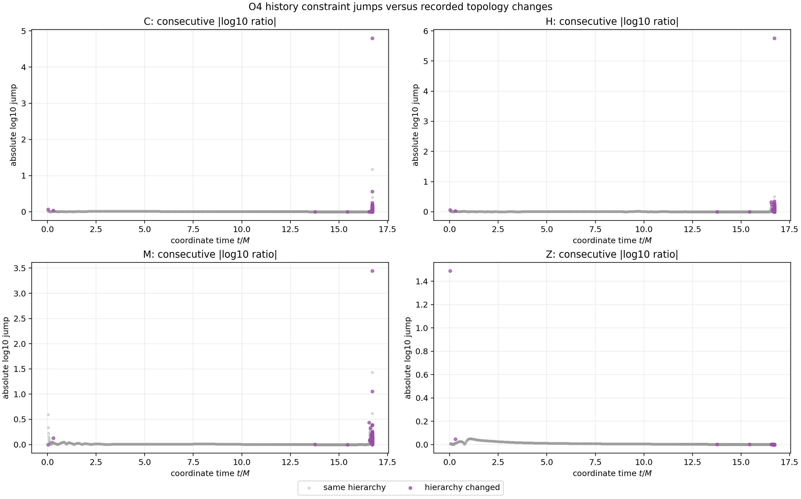

# Symmetric O4 Brill N256 qualification report

## Verdict

The clean symmetric O4 implementation and its focused CPU, MPI, Fourier, and
Aurora-PVC tests pass.  The physical `A=-0.047` N256 evolution does **not**
qualify the Figure 3 result or numerical convergence.  Its terminal disposition
and final authenticated segment evidence are recorded below.

The nearest retained O6 N256 comparator is not contract matched: it uses
`dchi_max=0.01`, whereas this O4 run uses `dchi_max=0.02`.  The plots therefore
support observational comparison only, not an isolated spatial-order claim.

## Source implementation

Implementation commit `3453b65a6b13c8f72cc1da6f05c565d245ce0f45`
introduces the requested O4 path without modifying the O2 or O6 formulas:

- reflection-symmetric cubic left/right O4 prolongation;
- complete five-parent chi validity coverage for the O4 sibling pair;
- centered and reflected current-active-only cubic O4 restriction closures;
- accepted-state ordering in which active algebraic projection precedes
  restriction, communication, boundary filling, Cartoon parity, and ADM
  reconstruction;
- O4 Kretschmann history support;
- focused static, Kokkos, MPI, cache-coherence, transfer, Fourier, and
  production-kernel tests.

No floor, clipping, weakened positivity gate, gauge change, KO change, or
physical-initial-data change was introduced.

## Qualification gates

The optimized CPU/MPI test build executed 59 tests successfully; two GPU-only
tests were correctly disabled.  Debug bounds checks, same-rank and MPI2 coarse
cache tests, and the production `nghost=2/3/4` kernels passed.  On the exact
Aurora PVC execution space, the state-admissibility, chi-prolongation,
O4-transfer/Fourier, O4-derivative, and production-kernel gates all passed.

The zero-PDE maximum child-to-parent RMS gains were:

| transfer | maximum gain |
|---|---:|
| O2 | 1.2965737272678381 |
| O4 | 3.4443389472700856 |
| O6 | 3.7965698987568768 |

The raw fixed-radius O4 derivative check measured order `4.01794`.  Existing
near-axis aggregate diagnostic lanes reduce toward third order and are retained
as a non-gating limitation; this report does not claim global fourth-order
convergence.

## Exact physical contract

The run uses direct IrisK coefficient import for Brill amplitude `A=-0.047`,
root `128 x 256 x 1`, `32 x 32 x 1` MeshBlocks, `nghost=4`, O4 bulk and
high-order AMR transfer, RK4, CFL `0.15`, KO `0.02`, `dchi_max=0.02`, and
derefinement factor `0.25`.  It permits levels 0--20, checks AMR every cycle,
uses the max-|K|-scaled telegraph lapse with `tau=kappa=1`, Gamma-driver shift
with `eta=2`, and zero Z4c constraint damping.  Chi floors and excision are off.

| object | identity |
|---|---|
| campaign input | `02b627dca6ad6ddf1802137882c543e0aa56c79db6d8d8efcd07c4c4c495769b` |
| Brill coefficients | `ff0993c390513c15d6aa65857a0a3c710f2e2c3faf5717d9d63245203ccf2d6b` |
| Aurora executable | `645de4273ab1509407cba6a5df93a153a2510c4bb4d335c0f10d892f41eeb4a0` |
| build source | `26d4c371ea57b8db2cde47e56ac0a8de8fb89dc9`, clean |
| build source tree | `ffa46e2b51d4bf46929565deee92df52ad7d6add` |
| Kokkos | `6739bc623081648af9e752b616d9671527922cbf` |
| IrisK | `2a069fd0497ef4352d4ecd28c6879ac47b84a5a1` |
| head-build manifest | `41e3e09a2a2a80827b0ad86d61b541a6a947850dd93ac724550144c1beb3923a` |

The build ran on the Aurora login node with 64 build workers.  Accelerator
segments used one PVC tile (`ZE_AFFINITY_MASK=0.0`) in two-hour capacity
allocations.

## Evolution and terminal evidence

Three one-PVC, two-hour-capacity allocations were used.  The first two ended
at explicit MeshBlock-capacity guards and were continued from authenticated
restarts with only `max_nmb_per_rank` increased.  They were operational stops,
not violations of a numerical invariant.  The third segment crossed both
earlier capacities and reached the first numerical fail-closed event.

| segment | PBS job | start | result | wall time |
|---:|---:|---|---|---:|
| 0 | `8769918` | fresh | proposed 4100 blocks exceeded capacity 4096 | 00:13:21 |
| 1 | `8769947` | restart `fb12aa17...` | proposed 8246 blocks exceeded capacity 8192 | 00:10:25 |
| 2 | `8769961` | restart `340be0e5...` | state inadmissibility detected; detail extraction failed | 00:26:31 |

Segment 2 ended with Athena exit `134`.  PBS reports exit zero because the
wrapper deliberately archived the nonzero Athena result and completed its
finalizer.  The last finite history record was

| quantity | value |
|---|---:|
| coordinate time | `16.714479500260431 M` |
| central proper time | `10.378859183276221 M` |
| cycle | 6092 |
| accepted `dt` | `1.9149049310410572e-9 M` |
| C / H / M / Z | `5.93915e19 / 5.70617e19 / 2.32987e18 / 12.7094` |
| maximum `|K|` | `1.04432e9` |
| maximum Kretschmann | `9.32008e38` |
| MeshBlocks / maximum level | `12518 / 20` |
| axis lapse | `0.6466261522619761` |

The terminal classification is
`STATE_INADMISSIBILITY_DETECTED_DETAIL_EXTRACTION_FAILED`.  This wording is
intentional.  The device scan in `Z4c::CheckStateAdmissibility` selected at
least one inadmissible Z4c cell.  When the diagnostic then attempted to copy
the selected 25-component, noncontiguous SYCL subview to host memory, Kokkos
raised a no-copy-mechanism exception before `z4c_state_failure.json` could be
written.  Thus the evidence establishes an invalid evolved state, but does
**not** establish its exact component, reason (nonfinite, nonpositive chi, or
metric SPD failure), cell, or task checkpoint.  It would be incorrect to call
this merely a generic accelerator crash, and equally incorrect to label it a
known chi-parent failure.

Every printed O4 chi-prolongation record through cycle 6090 reported zero
invalid parent stencils and zero invalid limited sibling groups.  Moreover,
the hierarchy remained unchanged through cycles 6067--6080 while the timestep
and constraints continued their runaway.  Regridding therefore need not occur
on every late-time step, although this history alone cannot distinguish bulk
evolution from a persistent coarse-fine-interface mode.

The three remote segment manifests have SHA-256 identities
`9506c5345...`, `e8e53de1...`, and `9cad7fc3...`; the complete hashes and
selected-file verification are stored in `EVIDENCE_MANIFEST.json`.  Restarts
used by segments 1 and 2 have SHA-256 identities `fb12aa1704...` and
`340be0e5f8...`, respectively.

## O4 versus closest O6 evidence

The two histories track the same qualitative central-curvature trajectory over
the paper range.  The O4 run enters its late runaway earlier in coordinate time:

| terminal quantity | O4 (`dchi=0.02`) | O6 (`dchi=0.01`) |
|---|---:|---:|
| coordinate time | 16.7144795003 | 16.9095883906 |
| central proper time | 10.3788591833 | 10.3738991338 |
| cycle | 6092 | 7616 |
| minimum recorded `dt` | `1.91490e-9` | `1.78814e-8` |
| maximum level | 20 | 20 |
| maximum MeshBlocks | 12518 | 13076 |
| topology-change history rows | 305 | 356 |
| terminal C norm | `5.93915e19` | `2.98004e14` |
| terminal `max|K|` | `1.04432e9` | `1.07969e8` |
| terminal maximum Kretschmann | `9.32008e38` | `1.16188e32` |
| first terminal guard | state inadmissibility; detail extraction failed | central-axis diagnostic support invalid/nonfinite |

| landmark | O4 (`dchi=0.02`) | O6 (`dchi=0.01`) |
|---|---:|---:|
| `dt <= 1e-4 M` | 16.6959433878 | 16.8958740234 |
| `max |K| >= 1e3` | 16.7113459160 | 16.9058349609 |
| maximum level >= 10 | 16.7124092066 | 16.9062194824 |
| `C >= 1e6` | 16.7140246980 | 16.9091926575 |
| maximum level >= 18 | 16.7144711998 | 16.9095748901 |

This timing difference is an observation.  Because the AMR thresholds differ,
it cannot be attributed to O4 alone.  The machine-readable summary includes
constraint values interpolated only within the common coordinate- and
central-proper-time ranges; no failed trajectory is extrapolated.

| common `t/M` | O4 C | O6 C | O4 H | O6 H | O4 M | O6 M |
|---:|---:|---:|---:|---:|---:|---:|
| 5 | 0.2288 | 0.4358 | 0.00868 | 0.06251 | 0.00206 | 0.02044 |
| 10 | 6.289 | 86.81 | 0.1465 | 54.83 | 0.1132 | 23.58 |
| 15 | 36.24 | 100.0 | 0.3858 | 43.73 | 0.2053 | 7.298 |

O4 has lower global C/H/M values at these common coordinate times.  That is a
contract-dependent observation and is not a convergence result: O6 refines at
the tighter `dchi_max=0.01` threshold and therefore evolves a different AMR
hierarchy.

The formal disposition is `COMPARISON_NOT_MATCHED`.  Descriptively, O4 reaches
its runaway and terminal guard earlier in coordinate time and the two runs
terminate through different diagnostic paths, but neither observation isolates
the spatial-order effect.

## Constraint jumps and topology

`data/o4_constraint_jump_events.csv` records every consecutive-history jump in
the four constraint families together with MeshBlock and maximum-level changes.
It preserves field evolution and hierarchy correlation without equating
correlation with transfer causation.  The history norms use the existing
axisymmetric Cartoon diagnostic definition
`2*pi*rho*dx_rho*dx_z*sqrt(det(gamma))`.  They do not include a fictitious
collapsed-y cell width, so the observed jumps are not that normalization
artifact.  This campaign does not introduce a new normalization.

## Limitations

- The closest O6 comparator uses a different AMR threshold, so the formal
  comparison disposition is `COMPARISON_NOT_MATCHED`.
- The published Figure 3 polylines are reconstructed from the rendered PDF and
  are not raw paper data.
- History does not retain a per-cell min/max-chi census; strict transfer logs do
  retain whether any consumed chi parent or limited sibling group was invalid.
- Ordinary history rows do not retain locations for every topology change, so
  the CSV reports hierarchy deltas but cannot reconstruct every refined parent
  location post hoc.
- No convergence, production readiness, horizon, or Figure 3 reproduction claim
  is made.

## Evidence index

- `data/comparison_summary.json`: strict numerical summary and contract caveat.
- `data/o4_history_combined.csv`: restart-deduplicated O4 history.
- `data/o4_o6_plotted_history.csv`: exact plotted histories.
- `data/o4_constraint_jump_events.csv`: consecutive constraint/topology events.
- `evidence/build/`: authenticated Aurora head-build evidence.
- `evidence/segment0/`, `segment1/`, and `segment2/`: selected authenticated
  run evidence.
- `EVIDENCE_MANIFEST.json`, `SHA256SUMS`, and `SHA256SUMS.sha256`: strict
  evidence inventory and two-layer checksum closure.
