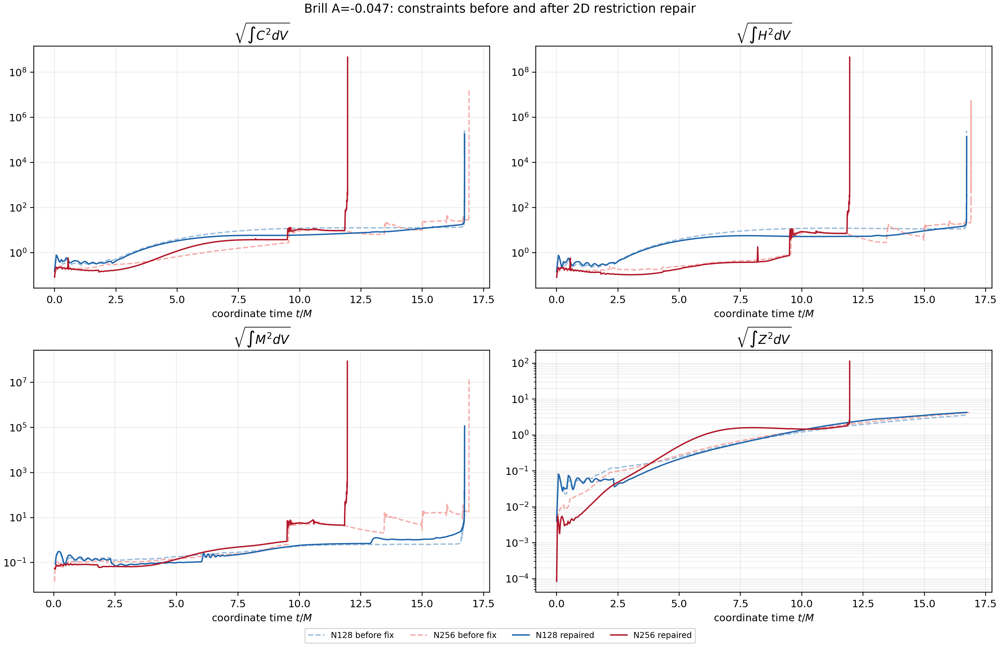
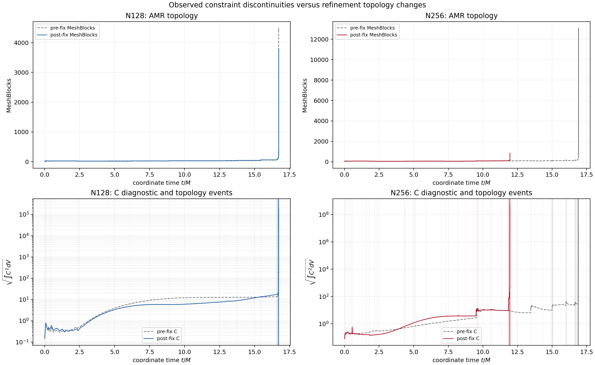
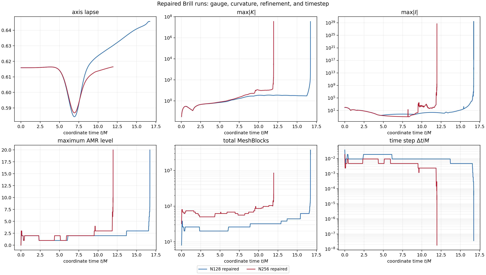
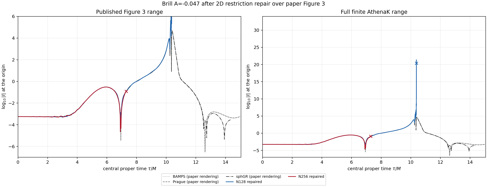

# Brill Figure 3: 2D high-order restriction repair and resolution rerun

## Executive conclusion

The code-level inconsistency was real and is fixed at source commit
`345dd31d59cebd9c0c7231be43dcc6a72524bcc7`: 2D Cartoon Z4c refinement and
same-level coarse-boundary refresh now use the configured O2/O4/O6
cell-centered restriction, matching the already high-order prolongation.
Generic non-Z4c physics retains its previous four-cell average.

The corrected N128/N256 rerun does **not** cure the late instability.
Typical AMR-topology-associated changes in the square-root constraint
diagnostics become smaller, which confirms that the mismatched low-order
restriction contributed to the visible jumps.  Nevertheless:

- N128 ends at `t=16.7284880161 M`, only `0.0062187552 M` later than before.
- N256 ends at `t=11.9558651984 M`, `4.9537231922 M` earlier than before.
- both corrected runs reach level 20 and stop at the unchanged strict-positive
  chi boundary-parent gate;
- neither reaches the requested `t=20 M`, so there is no Figure 3 or
  resolution-convergence qualification.

The result supersedes the earlier claim that the two resolutions have
comparable terminal times.  With the transfer operators made consistent, the
N256 trajectory is substantially more fragile.  This is evidence of a
remaining resolution/AMR-sensitive instability, but it does not by itself
distinguish a high-order restriction overshoot, an invalid evolved chi field,
or a coupled formulation/gauge instability.

## Code inconsistency and repair

Before the repair, two 2D Z4c paths silently ignored the configured spatial
order:

1. `MeshRefinement::RestrictCC` used an unconditional four-cell average for
   2D regridding.
2. `MeshBoundaryValuesCC::FillCoarseInBndryCC` used the same unconditional
   average for 2D same-level coarse-corner refresh.

The corresponding prolongation path was O6 in these runs.  That gave the
Cartoon evolution a low-order restriction/high-order prolongation transfer
pair precisely when the AMR topology changed.

The repair adds a collapsed-x3 tensor restriction in
`src/mesh/restriction.hpp` and dispatches the 2D Z4c paths by `nghost`:

- `NGHOST=2`: O2 restriction;
- `NGHOST=3`: centered cubic O4 restriction;
- `NGHOST=4`: O6 restriction, including the existing bounded edge rule.

The 3D path and non-Z4c 2D physics path are unchanged.  The patch changes five
files, has stable patch-id
`547319d9043b39c92d9c66cb670785f25833218b`, and is available on branch
`codex/cartoon-2d-high-order-restriction-20260815`.

## Verification

The repair passed:

- focused Serial and MPI tests, 2/2 each;
- a Debug Kokkos bounds-check focused test;
- full Serial and MPI AthenaK builds;
- shared-geometry, chi-prolongation, static-refresh, policy-migration, and
  restart-carrier regressions;
- a fresh Perlmutter CUDA/MPI build and the exact two focused CUDA tests.

The new collapsed-2D fixture checks polynomial exactness and a
restriction-to-prolongation round trip for O2/O4/O6.  Static coverage requires
both 2D Z4c call sites to use the order-aware dispatch and preserves the
generic-physics average.

## Frozen rerun configuration

Both repaired cases ran sequentially in job `57034787` on the same node
`nid008205`, with four distinct A100-SXM4-80GB rank bindings.  They used one
fresh executable with SHA256
`de137495fd4f0c9801c0887245cf6167053cf81de64a831b7ca0b09c952ded68`.

Common physics and numerics were unchanged:

- Brill amplitude `A=-0.047`, IrisK ADM mass `2.660301967997158`;
- domain `rho in [0,16]`, `z in [-16,16]`;
- O6, RK4, CFL `0.15`, KO dissipation `0.02`;
- pre-collapsed initial lapse;
- max-domain-`|K|`-scaled telegrapher lapse with `tau=kappa=1`;
- advective Gamma-driver shift with fixed `eta=2`;
- Z4c constraint damping off (`kappa1=kappa2=0`);
- `floor_chi=false`, maximum refinement level 20.

N128 uses root `64 x 128` and `dchi_max=0.02`; N256 uses root `128 x 256`
and `dchi_max=0.01`.  Capacity was provisioned independently above observed
use and was not the terminal cause.

## Terminal comparison

| Case | Last finite `t/M` | Change after repair | Last `tau/M` | Cycle | Max level | Max MeshBlocks | Native stop |
| --- | ---: | ---: | ---: | ---: | ---: | ---: | --- |
| N128 before | 16.7222692609 | -- | 10.3653818206 | 3012 | 20 | 4484 | 74 invalid chi parent stencils |
| N128 repaired | 16.7284880161 | +0.0062187552 | 10.3797709677 | 2936 | 20 | 3782 | 98 invalid chi parent stencils |
| N256 before | 16.9095883906 | -- | 10.3738991338 | 7616 | 20 | 13076 | invalid terminal axis support |
| N256 repaired | 11.9558651984 | -4.9537231922 | 7.2982053288 | 4680 | 20 | 851 | 171 invalid chi parent stencils |

The history columns named `C-norm2`, `H-norm2`, `M-norm2`, and `Z-norm2`
are **squared volume integrals**, not already square-root norms.  Every plot in
this report uses `sqrt(history column)`.  This corrects the labeling in the
predecessor resolution report.

## AMR-jump finding

For every adjacent history pair, an AMR topology event means either total
MeshBlocks or maximum refinement level changed.  The table reports the
reduction in the median absolute `log10` increment of the square-root
diagnostic after the repair:

| Resolution | C reduction | H reduction | M reduction |
| --- | ---: | ---: | ---: |
| N128 | 27.0% | 27.7% | 29.0% |
| N256 | 57.9% | 56.5% | 70.2% |

Thus the mismatch measurably amplified the usual topology-associated jumps.
It was not their only cause.  In repaired N256, the level-2 to level-3 event
at `t=9.5109375 M` still multiplies the square-root C/H/M diagnostics by
`2.63`, `7.65`, and `8.23`.  The corresponding pre-fix event near
`t=9.56953125 M` had factors `3.40`, `5.80`, and `11.93`.  Some components
improve and one worsens, so it would be inaccurate to call the patch a blanket
removal of AMR discontinuities.

High-order restriction is also less smoothing than the old four-cell
average.  The earlier N256 failure may therefore expose a real sensitivity
that the inconsistent low-order path partially damped; it is not evidence
that restoring order consistency was wrong.  A location-resolved chi census
before and after restriction would be needed to distinguish overshoot from an
already invalid evolved field.

## Figures

### Constraint comparison

### Topology changes and C diagnostic

### Repaired gauge, curvature, AMR, and timestep

### Published Figure 3 overlay

The paper curves are vector centerlines reconstructed from the published PDF,
not author-provided raw samples.  Crosses mark the last finite AthenaK rows.

## Evidence and integrity

- `data/comparison_summary.json`: derived topology events and paired metrics.
- `data/terminal_evidence.json`: 40 compact terminal files checked against the
  final remote root manifest.
- `data/post_fix_*_history.csv`: every finite post-fix history row and the 14
  plotted fields.
- `data/pre_fix_*_history.csv`: predecessor histories used in the comparison.
- `data/*_result.json`, `data/*_run_tail.txt`, and
  `data/post_fix_sacct_settled.psv`: terminal summaries and context.
- `scripts/extract_terminal_evidence.py` and `scripts/build_comparison.py`:
  deterministic extraction and plotting.

The complete remote root passed `sha256sum -c SHA256SUMS`.  Its manifest-file
SHA256 is `e846e03bf94cb10085f8d161368f86958dbc66eeea4f5a4bf30cfc11e82ddfbc`;
the detached manifest-file SHA256 is
`a956b7d677c6416436e71c4221edb5d75cf1499db837bfd3050c12e4f2b140f7`.
The bundle remains a diagnostic comparison with `qualification_claim=false`.
