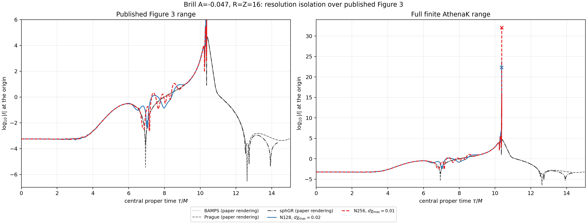
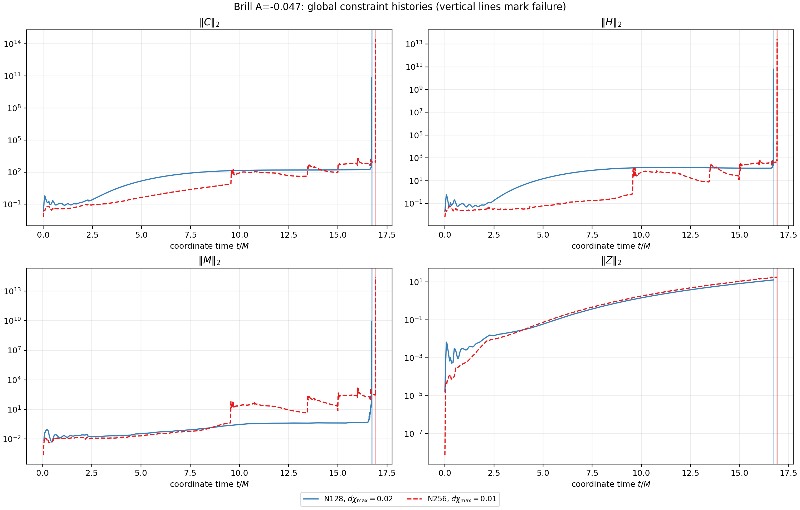
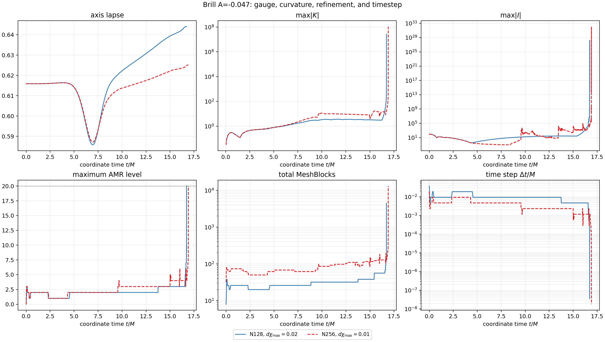

# Brill Figure 3 R=16 resolution-isolation report

## Executive conclusion

The doubled-resolution experiment does not cure the late-time failure.  The
authenticated N128 baseline fails at coordinate time
`16.722269260883227 M`; the N256 case fails at
`16.909588390589008 M`, a delay of only `0.1873191297057808 M` (1.12% of
the N128 terminal time).  This lies inside the prospectively frozen
`+/-0.25 M` comparable-time window and is therefore **consistent with a
formulation/gauge-scale failure**, not proof of one.

N256 has lower early constraint violations, but it eventually follows the
same qualitative sequence: curvature and constraints grow, AMR climbs to
level 20, the timestep collapses, and the evolution terminates fail-closed.
There is no R4 or Figure 3 qualification claim.

## Question tested

The experiment followed the requested three-way diagnostic:

- higher resolution failing materially earlier would favor a
  resolution-triggered numerical instability;
- comparable failure times would favor a formulation issue;
- materially longer survival would favor inadequate resolution.

The comparison intentionally changes both the root resolution and the AMR
trigger: N128 uses root grid `64 x 128` with `dchi_max=0.02`; N256 uses root
grid `128 x 256` with `dchi_max=0.01`.  The domain remains
`rho in [0,16]`, `z in [-16,16]`.

## Frozen common configuration

Both cases use the exact same source and executable:

- source commit: `2a8ad80e02279769a99fe279b7a33516bc6c8d0d`
- source tree: `67709c405a1169a15643cb933eec5353cd216243`
- Kokkos commit: `6739bc623081648af9e752b616d9671527922cbf`
- executable SHA256:
  `8325bd78f4851f04e6810aaf9fb5ecfc4007d876c3a3011a296512ffbd7875be`
- Brill amplitude: `A=-0.047`
- IrisK ADM mass: `2.660301967997158`
- O6 spatial differencing, RK4, CFL `0.15`
- pre-collapsed lapse initial data
- max-domain-`|K|`-scaled telegrapher lapse, `tau=kappa=1`
- fixed `eta=2` Gamma-driver shift
- Z4c constraint damping disabled (`kappa1=kappa2=0`)
- KO dissipation `0.02`
- `floor_chi=false`
- maximum refinement level 20

Only the requested root resolution and `dchi_max` change scientifically.
N256 capacity limits were doubled (`max_nmb_per_rank=4096`, total 16384) so
the larger case would not fail merely because it inherited the N128 capacity
ceiling.

## Terminal comparison

| Quantity | N128, dchi=0.02 | N256, dchi=0.01 |
| --- | ---: | ---: |
| Last finite coordinate time | 16.7222692609 | 16.9095883906 |
| Last central proper time | 10.3653818206 | 10.3738991338 |
| Last finite cycle | 3012 | 7616 |
| Last timestep | 3.5762787e-8 | 1.7881393e-8 |
| Maximum AMR level | 20 | 20 |
| Maximum MeshBlocks | 4484 | 13076 |
| Last C norm | 7.0060519e10 | 2.9800433e14 |
| Last H norm | 6.1685210e10 | 2.8876860e13 |
| Last M norm | 8.3753082e9 | 2.6912747e14 |
| Last max abs K | 2.6129864e7 | 1.0796923e8 |
| Last max abs Kretschmann | 1.6091916e28 | 1.1618778e32 |
| Final native error | 74 invalid chi boundary parent stencils | nonfinite/invalid axis-central diagnostic support |

The capacity ceiling is not the N256 cause: its 13,076 MeshBlocks remain
below the frozen 16,384 total limit.

Collapse landmarks shift together by approximately `0.18-0.19 M`:

| Landmark | N128 time | N256 time | Delta |
| --- | ---: | ---: | ---: |
| `dt <= 1e-4` | 16.7166503906 | 16.8958740234 | +0.1792236328 |
| `C >= 1e6` | 16.7214569092 | 16.9091926575 | +0.1877357483 |
| AMR level 20 | 16.7222636819 | 16.9095838487 | +0.1873201668 |
| last finite row | 16.7222692609 | 16.9095883906 | +0.1873191297 |

This coherent shift is stronger evidence than comparing only the final fatal
line.  N256 does not fail earlier, but its small delay is not the materially
longer survival expected if base-grid under-resolution were the primary cause.

## Figures

### Published Figure 3 overlay

The gray/black paper curves are vector centerlines reconstructed from the
published PDF, not the authors' raw samples.  N128 and N256 closely overlay
through the early evolution, then both depart and develop a late curvature
spike near central proper time `10.37 M`, well before the paper curves end at
`15 M`.

### Global constraints

N256 initially reduces several constraint norms, but this improvement does
not survive the late collapse.  Vertical lines mark the last finite history
time for each run.

### Gauge, curvature, AMR, and timestep

Both cases show the same coupled refinement/timestep/curvature pathology.

## Interpretation boundaries

What the evidence supports:

- simple root-grid under-resolution is not the leading explanation;
- the failure is associated with the max-refinement/timestep-collapse phase;
- the user's formulation/gauge-scale hypothesis is consistent with this
  two-resolution result.

What it does not establish:

- it does not mathematically identify the unstable continuum mode;
- it does not distinguish the telegrapher principal/damping terms from the
  Gamma-driver coupling, AMR trigger feedback, or another formulation term;
- the final fatal modes differ, so the terminal line alone should not be called
  convergent;
- N128 used four A100-40GB GPUs while N256 used four A100-80GB GPUs.  The
  source, executable, inputs, and rank binding are exact, but hardware remains
  a provenance caveat;
- changing resolution and `dchi_max` together isolates the requested combined
  refinement strategy, not each control independently.

## Evidence inventory

- `data/analysis_summary.json`: strict derived metrics and landmark times.
- `data/n128_history.csv`, `data/n256_history.csv`: all finite rows for the 14
  plotted history fields.
- `data/n128_result.json`, `data/n256_result.json`: authenticated terminal
  summaries.
- `data/n256_selected_root_verification.json`: selected files checked against
  the final Perlmutter root manifest.
- `data/n256_terminal_log_tail.txt`: terminal log context and native error.
- `data/n256_sacct_settled.psv`: job `57017386` accounting.
- `data/brill_r16_n256_dchi001.athinput`: exact N256 input deck.
- `data/figure3_published_curves*`: rendered-path paper reference and metadata.
- `figures/*.png`, `figures/*.pdf`: deterministic comparison figures.

`SHA256SUMS` and `SHA256SUMS.sha256` authenticate the review bundle.  The
documentation commit containing this report is distinct from the numerical
source commit above.
