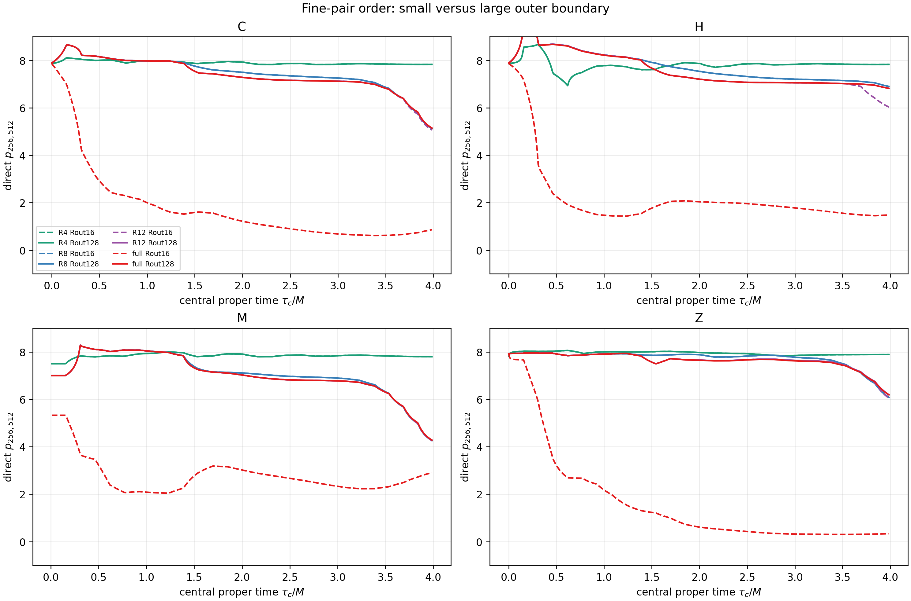
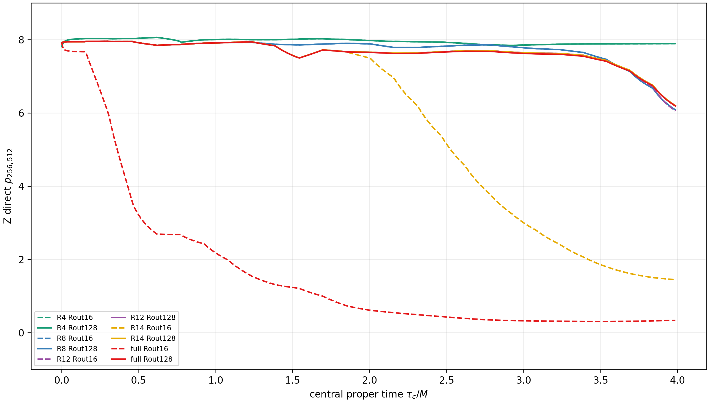
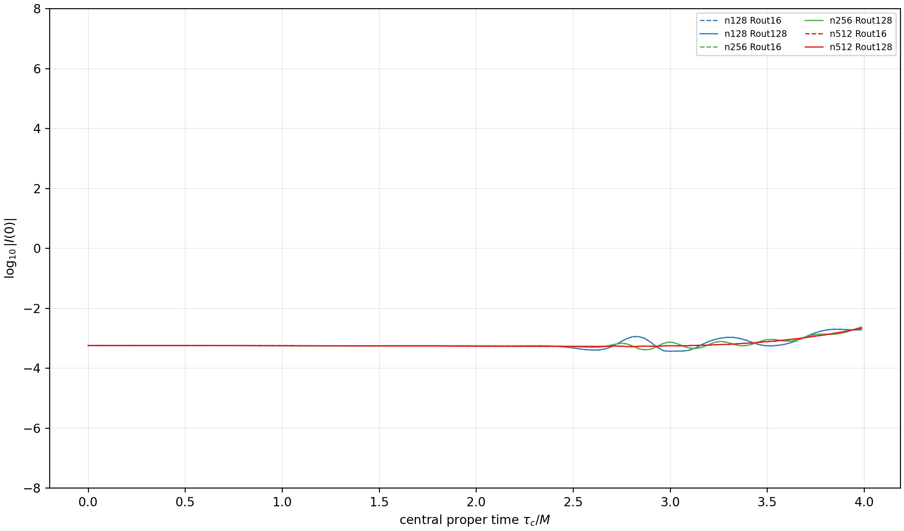

# Direct Rout=16 versus Rout=128 comparison

## Verdict

`BOUNDARY_CONTAMINATION_CONFIRMED`

All four defining observations are present:

1. Rout=16 convergence is already strong in small radii while its global
   fine-pair C/H/Z orders flatten.
2. Moving the boundary to 128M restores the fine-pair full-domain orders.
3. The discrepancy is concentrated in the old outer shells and is strongest
   for Z.
4. The central physical curvature trajectory is unchanged to numerical
   precision over the qualified interval.

## Terminal sensitivity at matched axisTau

The table gives the N512 inventory ratio
`Q(Rout=16)/Q(Rout=128)` and the direct fine-pair order before/after moving
the boundary.

| region | constraint | N512 ratio | p256-512 Rout16 | p256-512 Rout128 |
|---|---|---:|---:|---:|
| R4 | C/H/M/Z | 1.000 / 1.000 / 1.000 / 1.000 | 7.831 / 7.830 / 7.796 / 7.888 | 7.831 / 7.830 / 7.796 / 7.888 |
| R8 | C/H/M/Z | 1.000 / 1.000 / 1.000 / 1.000 | 5.120 / 6.901 / 4.258 / 6.079 | 5.120 / 6.901 / 4.258 / 6.079 |
| R12 | C/H/M/Z | 1.058 / 1.738 / 1.017 / 1.110 | 5.067 / 6.033 / 4.257 / 6.048 | 5.146 / 6.822 / 4.281 / 6.196 |
| full | C/H/M/Z | 53.35 / 65.45 / 2.88 / 844.68 | 0.861 / 1.482 / 2.901 / 0.334 | 5.146 / 6.821 / 4.281 / 6.186 |

R4 is conservatively causally protected and agrees to approximately one part
in a billion. R8 also agrees at plotting precision. R12 has modest boundary
sensitivity, consistent with its conservative reach time. The old full-domain
Z inventory is 845 times the large-domain value at N512.

For Rout=16 N512, 99.87% of Z lies outside r=12M: 50.53% in 12-16M and 49.34%
in the square corners beyond r=16M. In Rout=128, 91.39% of the much smaller Z
inventory lies in 4-8M and 5.70% in 8-12M; the exterior 16-120M shells are
negligible. This directly identifies the weak global Z order as an
outer-boundary/shell contribution.

## Central physical trace

No time, amplitude, or coordinate shifts were applied. The maximum matched
difference in `log10|axisKret|` between the small and large domains is:

| resolution | maximum absolute log10 deviation |
|---|---:|
| N128 | 1.36e-10 |
| N256 | 8.72e-10 |
| N512 | 6.68e-9 |

Thus the larger domain changes the constraint contamination without changing
the central physical trajectory over `t<=6.5M`.

The result confirms the source of the Figure-2 flattening only. It does not
prove that the old boundary causes the separate late refinement cascade; the
optional late Rout=128 N256 control was not needed for, and was not run as
part of, this first-gate conclusion.

