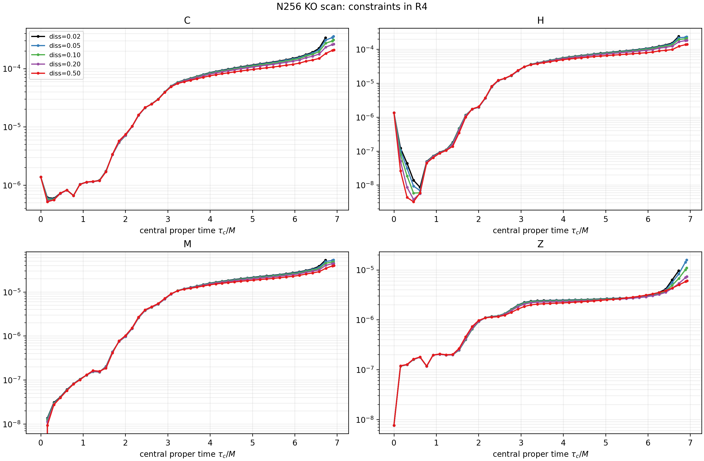

# Independent N256 KO-dissipation scan on Rout=16

## Controlled setup

Each case starts from scratch at N256 on the original Rout=16 domain and uses
native AMR in record mode. Only `z4c/diss` changes. Gauge, zero constraint
damping, dchi threshold 0.02, derefinement factor 0.25, q6 transfer, O4 bulk
operator, RK4, CFL 0.15, boundary condition, and initial data are identical.

All five cases reached t=6.5 and t=9.5. Stage C continued every case because
all remained diagnostically plausible. The diss=0.02 segment was terminated
after its timestep collapsed at essentially fixed coordinate time; this is a
numerical-runaway disposition, not a successful t=11.3 endpoint.

## Required summary

| diss | C(6.5) | C(~9.2) | first late refinement | max leaves | max physical level | terminal t | terminal axisTau | max log10 axisKret deviation from 0.02 | status |
|---:|---:|---:|---:|---:|---:|---:|---:|---:|---|
| 0.02 | 3.285e-3 | 1.032 | 10.2758 | 1526 | 20 | 11.191917 | 6.84660 | 0 | timestep collapse; exit 130 by bounded termination |
| 0.05 | 2.693e-3 | 0.692 | 10.3658 | 65 | 3 | 11.3 | 6.91532 | 0.0278 dex | reached tlim |
| 0.10 | 2.224e-3 | 0.390 | 10.7394 | 86 | 4 | 11.3 | 6.91700 | 0.0556 dex | reached tlim |
| 0.20 | 1.850e-3 | 0.168 | 11.1045 | 50 | 2 | 11.3 | 6.91945 | 0.0861 dex | reached tlim |
| 0.50 | 1.518e-3 | 0.0437 | none by 11.3 | 50 | 2 | 11.3 | 6.92374 | 0.1103 dex | reached tlim; no new late refinement |

The diss=0.02 terminal state has `C=1.61e16`,
`dt=7.98e-9M`, physical level 20, and 1,526 leaves at
`t=11.191916995M`. Continuing to 11.3 would not have been computationally
meaningful.

At t=11.3, terminal C is 255.5, 1593.4, 53.63, and 0.2695 for diss 0.05,
0.10, 0.20, and 0.50 respectively. The non-monotonic 0.05/0.10 terminal
ordering tracks their different accepted AMR trees; it is not evidence of a
monotone truncation-error law.

## Physical-trajectory check

The central `axisKret` curves remain visually coincident with the
authenticated Figure-3 trace over the interval reached here. The largest
baseline-relative logarithmic deviation grows from 0.028 dex at diss 0.05 to
0.110 dex at diss 0.50. The latter is about a 29% pointwise factor at the
worst matched point, but it is small compared with the multi-decade physical
trace and does not constitute clear evidence that collapse was erased or
phase-shifted. This campaign does not extend far enough to qualify diss=0.50
as physically convergent.

## Verdict

`KO_STRONG_EFFECT`

Increasing KO strongly and systematically delays the first late refinement
and suppresses the pre-refinement constraint growth. Diss=0.50 eliminates the
late accepted refinement through t=11.3 and avoids the baseline cascade.
Therefore the late cascade contains a strongly under-damped numerical
component. It is not KO-insensitive.

The evidence does not meet the stricter `KO_OVERDAMPED` label because the
central physical trace is not materially displaced over the matched interval.
Nevertheless, diss=0.50 should not become a production default from one
resolution. For the next controlled convergence campaign, diss=0.20 is the
conservative compromise and diss=0.50 should be retained as a stability
control. The next campaign should decide whether the remaining 0.20 growth
converges away and whether the small 0.50 trace change shrinks with
resolution.

One raw HBM trace in the diss=0.20 Stage-A segment ends with an isolated
36,577 MiB sample after otherwise steady 5,815 MiB samples. Because the mesh
and executable are comparable to the other N256 cases, this is treated as a
monitoring/out-of-step outlier, not as a dissipation-dependent memory result.

