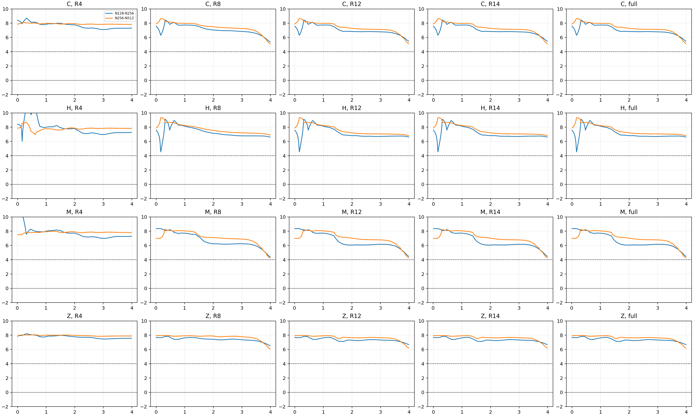
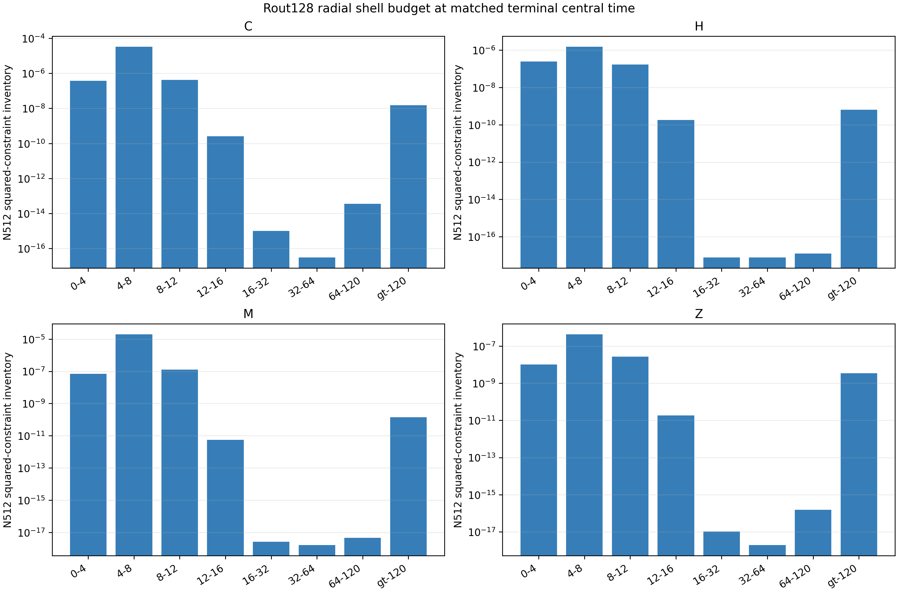

# Rout=128 common-tree radial convergence

The N128/N256/N512 runs use the same accepted N256 logical tree at the same
physical event times. Their common terminal central proper time is
`axisTau=3.986147425556009M`.

## Required terminal tables

### r <= 4M

| constraint | N128 | N256 | N512 | p128-256 | p256-512 |
|---|---:|---:|---:|---:|---:|
| C | 1.348006e-2 | 8.465296e-5 | 3.717430e-7 | 7.315 | 7.831 |
| H | 8.550495e-3 | 5.558939e-5 | 2.442657e-7 | 7.265 | 7.830 |
| M | 2.469862e-3 | 1.576264e-5 | 7.093297e-8 | 7.292 | 7.796 |
| Z | 4.702325e-4 | 2.470709e-6 | 1.043120e-8 | 7.572 | 7.888 |

### r <= 8M

| constraint | N128 | N256 | N512 | p128-256 | p256-512 |
|---|---:|---:|---:|---:|---:|
| C | 4.844786e-2 | 1.162073e-3 | 3.342642e-5 | 5.382 | 5.120 |
| H | 2.055927e-2 | 2.092869e-4 | 1.751192e-6 | 6.618 | 6.901 |
| M | 7.919855e-3 | 3.781460e-4 | 1.976259e-5 | 4.388 | 4.258 |
| Z | 2.767707e-3 | 2.999754e-5 | 4.438403e-7 | 6.528 | 6.079 |

### r <= 12M

| constraint | N128 | N256 | N512 | p128-256 | p256-512 |
|---|---:|---:|---:|---:|---:|
| C | 5.352804e-2 | 1.198378e-3 | 3.384100e-5 | 5.481 | 5.146 |
| H | 2.142163e-2 | 2.167933e-4 | 1.916765e-6 | 6.627 | 6.822 |
| M | 8.600726e-3 | 3.865970e-4 | 1.989037e-5 | 4.476 | 4.281 |
| Z | 3.558281e-3 | 3.453064e-5 | 4.709351e-7 | 6.687 | 6.196 |

### Full Rout=128 domain

| constraint | N128 | N256 | N512 | p128-256 | p256-512 |
|---|---:|---:|---:|---:|---:|
| C | 5.352967e-2 | 1.198424e-3 | 3.385614e-5 | 5.481 | 5.146 |
| H | 2.142183e-2 | 2.168081e-4 | 1.917581e-6 | 6.627 | 6.821 |
| M | 8.600811e-3 | 3.865976e-4 | 1.989052e-5 | 4.476 | 4.281 |
| Z | 3.558604e-3 | 3.453812e-5 | 4.743682e-7 | 6.687 | 6.186 |

The large-domain full inventories converge almost exactly like the interior.
The N256 to N512 direct order stays 4.28 or better in every family and exceeds
6 for H and Z. The same caveat as the small-domain analysis applies: these are
constraint convergence measurements for this interval, not a complete
Figure-3 or late-collapse convergence qualification.

The exterior shell budget extends through 16-32, 32-64, and 64-120M. At the
terminal slice those shells contribute negligibly compared with the inner
solution; the residual `r>120M` Z contribution is 0.72% of the already tiny
large-domain full Z inventory.

