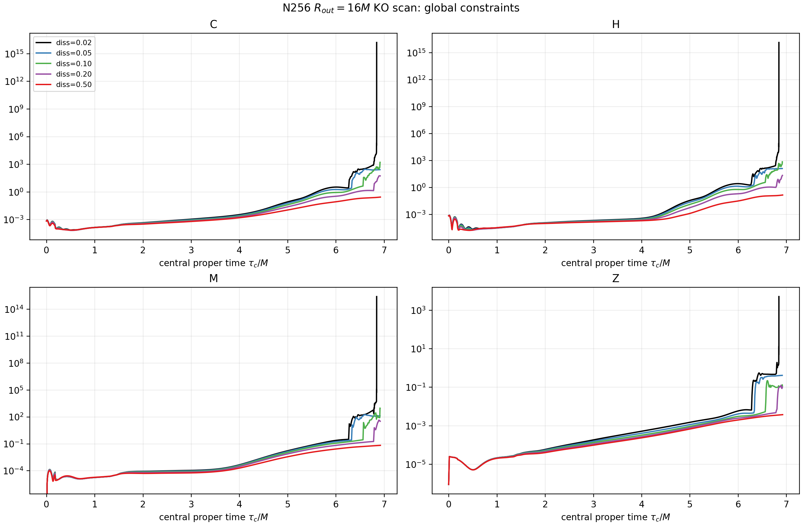
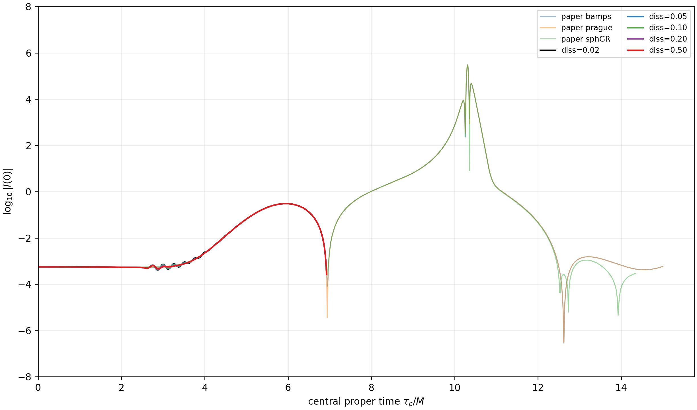

# Brill native-VC boundary convergence and KO scan

Date: 2026-08-24  
Base: `953f2724c00a2efd2f9fad91ae9a784639954a3b`  
Branch: `codex/z4c-vc-boundary-convergence-ko-scan-20260824`

## Executive verdicts

**Boundary:** `BOUNDARY_CONTAMINATION_CONFIRMED`

The apparent N256 to N512 flattening in the existing global Figure-2
constraint inventories is primarily an outer-boundary/shell effect. At
`axisTau=3.9861474M`, the Rout=16 full-domain direct fine-pair orders are
0.861, 1.482, 2.901, and 0.334 for C/H/M/Z. The corresponding Rout=128 orders
are 5.146, 6.821, 4.281, and 6.186. Inside `r<=4M`, both domains agree to
about one part in a billion and all four fine-pair orders are 7.80 or higher.
The central `axisKret` traces differ by at most `6.7e-9` dex.

**KO:** `KO_STRONG_EFFECT`

On the original Rout=16 N256 problem, increasing KO strongly delays the first
late refinement and suppresses constraint growth. The diss=0.02 baseline
stalls at `t=11.191917M` with `dt=7.98e-9M`, `C=1.61e16`, level 20, and
1,526 leaves. Diss=0.05, 0.10, 0.20, and 0.50 all reach `t=11.3M`. Their
first late refinements occur at 10.3658, 10.7394, 11.1045, and not by 11.3M,
respectively. Diss=0.50 ends with `C=0.2695` and no late accepted refinement,
while its maximum matched central-trace deviation from diss=0.02 is 0.110 dex.

## Part I: boundary/convergence experiment

The Cartoon history measure was audited first. It already uses
`2*pi*rho*sqrt(det(gamma))*drho*dz` with canonical native-VC trapezoid
ownership. There is no fictitious collapsed-y width.

The authenticated Rout=16 binaries were then re-integrated over
`r<=4,8,12,14M`, the full square, and radial shells. The small-domain N512 Z
inventory is 99.87% outside `r=12M`; 50.53% is in `12<r<=16M` and 49.34%
is in square corners with `r>16M`.

A new Rout=128 SMR domain preserves the old inner spacing exactly with three
dyadic minimum levels and raises only the absolute level ceilings by three.
The N256 inner initialization has identical coordinates and 23/25 variables
bitwise identical; Gamma_x/y differ by at most `1.94e-15`.

The N256 Rout=128 authority completes at t=6.5 with 206 final leaves. A
same-resolution replay has a bitwise-identical 264 by 71 history. N128 and
N512 replay the exact tree at physical event times and finish cleanly. The
large boundary is conservatively causally unable to reach `r<=12M`.

The old global plot and its radius-restricted replacement are shown together
in `REPORT.pdf`; the complete terminal tables for both domains are reproduced
below.

Detailed tables: [small-domain radial convergence](SMALL_DOMAIN_RADIAL_CONVERGENCE.md),
[large-domain convergence](LARGE_DOMAIN_CONVERGENCE.md), and
[direct boundary comparison](BOUNDARY_COMPARISON.md).

## Part II: independent N256 KO experiment

Only `z4c/diss` changes across 0.02, 0.05, 0.10, 0.20, and 0.50. Every case
uses a fresh native-AMR record authority; no baseline tree is replayed.

| diss | C(6.5) | C(~9.2) | first late refinement | max leaves | max level | terminal t | terminal axisTau | max axisKret deviation | status |
|---:|---:|---:|---:|---:|---:|---:|---:|---:|---|
| 0.02 | 3.285e-3 | 1.032 | 10.2758 | 1526 | 20 | 11.191917 | 6.84660 | 0 | bounded termination after timestep collapse |
| 0.05 | 2.693e-3 | 0.692 | 10.3658 | 65 | 3 | 11.3 | 6.91532 | 0.0278 dex | reached tlim |
| 0.10 | 2.224e-3 | 0.390 | 10.7394 | 86 | 4 | 11.3 | 6.91700 | 0.0556 dex | reached tlim |
| 0.20 | 1.850e-3 | 0.168 | 11.1045 | 50 | 2 | 11.3 | 6.91945 | 0.0861 dex | reached tlim |
| 0.50 | 1.518e-3 | 0.0437 | none | 50 | 2 | 11.3 | 6.92374 | 0.1103 dex | reached tlim; no late refinement |

The best conservative next campaign is Rout=128 SMR with the existing
common-tree record/replay workflow, zero Z4 damping, and diss=0.20, while
retaining diss=0.50 as a stability control. Diss=0.20 is chosen as a compromise,
not a qualified production default. A three-resolution comparison must show
that its remaining late growth converges away and that the small physical
trace change shrinks with resolution.

The existing curvature binaries were also censused offline. All late sampled
curvature and C/H/M/Z maxima localize to the equatorial annulus near `rho=5M`;
the per-case, per-field coordinates are in
`analysis/ko_stageC/ko_extrema_summary.csv` and
`ko_constraint_extrema_summary.csv`. These locations are snapshot-resolved
and do not claim an exact between-output maximum.

## Evidence boundaries and limitations

- This confirms the cause of the current Figure-2 global flattening through
  t=6.5. It does not qualify late-time Figure-3 convergence.
- The optional late Rout=128 N256 control was not run; the boundary and KO
  verdicts remain independent.
- The KO scan is one-resolution evidence. It identifies a strong numerical
  damping sensitivity but cannot by itself distinguish continuum, spatial,
  and AMR-interface error or set a production dissipation.
- No horizon/critical-scaling claim is made.
- No production numerical source was modified.
- One diss=0.20 HBM trace has an isolated post-step 36.6 GiB sample; raw data
  are retained and it is not interpreted as a physical memory dependence.
- Multi-gigabyte binaries/restarts remain at the exact Perlmutter paths in
  `EVIDENCE_MANIFEST.json`; the repository includes the derived integrals,
  histories, authorities, logs, plots, and hashes needed for read-only review.

## Artifact map

- [Static audit](STATIC_AUDIT.md)
- [Boundary causality](BOUNDARY_CAUSALITY.md)
- [SMR layout proof](SMR_LAYOUT_PROOF.md)
- [Large-domain authority](LARGE_DOMAIN_AUTHORITY.md)
- [KO scan](KO_SCAN_N256.md)
- [Requirement-by-requirement completion audit](COMPLETION_AUDIT.md)
- [Strict evidence manifest](EVIDENCE_MANIFEST.json)
- `REPORT.tex` and `REPORT.pdf`

## Required terminal boundary tables

All values are evaluated at the common `axisTau=3.98614742555601M`. They are
extensive squared-constraint inventories using the production ring measure.

### r <= 4M

| domain | constraint | N128 | N256 | N512 | p128-256 | p256-512 |
|---|---|---:|---:|---:|---:|---:|
| Rout16 | C | 1.348006e-02 | 8.465296e-05 | 3.717430e-07 | 7.315 | 7.831 |
| Rout16 | H | 8.550495e-03 | 5.558939e-05 | 2.442657e-07 | 7.265 | 7.830 |
| Rout16 | M | 2.469862e-03 | 1.576264e-05 | 7.093297e-08 | 7.292 | 7.796 |
| Rout16 | Z | 4.702325e-04 | 2.470709e-06 | 1.043120e-08 | 7.572 | 7.888 |
| Rout128 | C | 1.348006e-02 | 8.465296e-05 | 3.717430e-07 | 7.315 | 7.831 |
| Rout128 | H | 8.550495e-03 | 5.558939e-05 | 2.442657e-07 | 7.265 | 7.830 |
| Rout128 | M | 2.469862e-03 | 1.576264e-05 | 7.093297e-08 | 7.292 | 7.796 |
| Rout128 | Z | 4.702325e-04 | 2.470709e-06 | 1.043120e-08 | 7.572 | 7.888 |

### r <= 8M

| domain | constraint | N128 | N256 | N512 | p128-256 | p256-512 |
|---|---|---:|---:|---:|---:|---:|
| Rout16 | C | 4.844766e-02 | 1.162071e-03 | 3.342641e-05 | 5.382 | 5.120 |
| Rout16 | H | 2.055927e-02 | 2.092869e-04 | 1.751192e-06 | 6.618 | 6.901 |
| Rout16 | M | 7.919856e-03 | 3.781460e-04 | 1.976259e-05 | 4.388 | 4.258 |
| Rout16 | Z | 2.767653e-03 | 2.999699e-05 | 4.438367e-07 | 6.528 | 6.079 |
| Rout128 | C | 4.844786e-02 | 1.162073e-03 | 3.342642e-05 | 5.382 | 5.120 |
| Rout128 | H | 2.055927e-02 | 2.092869e-04 | 1.751192e-06 | 6.618 | 6.901 |
| Rout128 | M | 7.919855e-03 | 3.781460e-04 | 1.976259e-05 | 4.388 | 4.258 |
| Rout128 | Z | 2.767707e-03 | 2.999754e-05 | 4.438403e-07 | 6.528 | 6.079 |

### r <= 12M

| domain | constraint | N128 | N256 | N512 | p128-256 | p256-512 |
|---|---|---:|---:|---:|---:|---:|
| Rout16 | C | 5.352846e-02 | 1.200157e-03 | 3.580198e-05 | 5.479 | 5.067 |
| Rout16 | H | 2.142197e-02 | 2.180944e-04 | 3.331186e-06 | 6.618 | 6.033 |
| Rout16 | M | 8.600886e-03 | 3.868941e-04 | 2.022954e-05 | 4.474 | 4.257 |
| Rout16 | Z | 3.558256e-03 | 3.457498e-05 | 5.225604e-07 | 6.685 | 6.048 |
| Rout128 | C | 5.352804e-02 | 1.198378e-03 | 3.384100e-05 | 5.481 | 5.146 |
| Rout128 | H | 2.142163e-02 | 2.167933e-04 | 1.916765e-06 | 6.627 | 6.822 |
| Rout128 | M | 8.600726e-03 | 3.865970e-04 | 1.989037e-05 | 4.476 | 4.281 |
| Rout128 | Z | 3.558281e-03 | 3.453064e-05 | 4.709351e-07 | 6.687 | 6.196 |

### Full domains

| domain | constraint | N128 | N256 | N512 | p128-256 | p256-512 |
|---|---|---:|---:|---:|---:|---:|
| Rout16 | C | 5.580143e-02 | 3.281336e-03 | 1.806338e-03 | 4.088 | 0.861 |
| Rout16 | H | 2.155806e-02 | 3.504860e-04 | 1.254982e-04 | 5.943 | 1.482 |
| Rout16 | M | 8.642785e-03 | 4.283244e-04 | 5.734945e-05 | 4.335 | 2.901 |
| Rout16 | Z | 4.071228e-03 | 5.050659e-04 | 4.006896e-04 | 3.011 | 0.334 |
| Rout128 | C | 5.352967e-02 | 1.198424e-03 | 3.385614e-05 | 5.481 | 5.146 |
| Rout128 | H | 2.142183e-02 | 2.168081e-04 | 1.917581e-06 | 6.627 | 6.821 |
| Rout128 | M | 8.600811e-03 | 3.865976e-04 | 1.989052e-05 | 4.476 | 4.281 |
| Rout128 | Z | 3.558604e-03 | 3.453812e-05 | 4.743682e-07 | 6.687 | 6.186 |
