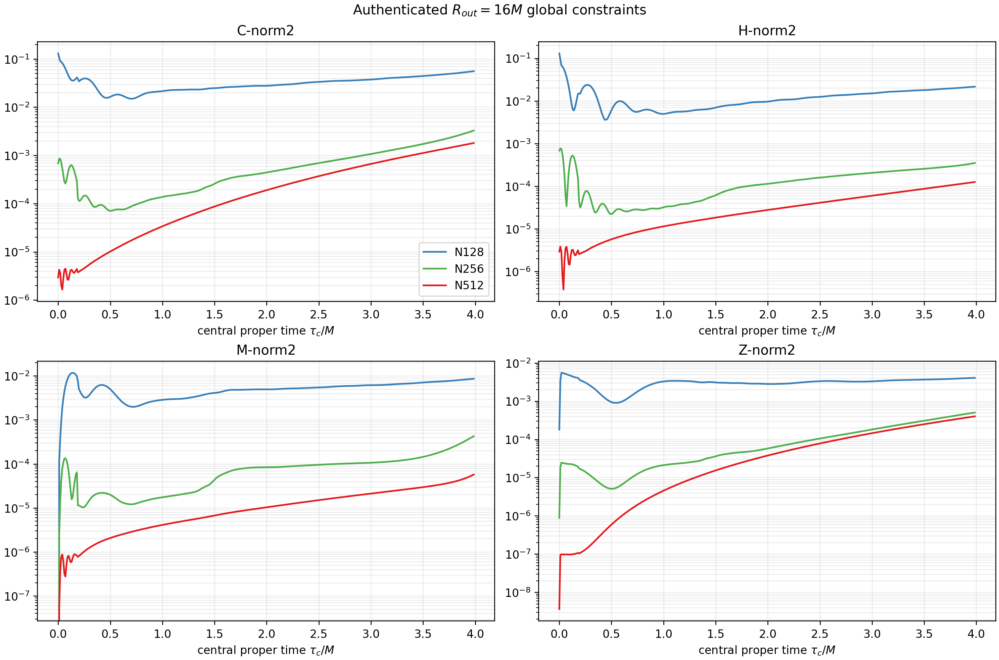
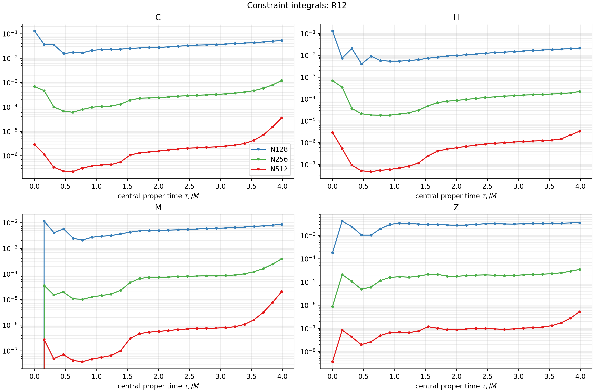
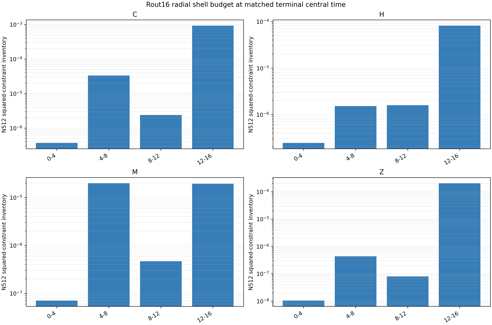

# Rout=16 radial convergence reanalysis

## Measure and authority

This is an offline reduction of the authenticated common-tree runs
`n128_native_replay_tau4_v1`, `n256_native_replay_tau4_v1`, and
`n512_native_replay_tau4_v1`; no evolution was rerun. The integrator uses the
production native-VC ring quadrature and reports the same extensive squared
constraint inventories as the history file. The common terminal time is
`axisTau=3.98614742555601 M` (`t=6.5 M`).

The terminal binary reconstruction agrees with the in-memory full history
inventory at roughly `2e-9` relative or better. The largest comparison error
over all binary snapshots is 2.43%, localized near discontinuous AMR changes
where the diagnostic compares a fixed-time binary against a linearly
interpolated every-four-cycle history. It is not used in the terminal tables.

## Terminal radial inventories and direct orders

### r <= 4M

| constraint | N128 | N256 | N512 | p128-256 | p256-512 | p_self |
|---|---:|---:|---:|---:|---:|---:|
| C | 1.348006e-2 | 8.465296e-5 | 3.717430e-7 | 7.315 | 7.831 | 7.312 |
| H | 8.550495e-3 | 5.558939e-5 | 2.442657e-7 | 7.265 | 7.830 | 7.262 |
| M | 2.469862e-3 | 1.576264e-5 | 7.093297e-8 | 7.292 | 7.796 | 7.289 |
| Z | 4.702325e-4 | 2.470709e-6 | 1.043120e-8 | 7.572 | 7.888 | 7.571 |

### r <= 8M

| constraint | N128 | N256 | N512 | p128-256 | p256-512 | p_self |
|---|---:|---:|---:|---:|---:|---:|
| C | 4.844766e-2 | 1.162071e-3 | 3.342641e-5 | 5.382 | 5.120 | 5.389 |
| H | 2.055927e-2 | 2.092869e-4 | 1.751192e-6 | 6.618 | 6.901 | 6.616 |
| M | 7.919856e-3 | 3.781460e-4 | 1.976259e-5 | 4.388 | 4.258 | 4.395 |
| Z | 2.767653e-3 | 2.999699e-5 | 4.438367e-7 | 6.528 | 6.079 | 6.533 |

### r <= 12M

| constraint | N128 | N256 | N512 | p128-256 | p256-512 | p_self |
|---|---:|---:|---:|---:|---:|---:|
| C | 5.352846e-2 | 1.200157e-3 | 3.580198e-5 | 5.479 | 5.067 | 5.490 |
| H | 2.142197e-2 | 2.180944e-4 | 3.331186e-6 | 6.618 | 6.033 | 6.625 |
| M | 8.600886e-3 | 3.868941e-4 | 2.022954e-5 | 4.474 | 4.257 | 4.486 |
| Z | 3.558256e-3 | 3.457498e-5 | 5.225604e-7 | 6.685 | 6.048 | 6.693 |

### Full Rout=16 square

| constraint | N128 | N256 | N512 | p128-256 | p256-512 | p_self |
|---|---:|---:|---:|---:|---:|---:|
| C | 5.580143e-2 | 3.281336e-3 | 1.806338e-3 | 4.088 | 0.861 | 5.154 |
| H | 2.155806e-2 | 3.504860e-4 | 1.254982e-4 | 5.943 | 1.482 | 6.559 |
| M | 8.642785e-3 | 4.283244e-4 | 5.734945e-5 | 4.335 | 2.901 | 4.469 |
| Z | 4.071228e-3 | 5.050659e-4 | 4.006896e-4 | 3.011 | 0.334 | 5.095 |

The self-difference order is misleading in the full-domain C/H/Z rows. The
zero-solution direct order shows that the fine pair is flattened by an outer
contribution, while the causally protected `r<=4M` inventory remains close to
eighth order and `r<=8/12M` remains fourth to seventh order depending on
constraint family.

## Time-dependent fine-pair order checkpoints

The entries below are `p256-512`: median over `0.5<=axisTau<=2`, values near
axisTau 2 and 3, terminal value, and the minimum over the late `axisTau>=3`
interval.

| region | C | H | M | Z |
|---|---|---|---|---|
| R4 | 7.943 / 7.929 / 7.838 / 7.831 / 7.828 | 7.717 / 7.871 / 7.835 / 7.830 / 7.824 | 7.896 / 7.908 / 7.836 / 7.796 / 7.796 | 8.001 / 7.973 / 7.849 / 7.888 / 7.850 |
| R8 | 7.962 / 7.497 / 7.253 / 5.120 / 5.120 | 8.118 / 7.537 / 7.208 / 6.901 / 6.901 | 7.958 / 7.111 / 6.894 / 4.258 / 4.258 | 7.885 / 7.881 / 7.776 / 6.079 / 6.079 |
| R12 | 7.965 / 7.283 / 7.123 / 5.067 / 5.067 | 8.120 / 7.206 / 7.057 / 6.033 / 6.033 | 7.952 / 7.024 / 6.777 / 4.257 / 4.257 | 7.856 / 7.654 / 7.641 / 6.048 / 6.048 |
| R14 | 7.965 / 6.555 / 3.941 / 3.226 / 3.129 | 8.120 / 5.973 / 4.076 / 3.478 / 3.460 | 7.952 / 6.607 / 5.058 / 4.008 / 4.008 | 7.856 / 7.492 / 3.000 / 1.445 / 1.445 |
| full | 1.608 / 1.215 / 0.685 / 0.861 / 0.618 | 1.732 / 2.039 / 1.781 / 1.482 / 1.453 | 2.312 / 3.018 / 2.332 / 2.901 / 2.230 | 1.511 / 0.610 / 0.322 / 0.334 / 0.303 |

No interval used here is declared an error-floor measurement; all terminal
inventories remain well above floating-point roundoff. Very early ratios near
exact initial cancellations should not be interpreted as asymptotic orders.

## Shell localization

At N512 terminal time, 50.53% of the full Z inventory lies in `12<r<=16` and
49.34% lies in the square corners with `r>16`; only 0.13% lies inside
`r<=12`. Thus almost the entire weakly converging Z inventory is an
outer-domain effect. The exact C/H/M/Z shell rows and maxima are in
`analysis/small_domain_radial/radial_shell_budget.csv`.

