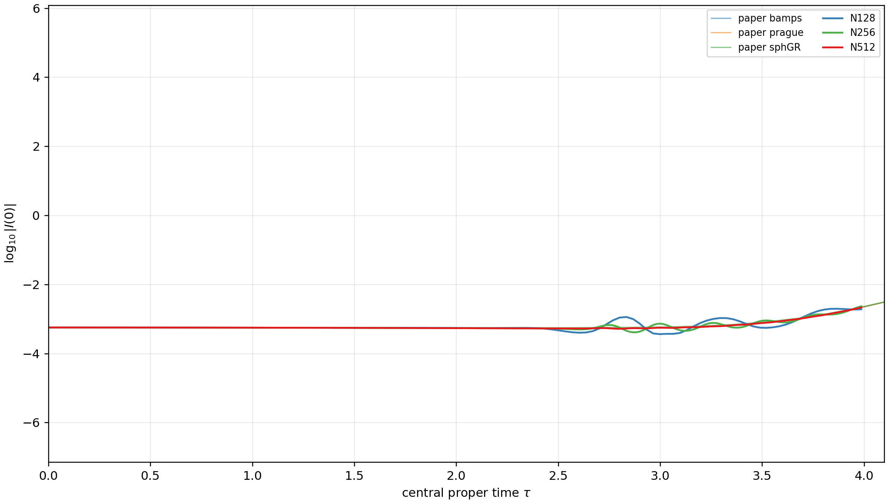

# Figure 3 status

Figure 3 is not reproduced. The authenticated paper curves are overlaid only
through the qualified tau approximately 4 window, with no time shift,
amplitude scaling, manual alignment, or coordinate rescaling.

The N256 native authority fails before tau approximately 7, so the published
interval and late-collapse branch were not attempted.

