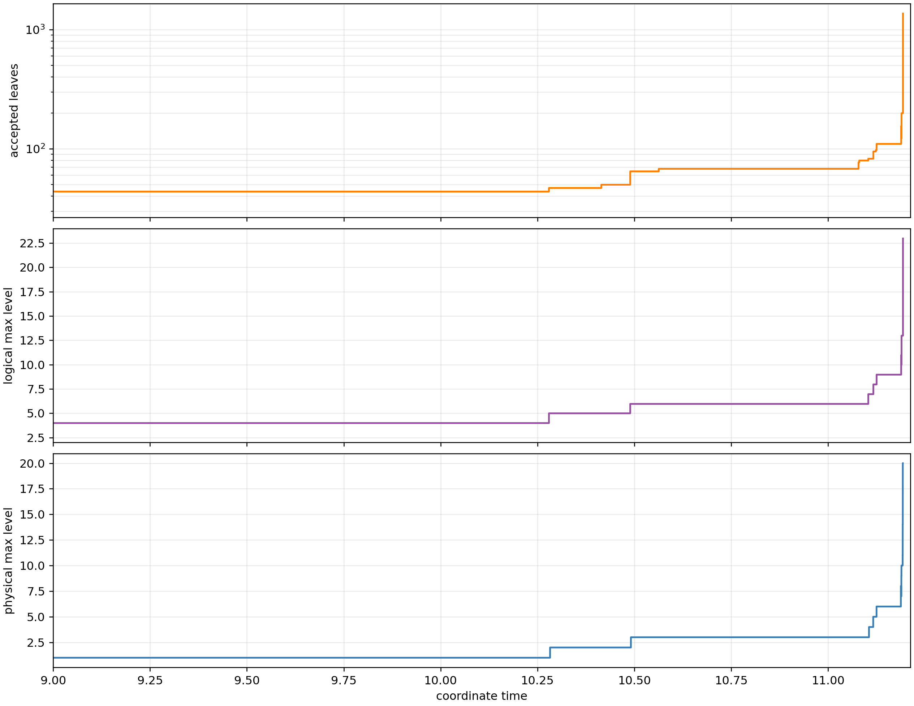
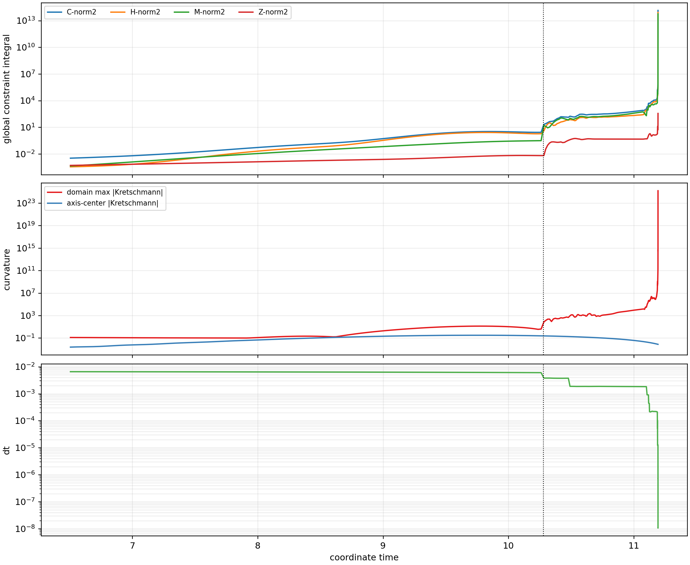

# Native AMR health

The repaired authority is exceptionally quiet through the accepted early
window: four total states, three topology changes, 44 leaves after event 3,
and physical maximum refinement level 1 through `t=6.5 M`.

The later N256 record extension fails the native-AMR health gate:

- C first exceeds 0.01 at `t=7.2894893`, tau=4.45109, while the hierarchy is
  still fixed at 44 leaves and physical level 1.
- C exceeds 1 at `t=9.2042653`, tau=5.61265, still on the same hierarchy.
- The first late refinement is only accepted at `t=10.2786687`, tau about
  6.28, when C is already about 20.9 in the nearest history row.
- Logical level 7 is reached at event 10, `t=11.1038229`.
- Event 22 at `t=11.19248494` reaches logical level 14 and begins the
  coordinate-time stagnation cascade.
- At cancellation, event 159 is at `t=11.192887945`, with 1,367 leaves,
  logical level 23, physical refinement level 20, `dt=1.07e-8`,
  C=1.40e14, and domain max |Kretschmann|=1.60e25.
- The sampled axis-center curvature remains only 7.40e-3, so the runaway is
  noncentral in this diagnostic.

Across the complete failed authority there are 160 accepted hierarchy states
(159 topology transactions). The authority records 211 refinement requests,
86,134 derefinement requests, 1,521 created leaves, 186 deleted leaves, and
888 balance-induced leaves. These request totals count recorded per-MeshBlock
flags and are not counts of successful coarsening transactions. Of the 159
accepted transitions, 144 grow the leaf inventory, 13 shrink it, and two leave
the count unchanged. There are 21 changes in the sign of successive leaf-count
increments, and 146 event records contain both refinement and derefinement
requests. The leaf inventory grows from 32 to a peak of 1,373 and terminates at
1,367. This is strong accepted-tree turnover during the late cascade, not a
simple monotonic sequence of refinements; it does not by itself identify the
upstream instability.

Observation: substantial constraint growth begins on the fixed hierarchy
before the late refinement cascade. Inference: the current chi-only native
sensor is late relative to the shortest/error-bearing scale, or a bulk mode
grows before AMR exposes/amplifies it. Hypothesis: subsequent repeated
high-order transfer/interface interactions accelerate the already-developed
error. These data do not isolate those two mechanisms.

Job 57525753 was explicitly cancelled after the fail gate. No lower/higher
resolution replay was launched past the failed N256 authority.

