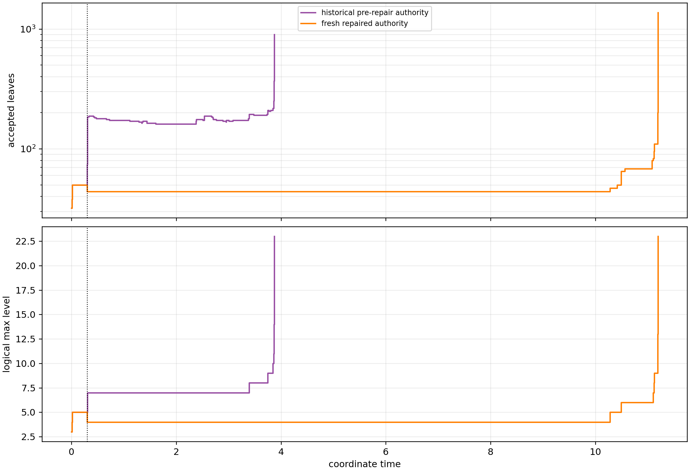

# Fresh versus historical authority

The repaired and historical N256 authorities agree exactly through accepted
event 3, including physical time, leaf inventory, maximum logical level, and
tree checksum.

| Event | Time | Leaves | Logical max level | Tree checksum |
|---:|---:|---:|---:|---|
| 0 | 0 | 32 | 3 | `c06467c519b4501d` |
| 1 | 0.01082331294 | 38 | 4 | `6d1dc10512d42608` |
| 2 | 0.01621417544 | 50 | 5 | `e38dd0ebe7826578` |
| 3 | 0.2979919497 | 44 | 4 | `b6c60694c30a2049` |

The first meaningful divergence is immediately after the repaired
derefinement:

- Historical event 4 occurs at `t=0.30305969096346536`, requests six
  refinements, creates 30 leaves including 12 balance-induced leaves, and
  returns to 74 leaves.
- The repaired native run accepts no new transaction through `t=2.5` or the
  tau approximately 4 milestone at `t=6.5`; it remains at 44 leaves.
- Its next accepted event is event 4 at `t=10.278668702889213`, when one late
  refinement creates three leaves and yields 47 leaves.

This is the expected scientific consequence of repairing the corrupted
derefinement slots, not a record/replay mismatch. The historical authority is
used only for this offline comparison.

