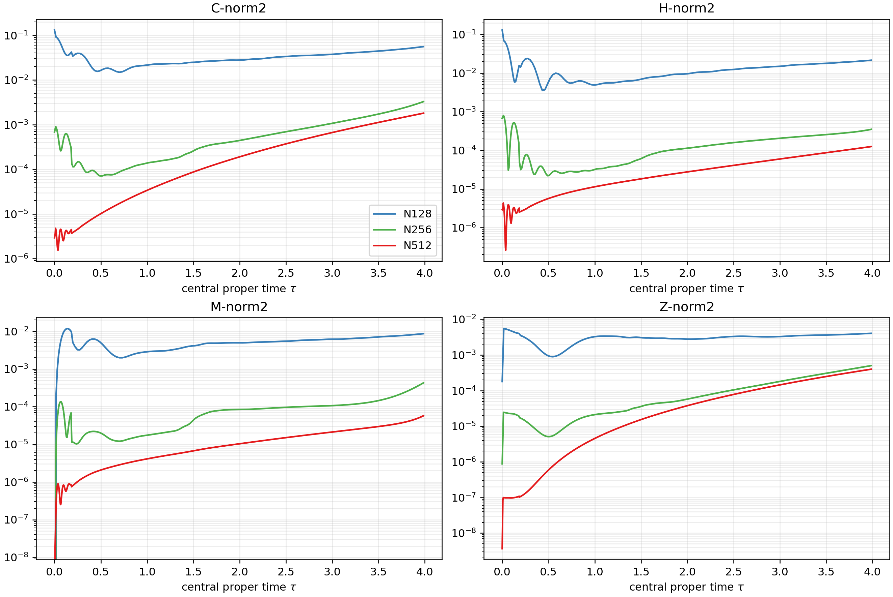
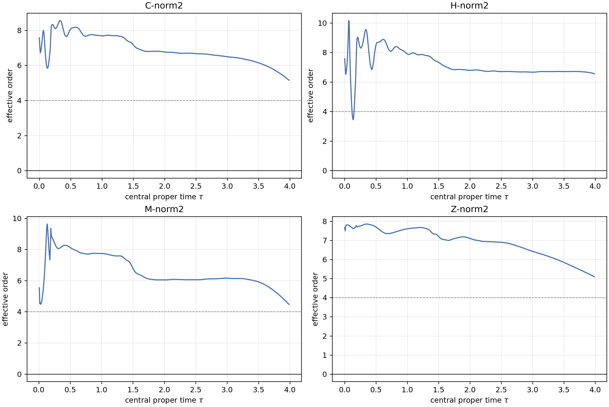

# Tau approximately 4 milestone

All three from-scratch replays reached `t=6.5 M`, corresponding to central
proper times 3.98615, 3.98694, and 3.98712 for N128, N256, and N512.

Global constraint norms improve monotonically N128 to N256 to N512. Median
effective history orders over the common proper-time interval are:

| C | H | M | Z |
|---:|---:|---:|---:|
| 6.746 | 6.794 | 6.127 | 7.029 |

Every nonzero evolved field has positive minimum trusted-core order over the
sampled times through `t=6.5`; the lowest is Theta at 1.053. Minimum chi and
all conformal-metric SPD pivots remain positive. Common shared-node spreads
are zero. Causal integration leaves a protected central comparison region.

The milestone passes, but this does not qualify later collapse.

