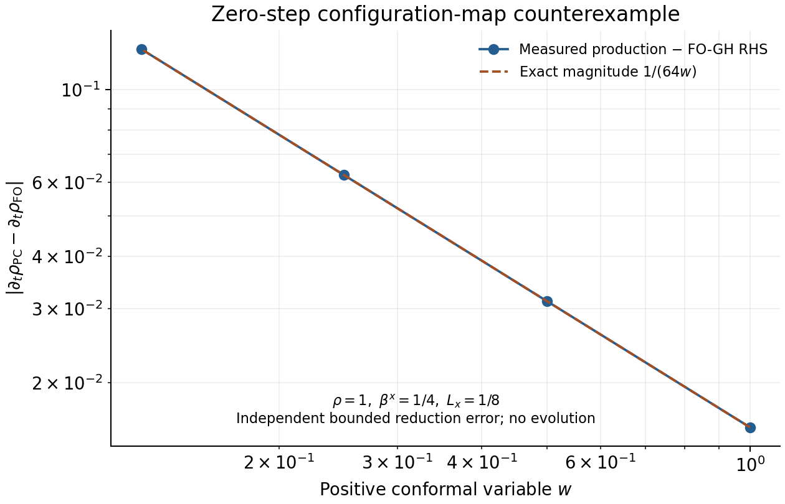

# Complete FO-GH gamma2 pullback audit, 2026-09-04

**Classification: failed dynamical scheme — the proposed exact retrofit is rejected
at the derivation gate. This is not a measured gamma2 evolution failure.**

The full FO-GH damping increment has been derived and independently checked, but it
cannot be added to the present regular equations and described as the exact standard
FO-GH system. The existing zero-damping configuration equation already differs off
the reduction manifold. A production-kernel oracle reproduces the discrepancy at
strictly positive lapse and conformal factor. In addition, the moving-puncture gauge
substitution destroys invertibility of the stated PC-GH to FO-GH point map.

A bounded nonzero coordinate-time rate also produces singular *primary* increments
for independently bounded reduction errors. A vanishing rate can regularize these
increments, but does not repair the baseline. Thus neither a qualified dynamical
scheme nor a demonstrated need for an inner hybrid has been established. The
qualification ladder was not advanced past this prerequisite. No production equations,
projection defaults, damping parameters, diagnostic thresholds, AMR transfers,
boundaries, restart ABI, or wave extraction code were changed.

## Scope and evidence

Work starts at `5811268b` on `codex/pc-gh-gamma2-20260904`. The existing derivation,
implementation, regularization audit, qualification ledger, symbolic maps/oracles,
all PC-GH evolution and diagnostic kernels, task ordering, transfer operators,
restart reader/writer, boundary implementation, ADM conversion, and shared waveform
paths were inspected before evaluating a proposed change. The symbolic oracle
`verify_fo_gh_map.py` proves a point-map round trip for a fixed source; the covariant
point-jet oracle enforces the defining derivatives. Neither verifies equality of
the full off-reduction evolution systems.

The authority for the standard system is Lindblom, Scheel, Kidder, Owen, and Rinne,
[A New Generalized Harmonic Evolution System, Eqs. (30), (33), (35)–(37),
(45), (50)–(51)](https://arxiv.org/html/gr-qc/0512093v3).
The equations and subsidiary relations below retain the coupled Pi term and all
spatial derivatives of a variable rate. This audit uses the opposite reduction
constraint sign from that paper and states it explicitly.

## The complete standard system

Use signature `(-+++)`, future unit normal `n`, spatial metric `gamma`, and

\[
\Pi_{ab}=-\alpha^{-1}(\partial_t-\beta^k\partial_k)\psi_{ab},\quad
\Phi_{iab}\simeq\partial_i\psi_{ab},\quad
R_{iab}=\Phi_{iab}-\partial_i\psi_{ab},\quad \lambda=\alpha\gamma_2.
\]

The first identity defines the intended velocity on the reduction manifold; off
that manifold the actual `gamma1=-1` metric equation below uses stored `Phi`.
For `gamma1=-1` and `gamma3=gamma1*gamma2`, the full equations are

\[
\begin{aligned}
\partial_t\psi_{ab}&=-\alpha\Pi_{ab}+\beta^k\Phi_{kab},\\
\partial_t\Pi_{ab}&=\beta^k\partial_k\Pi_{ab}
-\alpha\gamma^{ki}\partial_k\Phi_{iab}+{\cal S}_{ab}
+\gamma_2\beta^kR_{kab},\\
\partial_t\Phi_{iab}&=\beta^k\partial_k\Phi_{iab}
-\alpha\partial_i\Pi_{ab}
-\widehat a_i\Pi_{ab}+\widehat b_i{}^k\Phi_{kab}-\lambda R_{iab},
\end{aligned}
\]

where all nonprincipal Pi terms are

\[
\begin{aligned}
{\cal S}_{ab}={}&2\alpha\psi^{cd}
 (\gamma^{ij}\Phi_{ica}\Phi_{jdb}-\Pi_{ca}\Pi_{db}
 -\psi^{ef}\Gamma_{ace}\Gamma_{bdf})
-2\alpha\nabla_{(a}H_{b)}\\
&-\frac\alpha2 n^cn^d\Pi_{cd}\Pi_{ab}
-\alpha n^c\Pi_{ci}\gamma^{ij}\Phi_{jab}\\
&+\alpha\kappa(2\delta^c{}_{(a}n_{b)}-\psi_{ab}n^c)(H_c+\Gamma_c).
\end{aligned}
\]

Here `Gamma` uses first derivatives represented by
`d_0 psi=-alpha Pi+beta Phi`, `d_i psi=Phi_i`. The source is prescribed or metric-only,
and its derivatives must be evaluated with that same convention. The derivative
representatives are

\[
\widehat a_i=-\frac\alpha2 n^cn^d\Phi_{icd},\qquad
\widehat b_i{}^k=\alpha\gamma^{kj}n^c\Phi_{ijc}.
\]

Consequently, relative to the *standard* zero-gamma2 equations, the entire increment is

\[
\boxed{\Delta\psi_t=0,\quad
\Delta\Pi_t=+\gamma_2\beta^k R_k,\quad
\Delta\Phi_{i,t}=-\lambda R_i.}
\]

In particular the Pi term has a plus sign with our `R`. The parameter `kappa` is
the paper's gauge damping `gamma0`; it is independent of reduction damping.

## Exact gamma2 increment in the regular variables

Write `g=gtilde`, `alpha=rho*w`. Work on the conformal algebraic manifold:
`det(g)=1`, `tr_g Atilde=0`, and `tr_g Q_i=0`. Define

\[
\begin{aligned}
r_i&=p_i-\partial_iw, & q_{iab}&=Q_{iab}-\partial_i g_{ab},\\
a_i&=L_i-2(w\partial_i\rho+\rho p_i),&
b_i{}^j&=B_i{}^j-\partial_i\beta^j,\\
\ell_i&=L_i-2\partial_i\alpha=a_i+2\rho r_i.
\end{aligned}
\]

The code's `Ralpha` is `a`, not the true lapse-gradient residual `ell`.
In this section `a,b,q,r` denote residuals, not coordinate indices when unindexed.
Introduce the linear contracted-Christoffel map

\[
{\cal G}^a(q)=\tfrac12g^{ad}g^{bc}
(q_{bdc}+q_{cdb}-q_{dbc}),\qquad
\Sigma_{ij}=g_{k(i}b_{j)}{}^k.
\]

The spatial spacetime-metric residual is

\[
R_{kij}=w^{-2}q_{kij}-2w^{-3}g_{ij}r_k.
\]

The remaining components follow from differentiating
`psi_0i=gamma_ij beta^j`, `psi_00=-alpha^2+gamma_ij beta^i beta^j`:

\[
R_{k0i}=R_{kij}\beta^j+\gamma_{ij}b_k{}^j,\quad
R_{k00}=-\alpha\ell_k+R_{kij}\beta^i\beta^j
+2\gamma_{ij}\beta^i b_k{}^j.
\]

Since the metric and the prescribed/metric-only source are unchanged by the
increment, applying the derivative of the *inverse* FO-GH map yields

\[
\begin{aligned}
\Delta w_t&=\Delta g_{ij,t}=\Delta\rho_t=\Delta\beta^i_t=0,\\
\Delta p_{i,t}&=-\lambda r_i,&
\Delta Q_{ijk,t}&=-\lambda q_{ijk},\\
\Delta L_{i,t}&=-\lambda\ell_i,&
\Delta B_i{}^j{}_{,t}&=-\lambda b_i{}^j,\\
\Delta K_t&=-\gamma_2\left(\frac3w\beta^kr_k+b_k{}^k\right),\\
\Delta\widetilde A_{ij,t}&=
\gamma_2\left(\tfrac12\beta^kq_{kij}-\Sigma_{ij}\right)^{TF},\\
\Delta C_{\perp,t}&=\Delta K_t-\frac{\gamma_2}{2\alpha}\beta^k\ell_k,\\
\Delta Z^i_t&=-\lambda{\cal G}^i(q)
+\frac{\lambda}{\alpha^2w^2}\beta^kb_k{}^i
+\frac{\gamma_2}{2}g^{ij}a_j.
\end{aligned}
\]

For example, the independent inverse relations give
`Delta K_ij=Delta Pi_ij/2+gamma_k(i Delta B_j)^k/alpha` and
`Delta pi= n^a n^b Delta Pi_ab/2`. Differentiating
`Z=Gamma(Q)-Lambda` gives the last row. The two apparent `rho*r` terms in that row
cancel only after replacing `ell=a+2*rho*r`; the shift-reduction term survives.
These are increments at the same state, not corrections to configuration velocities
induced after integrating the modified curvature variables.

The exact inverse-map regression uses a non-diagonal unimodular positive metric,
nonzero shift, symbolic positive `w,rho,lambda`, and four independent residual
amplitudes. The pre-existing inverse-map function receives the changed Pi and Phi
and reconstructs the variables without using the displayed increment formulas.
It checks every component for those independent tensor/vector test directions.
The index derivation above gives the general result; the test is not represented
as an exhaustive enumeration of every metric and error tensor.

## Subsidiary system and the spatial rate gradient

The following compact tensor equations specify all reduction and curl components
without setting any reduction residual to zero. Define

\[
\Omega_{ijab}=\partial_i\Phi_{jab}-\partial_j\Phi_{iab}
=\partial_iR_{jab}-\partial_jR_{iab},\quad
T_{iab}=-(\widehat a_i-\partial_i\alpha)\Pi_{ab}
+(\widehat b_i{}^k-\partial_i\beta^k)\Phi_{kab}.
\]

In regular variables, `a_hat-d alpha=ell/2` and `b_hat-d beta=b`.
Direct differentiation of the metric equation and subtraction from the Phi equation
gives, exactly,

\[
\boxed{\partial_tR_{iab}=\beta^k\Omega_{kiab}+T_{iab}-\lambda R_{iab}.}
\]

Taking its curl, and using the differential identity of `Omega`, gives

\[
\begin{aligned}
\partial_t\Omega_{ijab}={}&\beta^k\partial_k\Omega_{ijab}
+(\partial_i\beta^k)\Omega_{kjab}-(\partial_j\beta^k)\Omega_{kiab}\\
&+\partial_iT_{jab}-\partial_jT_{iab}-\lambda\Omega_{ijab}
-(\partial_i\lambda)R_{jab}+(\partial_j\lambda)R_{iab}.
\end{aligned}
\]

Thus an initially curl-free residual need not stay curl-free under a spatially
varying rate. Derivatives of `lambda=alpha*gamma2` include both lapse and gamma2
gradients. No derivative-of-lambda source belongs in the original Phi equation;
it arises when deriving the curl equation.

For a complete regular-variable form, let the ten independent configurations be
`q^A=(w,gtilde,alpha,beta)`, with five independent conformal-metric entries, and
`M^A_ab=partial q^A/partial psi_ab`. Its action on any symmetric variation is

\[
\begin{aligned}
\delta w&=-\tfrac16w\gamma^{ij}\delta\psi_{ij},\\
\delta g_{ij}&=w^2\delta\psi_{ij}-\tfrac13g_{ij}\gamma^{kl}\delta\psi_{kl},\\
\delta\alpha&=-\tfrac12\alpha n^an^b\delta\psi_{ab},\\
\delta\beta^i&=\gamma^{ij}(\delta\psi_{0j}-\beta^k\delta\psi_{jk}).
\end{aligned}
\]

Set

\[
G_i^A=(p_i,Q_i,L_i/2,B_i),\qquad
E_i^A=G_i^A-\partial_iq^A=M^A{}_{ab}R_{iab}.
\]

This means `E=(r,q,ell/2,b)`. With
`F_iab=beta^k Omega_kiab+T_iab-lambda R_iab`, their entire subsidiary RHS is

\[
\begin{aligned}
\partial_tE_i^A&=M^A{}_{ab}F_{iab}+(\partial_tM^A{}_{ab})R_{iab},\\
\partial_t a_i&=2\partial_t E_i^\alpha
-2\rho\partial_t E_i^w-2(\partial_t\rho)E_i^w,\\
\omega^A_{ij}&=\partial_iG_j^A-\partial_jG_i^A
=M^A{}_{ab}\Omega_{ijab}
+(\partial_iM^A{}_{ab})R_{jab}-(\partial_jM^A{}_{ab})R_{iab},\\
\partial_t\omega^A_{ij}&=\partial_i[M^A{}_{ab}F_{jab}
+(\partial_tM^A{}_{ab})R_{jab}]-(i\leftrightarrow j).
\end{aligned}
\]

`M_t` is evaluated from the displayed FO-GH metric equation. These are exact chain-rule
forms on positive `w,rho`; they retain the Hessian terms of a nonlinear variable map.
They specify the `p/Q/B` curls directly and half the stored `L` curl. In particular
their gamma2 increments simplify to

\[
\Delta E_{i,t}^A=-\lambda E_i^A,\quad
\Delta a_{i,t}=-\lambda a_i,\quad
\Delta\omega^A_{ij,t}=-\lambda\omega^A_{ij}
-(\partial_i\lambda)E_j^A+(\partial_j\lambda)E_i^A.
\]

For the unscaled `L` curl the last two terms contain `ell`, not `a` alone.
The symbolic test independently differentiates the full metric/Phi equations with
arbitrary spacetime functions, checks the rate-gradient signs, a non-affine
configuration map, and the lapse/p coupling. These subsidiary equations are for the
exact FO-GH system; because of the baseline counterexample below, they cannot be
asserted to be the full subsidiary system of the present production code.

## Characteristics, rates, dimensions, and stiffness

For a physical-unit spatial covector `s`, the standard fields are

| field | coordinate speed |
|---|---|
| `delta psi` | `0` |
| `delta Pi +/- s^i delta Phi_i - gamma2 delta psi` | `-beta.s +/- alpha` |
| `(delta_i^k-s_i s^k) delta Phi_k` | `-beta.s` |

For a Euclidean coordinate-unit covector `n_i`, the physical light-speed magnitude
is `rho*w^2*sqrt(gtilde^{ij}n_i n_j)`. A frozen positive symmetrizer is the
positive tensor inner product applied to
`c |delta psi|^2+|delta Pi-gamma2 delta psi|^2+gamma^{ij}<delta Phi_i,delta Phi_j>`,
where `c>0`. The exact matrix test verifies symmetry, all leading principal minors,
and a complete characteristic basis. Omitting the Pi partner breaks this identity.
A varying rate changes the frozen coefficient value, and introduces lower-order
coefficient derivatives in differentiated characteristic equations.

With curl constraints included as independent subsidiary fields, the reduction
characteristic speed for `gamma1=-1` is **zero**, and the curl speed is `-beta.s`.
On a constant flat background with constant lambda, for a wavevector along `x`,

\[
\partial_tR_x=-\lambda R_x-ik\beta^A R_A,\qquad
\partial_tR_A=(-\lambda+ik\beta^x)R_A.
\]

The corresponding eigenvalue real parts are `-lambda`, but coupling can give
transient polynomial growth at coincident speeds. One must not require every
independently excited reduction pulse to translate rigidly at `-beta`.
This also explains why the shorthand advection/damping relation alone is
insufficient for the requested shifted-pulse tests.

In geometrized Cartesian units, configurations are dimensionless, Pi/Phi and
`K,Atilde,Cperp,Z,p,Q,L,B` have dimension `length^-1`, and `gamma2,lambda,kappa,f`
also have dimension `length^-1`. Every displayed primary/gradient damping increment
has dimension `length^-2`; the symbolic homogeneous-scaling check verifies this.
For an isolated decay mode, explicit RK2 has amplification
`1-z+z^2/2`, `z=lambda*dt`, with stability on `0<=z<=2`. Classical RK4 has
`1-z+z^2/2-z^3/6+z^4/24`, with negative-real stability through about `z=2.7853`.
These are necessary scalar stiffness controls, not sufficient bounds for the coupled
non-normal PDE or its AMR discretization. No fitted production damping rate is claimed.

## Why bounded lambda does not suffice

The coupled rows contain `lambda/alpha`, `lambda/(alpha*w)`,
`lambda/alpha^2`, and `lambda/(alpha^2*w^2)`. For a bounded, independent trace error
in `B` on a zero-shift wormhole point with `rho=1,w~r^2`,
`Delta K_t=-lambda tr(b)/w` scales as `r^-2` at constant nonzero lambda.
For a stationary-trumpet scaling `w~r`, `rho~r^0.091297265`, `beta~r`, the `b`
contribution to `Delta Z_t` scales as `r^-3.18259453` for a bounded independent error.
These are exact source-conditioning counterexamples, **not measured evolved-field
divergences**. They expose why a check confined to `-lambda R_Q` would miss the problem.

A sufficient denominator-free choice for the increment is

\[
\lambda=\rho^2w^4 f,\qquad \gamma_2=\rho w^3 f,
\]

with nonnegative bounded smooth `f`. For example `f=2 lambda_infinity/(1+rho^2*w^4)` makes
lambda bounded and equal to `lambda_infinity` at Minkowski. Substitution gives

\[
\begin{aligned}
\Delta K_t&=-f(3\rho w^2\beta^kr_k+\rho w^3b_k{}^k),\\
\Delta\widetilde A_{ij,t}&=f\rho w^3(\tfrac12\beta^kq_{kij}-\Sigma_{ij})^{TF},\\
\Delta C_{\perp,t}&=\Delta K_t-\tfrac12 f w^2\beta^k\ell_k,\\
\Delta Z_t^i&=-f\rho^2w^4{\cal G}^i(q)+f\beta^kb_k{}^i
+\tfrac12 f\rho w^3g^{ij}a_j.
\end{aligned}
\]

All these coefficients are finite without field division. The coordinate damping
rate now vanishes as `r^8` on the initial wormhole and `r^4.18259453` on the
stationary trumpet, for finite nonzero `f`. This choice is a valid regularization
of the increment, not an implemented or qualified cure and not a no-go theorem
against all other choices. It cannot alter the following gamma2-independent issue.
Smooth dependence on the evolved fields does not imply infinite spatial
differentiability at the compactified point with these fractional trumpet powers.

## Production counterexample at positive w and rho

Let `F_w=w(alpha*K-tr(B))/3` and `F_alpha=alpha*(alpha*pi-h_perp)`.
The standard metric equation and inverse configuration map require

\[
\partial_tw=\beta^ip_i+F_w,\qquad
\partial_t\alpha=\tfrac12\beta^iL_i+F_\alpha,\qquad
\partial_t\rho=\frac{\beta^i(L_i/2-\rho p_i)}w
+\frac{F_\alpha-\rho F_w}w.
\]

The production kernel instead evolves

\[
\partial_t\rho\big|_{PC}=\beta^i\partial_i\rho
+\rho[\alpha\pi-h_\perp-(\alpha K-\mathrm{tr}B)/3].
\]

Therefore

\[
\boxed{\partial_t\rho\big|_{FO}-\partial_t\rho\big|_{PC}
=\frac{\beta^ia_i}{2w}.}
\]

It vanishes on the reduction manifold, which is why the old exact substitution
tests did not detect it. It is present already at gamma2 zero. The exact FO-GH
gamma2 increment has `Delta rho_t=0`, so *no value or spatial profile of gamma2
can repair this discrepancy by adding that increment*. Correcting it requires a
separate baseline change with an explicit field quotient, or a different
off-constraint formulation with a newly established principal/subsidiary system.
Backward compatibility can preserve a separate legacy mode, but the new mode would
still need that derivation and regularity analysis.

The isolated C++ oracle calls the actual production `CalcRHS<2>` and
`CalcConstraints<2>` at zero steps, with no reduction projection or KO. Each test
fills active cells and ghosts with a specified local point jet; these are not
periodic evolution solutions. All active cells are checked. Set flat conformal
metric, `rho=1`, constant `beta^x=1/4`, `L_x=1/8`, and all other nonconfiguration
variables zero. The measured results are

| w | production rho RHS | exact FO-GH rho RHS | production minus FO-GH |
|---:|---:|---:|---:|
| 1 | 0 | 0.015625 | -0.015625 |
| 1/2 | 0 | 0.03125 | -0.03125 |
| 1/4 | 0 | 0.0625 | -0.0625 |
| 1/8 | 0 | 0.125 | -0.125 |

A second jet has `w=1`, `d_x rho=1/8`, `L_x=0`: production gives `0.03125`
and FO-GH gives zero. Setting `L_x=1/4` makes that jet reduction-consistent;
both give `0.03125`. This isolates the mismatch from discretization and sign mistakes.



## Moving-puncture gauge and theorem domain

The old fixed-source map contains `D0 alpha=alpha*(alpha*pi-h_perp)`.
Substituting the moving-puncture source `h_perp=alpha*pi+2K` cancels pi entirely:
`D0 alpha=-2alpha K`. The remaining configuration velocities contain no Cperp.
Hence the forward map to `(psi,Pi,Phi)` has an identically zero Cperp column after
this source substitution, on the 50-dimensional algebraic tangent space.
The symbolic regression verifies this at symbolic positive alpha and chi.
The hyperbolic shift switch introduces no Cperp dependence and does not cure it.
Treating the source as an extra independent field would define a larger gauge-driver
system and requires a new analysis; it is not the standard fixed-source map.

Strong/symmetric hyperbolicity of the standard FO-GH equations at each regular point
therefore does **not** prove that property for this moving-puncture production system.
The old explicit moving-gauge matrix calculation still checks its specified flat,
zero-shift frozen matrix and its recorded defective surfaces. Extending its conclusion
to all nonzero-shift or nonzero-gradient production backgrounds needs a direct
symbol calculation, not the failed equivalence argument.

The map-equivalence failure is already on `r>0`; it does not establish loss of
hyperbolicity there, and is distinct from the permissible absence of a uniform
symmetrizer at the single point `r=0`. A valid future candidate can satisfy the user's
weaker puncture criterion without a theorem at that point: finite regular principal
coefficients, no resolution-growing evolved-field divergence, practical degeneracy
comparable to stable moving-puncture Z4c, and convergent exterior solutions. None
of those numerical conclusions is established by these zero-step checks.

## Qualification and transfer status

| requested gate | this audit |
|---|---|
| exact full-system derivation / regularity | rejected for an exact retrofit of the current baseline |
| Minkowski and independent compact p/Q/L/B pulses | production point-jet counterexamples only; evolution gate not run |
| shifted/gauge-wave invariance | exact reduction-satisfying point control only; evolution gate not run |
| three-resolution puncture ladders with/without AMR | not run after failed prerequisite |
| AMR-interface pulse | not run after failed prerequisite |
| Della head-on to 100M | not submitted |
| moving inner hybrid relaxation | trigger not established; no hybrid implemented |

Existing evidence is preserved: ordinary SMR prolongation injects Q curl; early
hard-Q projection is net corrective; the projected long run lost metric positivity
at `73.7999M`, while the user-supplied no-projection gamma2-zero comparison failed
near `4.2246M`. These are distinct saved runs, not results of this audit. This audit
does not attribute the late instability to projection or establish that continuum
damping could remove transfer injection.

Source inspection also finds that existing transfer measurements run only on the
last RK stage and configured cadence. They record maxima of changes in local norms,
without maximizing locations or refinement levels; dynamic regrid transfer has no
equivalent complete bracket. Thus they do not yet meet the proposed every-stage and
every-AMR-operation instrumentation gate. Existing Sommerfeld plus extrapolation
boundaries, 55-field restart serialization and tracker flag, and shared ADM Weyl
extraction remain unchanged. None is a constraint-preserving FO-GH interface proof.

If a later correctly derived dynamical scheme fails only in the puncture interior
while exterior and AMR controls pass, the specified inner-relaxation investigation
becomes appropriate. For a mask rate `nu=P(x,t)*nu0`, the instantaneous correction
to each true gradient residual is `-nu E`, and its curl source is
`-nu omega-d(nu) wedge E`. A moving mask does not add `P_t` to that instantaneous
gradient RHS; time dependence must be included when integrating the relaxation.
This identity explains the required taper audit, but it is not evidence that a
hybrid is necessary or sufficient. Fixed physical widths, symmetry, mask-size
independence, and convergence remain mandatory future tests.

## Reproduction and artifacts

From the worktree root, the actual commands were

```bash
cmake -S . -B build-gamma2-map-audit \
  -DPROBLEM=../../analysis/pc_gh_gamma2/production_oracle \
  -DCMAKE_BUILD_TYPE=Release -DAthena_ENABLE_MPI=OFF -DAthena_ENABLE_OPENMP=OFF
cmake --build build-gamma2-map-audit -j8
.venv-bbh-plots/bin/python -u analysis/pc_gh_symbolic/verify_fo_gh_gamma2.py
.venv-bbh-plots/bin/python -u analysis/pc_gh_symbolic/run_all.py
```

From `qualification-runs-20260904/gamma2-map-audit`:

```bash
../../build-gamma2-map-audit/src/athena \
  -i ../../analysis/pc_gh_gamma2/oracle.athinput
```

After the logs are present, from the worktree root:

```bash
.venv-bbh-plots/bin/python analysis/pc_gh_gamma2/summarize.py \
  qualification-runs-20260904/gamma2-map-audit
```

The evidence directory stores exact command arrays and working directories,
configure/build/production/symbolic logs, CSV, JSON, PNG/SVG, and SHA-256 provenance
for the executable, CMake cache, input, production equations, audit code, and results.
Initial failed symbolic logs are retained: a structural expression comparison rejected
two algebraically equal Fourier eigenvalues. The regression now compares their exact
characteristic polynomial. The corrected full suite passes; the physical counterexample
was not altered. There are no new restarts because no evolution was attempted.
The new build is Release, Apple clang, Kokkos Serial, binary64, MPI/OpenMP disabled.
The existing Python environment provides SymPy 1.14.0, NumPy 2.0.2, SciPy 1.13.1,
and Matplotlib 3.9.4. No pre-existing build or run directory is overwritten.

The focused change consists of research tests and corrections to the scope of earlier
claims. Implementing a regular off-constraint baseline, a gauge-driver alternative,
or a separately derived regular relaxation system remains further formulation work;
none is silently substituted for the requested complete standard construction.
