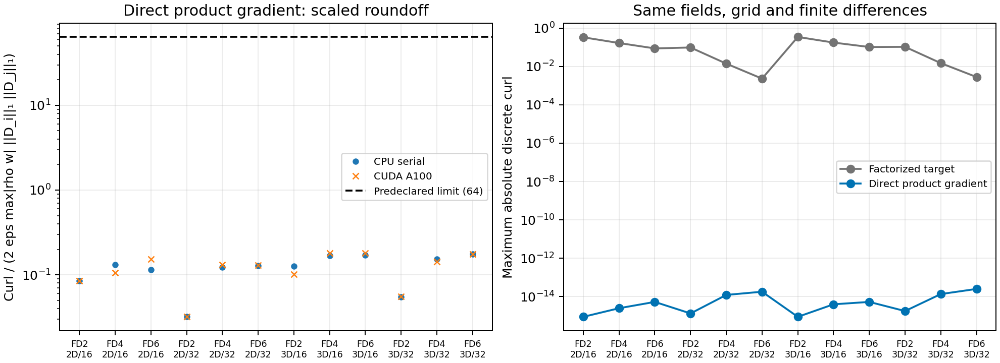
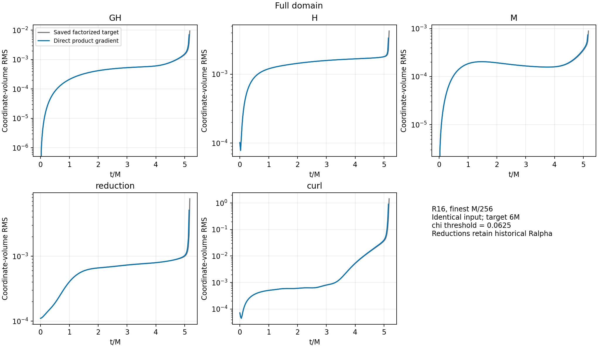
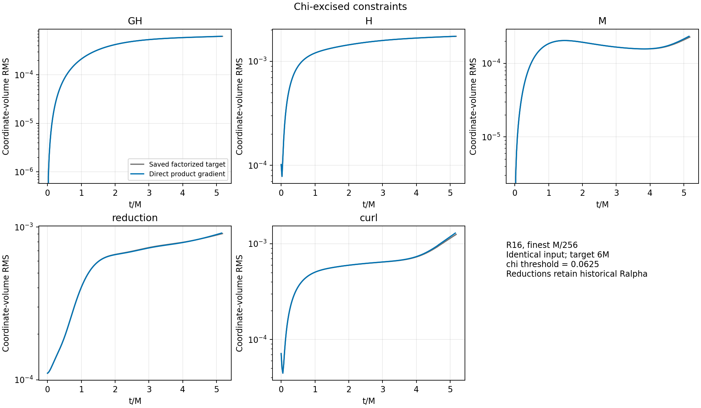
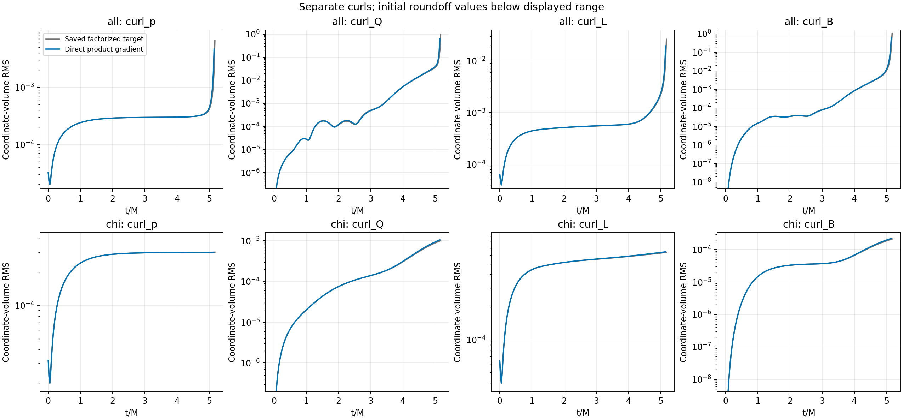
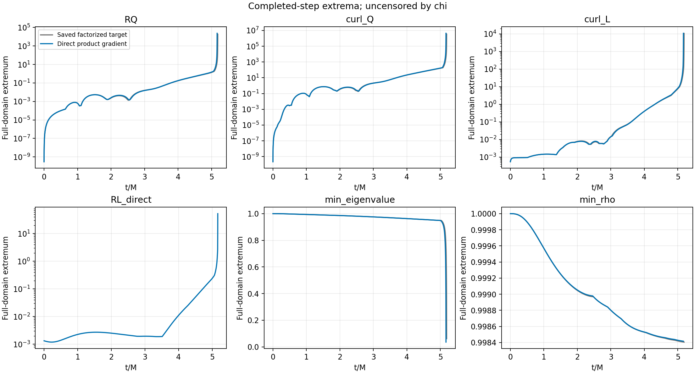
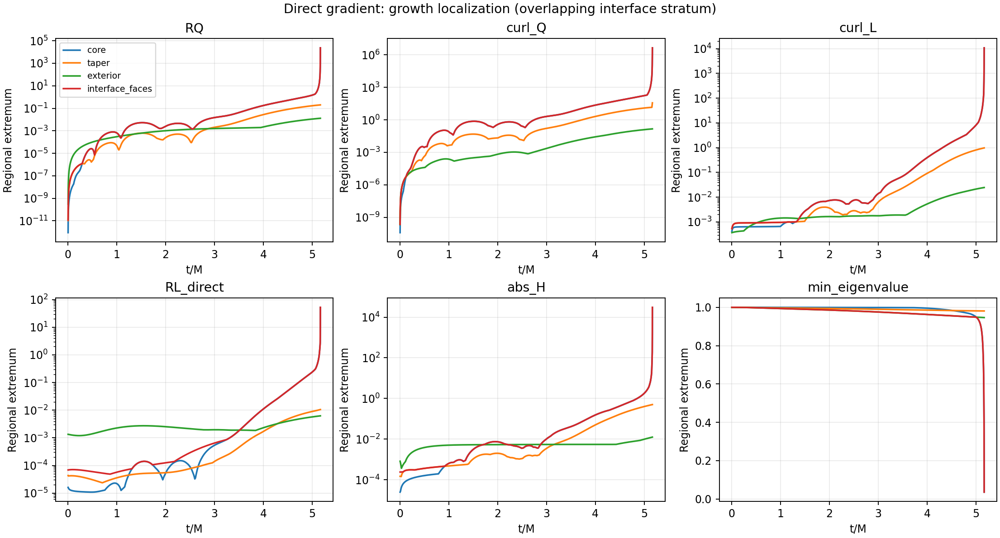
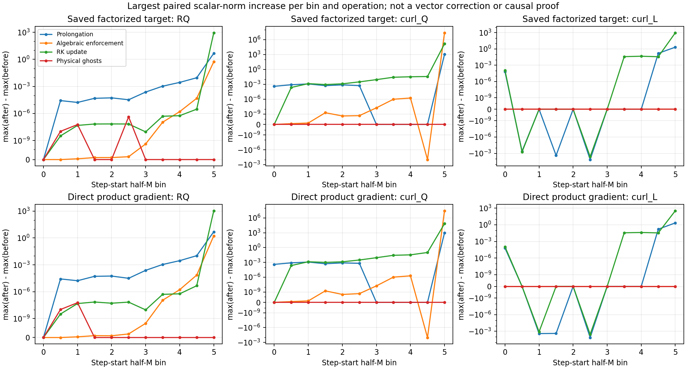

# Direct lapse-gradient qualification — completed with failure

The focused implementation is correct on the tested uniform grids, but the matched R16 fine-core stress test **fails at t=5.167923M**, before its 6M target and 0.019895M earlier than the saved baseline failure at 5.187818M. The correction does not qualify this branch for the convergence or binary campaign. No downstream simulation was launched and no unrelated parameter was tuned.

| Gate | Decision | Evidence |
| --- | --- | --- |
| 1: shared target, stencil orders, CUDA | **PASS** | CPU/CUDA curl matrix, full production build, projection and diagnostic oracles |
| 2: identical R16 M/256 through 6M | **FAIL** | Strict negative-rho failure, runaway core curls/reductions, deteriorating metric |
| 3: M/8, M/10, M/12 through 20M | **NOT RUN — blocked by Gate 2** | Original inputs preserved; no convergence claim |
| 4: documented head-on binary | **NOT RUN — blocked by Gate 2** | Original setup recovered in the frozen plan; no binary claim |

The criteria were recorded in [PLAN.md](PLAN.md) before testing or corrected evolution. A strict failure is a failure regardless of lifetime; unexplained growing norms would also withhold promotion even with survival. This is a completed gated campaign with a negative scientific outcome.

## Implementation and correctness

Implementation commit `5a9230e3` adds `src/pc_gh/lapse_gradient.hpp`: a scalar accessor multiplies rho*w at each requested stencil point, and `DirectLapseGradient` applies the existing `Dx` operator and the factor two. Both the finite-relaxation RHS and optional L projection call this same helper. FD coefficients are not duplicated. All other equations, rates, masks, switches, timing, grids, CFL and dissipation are preserved.

The vector residual L−2D(rho*w) is appended as `pcgh_red_L_direct` / `RL_direct` in per-cell diagnostics, regional maxima and coordinate-volume L1 reductions, transfer diagnostics, and boundedness output. The existing Ralpha and separate curl_p, curl_Q, curl_L and curl_B measurements remain. The 55 evolved fields and old native history columns retain their definitions. In particular, the historical reduction RMS below still contains Ralpha; it has not silently been redefined using RL_direct.

There are 12 uniform-grid cases on each of CPU and CUDA: FD2/4/6, 2D/3D, N=16/32, unequal directional spacings, and periodic consistent scalar and materialized-target ghosts. The scale for curl_ij is 2 epsilon max|rho*w| ||Di||1 ||Dj||1. The frozen limit is 64. CUDA's largest scaled curl is **0.18165** and largest independently summed target discrepancy **0.36181**. The factorized target has resolved nonzero curl in every case. Its absolute curl is about 0.0023–0.345, versus approximately 1e-15–2.5e-14 for the new target.

All 39 production projection checks pass across dimensions, orders and zero/full/taper/global/overlap masks; maximum component error is 2.20e-15 and curl-identity error 3.21e-14. Three independent direct-residual max/L1 checks also pass. The full MPI-capable CUDA executable builds with all three stencil orders. A Git-status setup failure caused by a Kokkos symlink occurred before the first oracle evolution; copying the identical Kokkos directory resolved it. Its log is preserved. There was no numerical workaround.

With a projection weight P, the new direct residual scales by (1−P). The old Ralpha instead receives P delta, where delta=2D(rho*w)−2(wD rho+rhoD w); the oracle checks that discrete identity. Uniform-grid commutation does not imply zero curl of the evolved L on this refined mesh: spatially varying relaxation, independent field evolution/transfers and existing algebraic enforcement remain.



## Matched execution and provenance

The stress used the **byte-identical saved input**, with R16 rate 1+15P, radii (0.125,0.5)M, both reduction/GH projection switches off, FD6/RK3, CFL=0.2, KO=0.3, dt ceiling 0.0125, boundaries ±8M and the original eight-level static hierarchy. It has 456 blocks of 8³ active cells (233,472 total), finest M/256. Both checkpoint headers have identical logical block maps. All 101 initial history values agree at saved precision; this is not a claim of bitwise field equality.

| Artifact | SHA256 / identity |
| --- | --- |
| Baseline production source | `1e6b0612aed52509d1f255627ba75211a82497bd` |
| Local pre-patch HEAD | `80602ffc`; production src identical to baseline |
| Corrected implementation | `5a9230e3`; frozen plan/provenance commit `d32130a2` |
| Baseline binary | `96bc34157896c164904a6ff426e84f4c97d95a7b8c8c1a43971940fc744e60b1` |
| Corrected binary | `0bfd4c5ce9c9e55285614fb988ebd90624a12640f21a41eb60d674148e4e1788` |
| Both used inputs | `ff69d9d88a75e4156735454b19b7cd91522d133ce4ff0f8fd9ced1e2d7105f80` |

All 319 production source hashes match the local implementation and were reverified at termination. The remote working source is baseline commit plus the saved patch, so its bare Git commit alone does not identify the corrected code. All 102 selected CMake options match the baseline. Build: Release, MPI, Kokkos 4.4.0, CUDA 12.6.85, Ampere80, GNU C++ 11.5 through nvcc_wrapper, the same production_oracle problem generator. Source manifests, patches, complete CMake caches, build logs and runtime provenance are preserved alongside this report.

Execution was on the permitted `della-vis1.princeton.edu` A100. Its GPU was idle immediately before launch. The actual Slurm partition `gputest` and QoS `gpu-test` were inspected (MaxTime 15 days; QoS MaxJobsPU=3, MaxWall unset), but **no new Slurm allocation was needed or submitted**. Baseline provenance records Slurm job **13481403**. Corrected head driver PID was **2361206**; it has terminated. No unrelated jobs were modified.

The established driver used five 15-minute segments with clean checkpoint restarts after the first four. Restart checkpoints were `.00001`, `.00003`, `.00004`, `.00005`, at approximately 0.956603, 2.047274, 3.143568, 4.200522M. The same binary and input were used throughout. The final segment exited 1 on the strict failure and was not resumed. Execution ran from 2026-09-05 21:19:00 to 22:34:00 UTC. Exact commands, timestamps and hashes are in [terminal-audit.json](terminal-audit.json).

## Constraints and independent curls

These are coordinate-volume RMS norms, linearly interpolated from each native history to the common physical time **5M**. `chi` retains chi≥0.0625. The two final native outputs are at different times (baseline 5.17507M, corrected 5.15030M), so their endpoint magnitudes must not be interpreted as a matched-time improvement.

| Region | Family | Baseline at 5M | Corrected at 5M | Corrected / baseline |
| --- | --- | ---: | ---: | ---: |
| all | GH | 0.001498877 | 0.001575351 | 1.051021 |
| all | H | 0.001794867 | 0.001804534 | 1.005386 |
| all | M | 0.0003534266 | 0.0003688462 | 1.043629 |
| all | reduction | 0.001000179 | 0.001026965 | 1.026782 |
| all | curl | 0.0375294 | 0.04067021 | 1.083689 |
| chi | GH | 0.0006165496 | 0.0006174996 | 1.001541 |
| chi | H | 0.001729621 | 0.001729932 | 1.000180 |
| chi | M | 0.0002082514 | 0.000214996 | 1.032387 |
| chi | reduction | 0.0008850965 | 0.0008925201 | 1.008387 |
| chi | curl | 0.001141329 | 0.00118723 | 1.040217 |

Full-domain GH, momentum, reduction and curl norms are already larger at 5M. Excision hides much of the strongest core growth, but the excised momentum and curl norms are also larger. Neither set supports promotion.





The separate completed-step full-domain maxima at common 5M are:

| Quantity | Baseline | Corrected |
| --- | ---: | ---: |
| curl_p | 1.07891 | 1.28566 |
| curl_Q | 159.200 | 168.310 |
| curl_L | 7.49408 | 8.16574 |
| curl_B | 33.5537 | 41.2676 |
| Minimum metric eigenvalue | 0.948856 | 0.948850 |

These scalar extrema are interpolated in time; their locations are never interpolated. By the last corrected completed step at 5.167923393M, the maxima reach curl_p=1.78045e3, curl_Q=4.38072e6, curl_L=1.08055e4, curl_B=2.94878e6, RQ=2.34381e4, Ralpha=118.368, and RL_direct=52.3209. The minimum metric eigenvalue has collapsed to **0.0358940**. The corresponding baseline completed-time minima/peaks over its longer run are 0.0616958 and curl_Q=3.45415e6; these are descriptive run extrema, not matched-time ratios.

The frozen late-growth triggers fire independently of the fatal check: corrected full-domain curl_Q, curl_L and RL_direct have positive late log slopes and late/2–3M peak ratios of about 2.14e6, 7.70e5 and 2.08e4. Successive half-M envelopes also repeatedly more than double. This is unresolved runaway, not a benign bounded offset.



## Localization, failure and diagnosis

The corrected failure is:

```text
PC-GH strict diagnostic failed at t=5.167923e+00 during post-RK update
on rank 0: state pcgh_rho=-1.402322e+00 at (m,k,j,i)=(50,4,9,10)
```

The baseline failed metric positivity at t=5.187818M, det=−2.584038, in **the same indexed cell**. Identical static checkpoint block maps locate that cell at (−0.005859375,−0.041015625,−0.060546875)M, physical level 8, spacing M/256. The invalid RK state itself was not checkpointed. The last completed-step rho minimum was still positive (0.998416); the fatal check catches an intermediate updated state. The last sampled stage metric minimum was 0.0241500. This does not establish positivity of the unrecorded failed state or exclude another simultaneous violation.

The strongest growth is in the core and overlapping interface-face stratum. The final curl_Q maximum is at (−0.060546875,0.001953125,−0.037109375)M on level 8; curl_L and RL_direct peak nearby. Earlier growth also appears immediately across the finest-grid edge on level 7. At the final completed step, taper/exterior curl_Q maxima are only 36.8374/0.145593 versus 4.38e6 in the core. The interface stratum overlaps the core; it is not an independent disjoint volume or proof that interpolation caused the growth.



Paired operation diagnostics show a similar pattern in both runs. For corrected curl_Q, the largest algebraic-enforcement scalar-max increase in the [5,5.5)M bin is 2.87507e7 (baseline 2.40213e7), while the corrected largest prolongation/RK-update increases are 987.50/69991.54. Earlier [3,3.5)M algebraic increases are only about 1.71e-8, while RK-update increases reach 0.00884. Large near-failure algebraic amplification therefore does not by itself explain the earlier instability. A zero change in a global maximum does not imply zero local transfer error.



These are differences of scalar maxima before/after the same cycle/stage/operation, not norms of vector corrections; maximizing cells can change, and some brackets have stale ghosts. The reduction preserves both locations and all winning events. It provides evidence for further diagnosis, not a causal decomposition. The supported conclusion is narrow: eliminating the factorized L target's discrete curl defect is insufficient to stabilize this exact finite-rate refined-grid system. No changes to rates, transfer rules, algebraic enforcement or dissipation were made to force a pass.

## Evidence and reproduction

[REPRODUCE.md](REPRODUCE.md) gives the analysis commands and preserved remote paths. [analysis/comparison.json](analysis/comparison.json) contains all regional extrema, growth flags, common-time norms and minimum-eigenvalue locations. [decisions.json](decisions.json) records the final gate decisions. `ARTIFACTS.sha256` identifies the committed evidence; large original monitors, field outputs and checkpoints remain on Della with paths/hashes in the raw artifact inventory.

Both full hybrid monitors were reduced only after termination. The baseline is 4,155,449,238 bytes (26,643,320 rows); corrected is 4,359,516,537 bytes (27,932,800 rows). The reducer retains completed-stage samples, half-M stage/operation envelopes and paired scalar changes. It audits restart rollback epochs and unmatched pairs; neither run has discarded rollback rows or unmatched pairs. Native histories use the established restart-aware reader. Two synthetic rollback/pairing tests pass, and a baseline-versus-itself parser check returns identical comparisons while retaining its known FAIL status. All final figures were visually inspected.

The original ±128M, M/8–M/10–M/12 inputs and physical refinement layout are preserved in `inputs/convergence`; they were not run. The documented head-on setup and remaining numerical waveform-tolerance ambiguity are recorded in PLAN.md. Because the stress gate failed, no substitute setup or clarification was needed and no downstream qualification is claimed.
