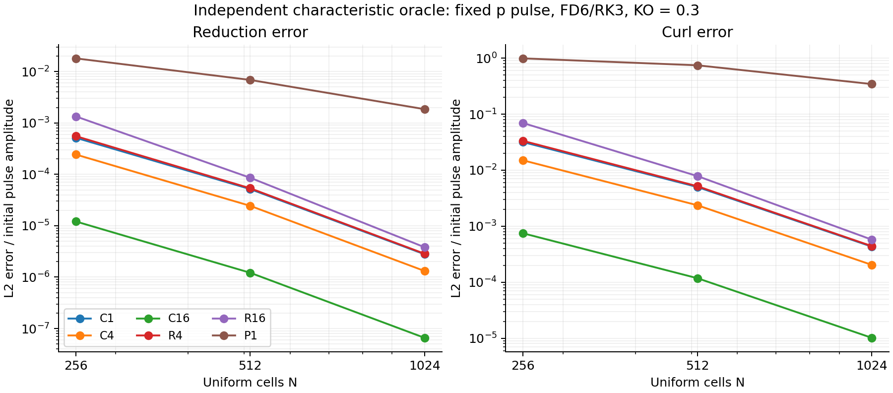

# Puncture-local hybrid campaign

Status at 2026-09-05 14:38 UTC: implementation and initial correctness controls
complete; puncture screening is running. **No qualified hybrid yet.**

## Fixed experiment

Branch `codex/pc-gh-gamma2-20260904`, current cell-centered transfers, regular
advective reduction equations, moving-puncture gauge, existing algebraic maps,
GH gauge projection disabled. Primary FD6/RK3, CFL .2, KO .3, common coordinate
dt ceiling .0125 M. Standard core/taper radii .125/.5 M. Neither uniform survival
nor reduction suppression alone satisfies the promotion gates.

C1/C4/C16 use constant rates 1/4/16 per M. R4/R16 use outer rate 1 and smooth
inner rates 4/16. P1 uses rate 1 and smooth end-step reduction projection. The
projection applies all 33 p/Q/L/B targets; L keeps the factorized discrete product
rule target. The Einstein surface and finite-map curl audit is in
`docs/pc_gh_hybrid_projection.md`, with the complete underlying coupled equations
and hyperbolicity domain in `docs/pc_gh_regular_extension.md`.

All evolution and zero-step production oracles run on Della CUDA. Local work is
limited to compilation, symbolic checks, analysis and plots.

## Correctness evidence

| Check | Result |
|---|---|
| 26 serial production projection oracles, FD2/FD6 and 1D/2D/3D | Pass; worst component discrepancy 3.584e-15; curl identity discrepancy 4.685e-14 |
| 3 two-rank projection oracles | Pass |
| All six exact Minkowski controls | Pass |
| All six shifted-wave N32/N64/N128 ladders | Pass original all-sector order >=1.8 and exact tolerance 1e-12 gates |
| Moving-mask shifted-wave trackers, P1/R16 | Errors decrease across N32/N64/N128; this alone is not full field qualification |
| P1/R16 midpoint restart, moving overlapping masks | All 55 fields and 66 reduction/curl components agree within 3.495e-23; endpoint trackers agree |
| P1 moving pulse, two blocks, one vs two MPI ranks | Final 121 field/reduction/curl components identical; trackers identical |
| Fuller health monitor vs original pulse evolution | Final components identical; tracker discrepancy <=1.23e-30 |
| New flat monitor scalar minima | min eigenvalue, w, rho and alpha all exactly 1 |

All p/Q/L/B fixed pulse controls completed at N256/512/1024. Their errors are
measured against the independent characteristic transport/damping oracle and,
for P1, its actual sequence of projection times. The four families agree in
orders (Q has the expected component-norm scaling).

| Candidate | Reduction L2 orders | Curl L2 orders |
|---|---|---|
| C1 | 3.317, 4.211 | 2.665, 3.537 |
| C4 | 3.317, 4.211 | 2.665, 3.537 |
| C16 | 3.316, 4.206 | 2.665, 3.536 |
| R4 | 3.371, 4.230 | 2.690, 3.552 |
| R16 | 3.966, 4.489 | 3.147, 3.770 |
| P1 | 1.393, 1.891 | 0.410, 1.114 |

P1 has substantially slower curl convergence. Its projection counts are
77/154/307, so these runs compare to distinct discrete jump schedules and do
**not** establish a common continuum or projection-frequency limit. No pulse
measurement is being promoted to puncture qualification.

## Puncture screen and reproductions

| Candidate/run | Grid | Outcome |
|---|---|---|
| Original C1, original steps | Uniform h=M/8, [-8M,8M]^3 | Exact reproduced strict w failure at 8.379261 M |
| Original C16, original steps | Saved core h=M/256 hierarchy | Exact reproduced metric-positivity failure at 4.891496 M, including wall-time restart |
| Controlled C1 | Uniform h=M/8 | Strict w failure at 8.375 M |
| Controlled C4 | Uniform h=M/8 | Strict w failure at 9.7125 M |
| Controlled C16 | Uniform h=M/8 | Reached 12 M; screening survival only |
| R4/R16/P1 | Uniform h=M/8 and saved core h=M/256 | In progress |
| C1/C4/C16 | Saved core h=M/256, controlled steps | In progress |

Uniform C1/C4 terminal reduction/curl maxima are in the innermost few cells,
so refinement interfaces are not required for those failures. That observation
does not locate the source of a separate refined-hierarchy failure. The uniform
meshes are 32 times coarser than the M/256 core and are not matched fine-core
controls.

No candidate has passed the complete joint uniform/refined screen. Resolution,
mask-width, interface-position, half-step, and FD2 qualification remain
conditional. No binary evolution has been launched. A strict screen failure
blocks promotion even if its lifetime improves.

## Provenance and diagnostic corrections

Remote evidence root on della-vis1:
`/scratch/gpfs/FPRETORI/hz0693/pcgh-hybrid-20260905-1317`.
Raw logs, per-stage CSVs, inputs, binary hashes, GPU information, source snapshots,
and checkpoints remain there. Compact local copies are in `della-controls/`;
`inputs-final/` is the authoritative corrected screen/control input set. Earlier
input sets and rejected setup attempts are retained, not overwritten.

Implementation commits: `11714160` (hybrid), `813e987b` (pulse opt-in),
`25527982` (distinct jump operation, input validation), `1e6b0612` (stage health,
postprojection physical-boundary bracket, restart/MPI comparisons).

The first monitor reused operation 8, already used for physical boundary updates.
This affected labels, not dynamics. The independent pulse verifier stopped on
invalid event ordering. The corrected reader recovers only actual jump rows
inside the operation-3 projection bracket; operation 100 is used in new builds.
Four parser regression checks cover boundary collisions, duplicate events and
intermediate-stage rejection. The original unmasked reduction CSV remains valid.

Earlier baseline builds record eigenvalues/GH/ADM at complete steps and reductions
at all transfer stages. The later hybrid build adds regional GH/ADM/algebraic
and health samples at every bracket, including postprojection physical boundaries.
This diagnostic extension was checked to leave evolution unchanged. Scalar
minimum rows place the named minimum in the legacy `max` column; empty regions
have block=-1. Interface strata cover face-adjacent finite-difference consumers,
not diagonal-only coarse/fine contacts.

R16's standalone restart was launched with the pulse-source driver but the
original source/build-hybrid-cuda executable. Its binary hash matches the parent
R16 run; use that parent's source snapshot for the executable provenance. The
restart metadata's driver/source snapshot is retained to expose this distinction.
