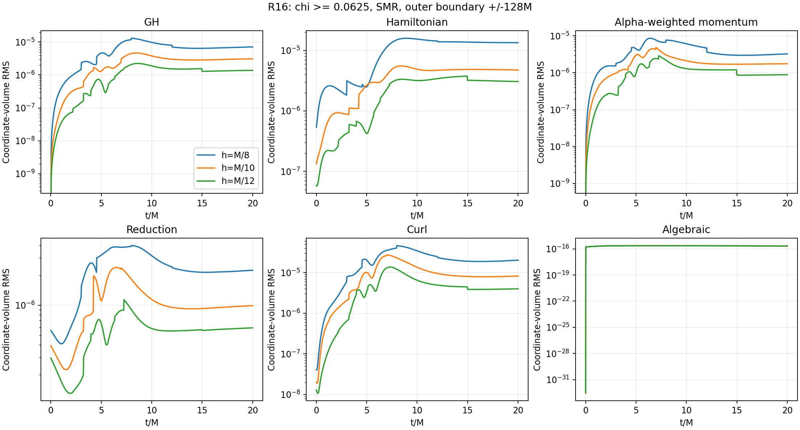
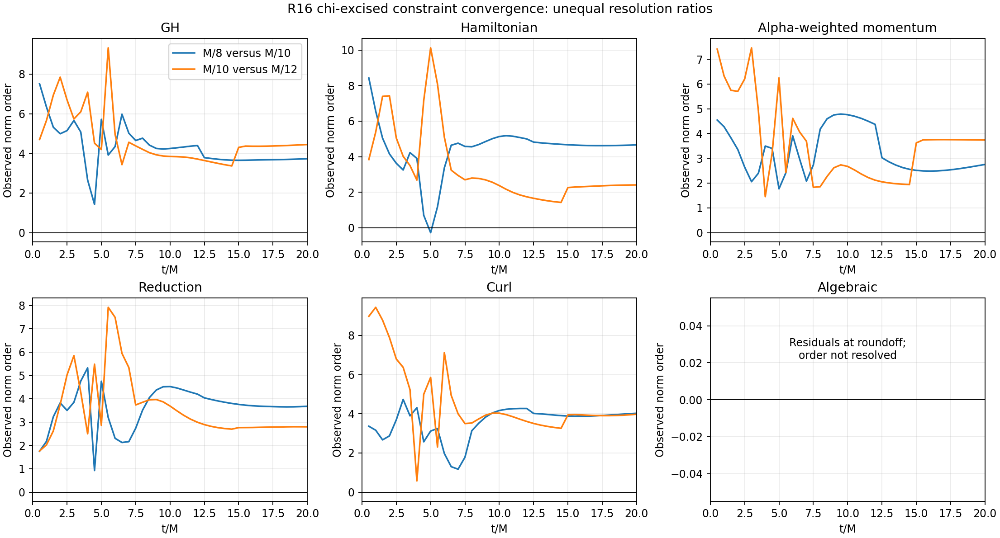
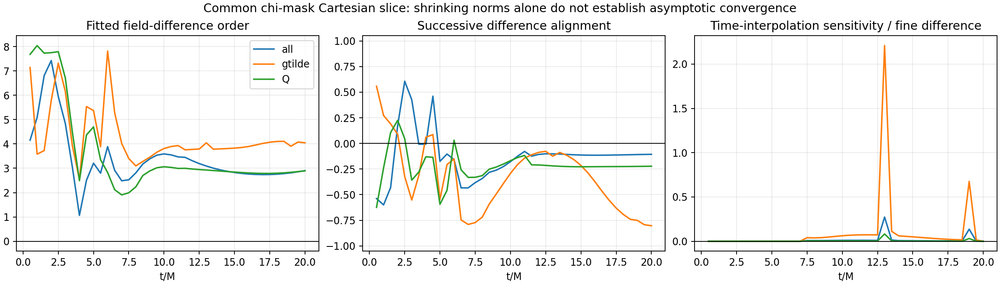

# R16 SMR convergence through 20M

2026-09-05. **Partial improvement, not a qualified puncture scheme.** All three requested large-domain R16 runs reached 20M without a strict state failure. Chi-excised constraint norms decrease with refinement at the endpoint and throughout the sampled 10–20M interval. The prior M/256 R16 screen failed at 5.187818M, and these three coarse resolutions do not establish asymptotic convergence of all exterior fields. The binary condition did not pass; no new binary run was launched.

## Runs and fixed numerical choices

Unit mass, isotropic single puncture; cell-centered FD6/RK3, CFL 0.2, KO 0.3, common timestep ceiling 0.0125M. R16 uses finite coordinate-time damping lambda=(1+15P)/M, with core/taper radii (M/8,M/2). Reduction projection and GH gauge projection are off. Existing algebraic enforcement and unexcised strict checks remain active. All three use the same preserved CUDA executable, with no production-code changes.

Seven static refinement levels give 400 blocks and a finest region [-2M,2M]^3. Blocks contain 8^3, 10^3, or 12^3 active cells, giving 204800, 400000, or 691200 active cells respectively. The outer boundary is +/-128M in each direction, using the existing outflow/extrapolation treatment. This places it far from the central 20M experiment; no separate boundary-location or characteristic-domain proof was performed.

| Central spacing | Result | Execution | Wall segments | Minimum sampled metric eigenvalue |
|---|---|---|---:|---:|
| M/8 | Clean through 20M | della-l02g11 | 1 | 0.903785 |
| M/10 | Clean through 20M | della-l01g15 | 2 | 0.903908 |
| M/12 | Clean through 20M | della-vis1.princeton.edu | 2 | 0.903969 |

The M/8 and M/10 runs were Slurm array 13484719 elements 0 and 1. The still-pending M/12 element was canceled before allocation and run on the verified-idle della-vis1 A100 (head driver 1704699). It was not duplicated. Both original fine-core jobs had terminated first: R16 lost metric positivity at 5.187818M; P1 developed negative rho at 5.462666M. Their fatal logs and exit records are preserved in refinement-evidence/.

## Native chi-excised constraint convergence

The diagnostic selection is chi=w^2 >= 0.0625. This excises points only from the reported primary constraint integrals, not from evolution or strict validation. The table uses native 3D coordinate-volume RMS norms, sqrt(integral C^2 dV / selected volume). M denotes the alpha-weighted momentum constraint. Orders are measured separately for each unequal spacing ratio, log(N_coarse/N_fine)/log(h_coarse/h_fine); they are observed norm orders rather than a proof of the formal scheme order.

| Quantity at 20M | h=M/8 | h=M/10 | h=M/12 | Order 8→10 | Order 10→12 |
|---|---:|---:|---:|---:|---:|
| GH | 7.123642e-06 | 3.099521e-06 | 1.378062e-06 | 3.729 | 4.446 |
| H | 1.346150e-05 | 4.755201e-06 | 3.063135e-06 | 4.663 | 2.412 |
| M | 3.234298e-06 | 1.749644e-06 | 8.849252e-07 | 2.753 | 3.739 |
| reduction | 2.242562e-06 | 9.866087e-07 | 5.921399e-07 | 3.680 | 2.800 |
| curl | 2.014722e-05 | 8.207236e-06 | 3.974497e-06 | 4.025 | 3.977 |

All five families have positive pair orders at each half-M sample from 10M through 20M. The early transient is less uniform: the coarse Hamiltonian pair briefly has negative order near 5M. The changing chi mask changes selected cells and contributes jumps in norms, so the time histories and selected volumes are retained.

True algebraic det/trace residuals remain at roundoff (final maximum residual below 7e-16 in every run). The legacy regional “algebraic” helper also included the last algebraic-map correction; this analysis explicitly removes that correction from the residual norm and records it separately. In particular, the coarse runs take a tiny final step while M/12 ends with a roughly 0.0011456M step. Comparing their last correction amplitudes as if they were residual errors would be misleading.

## Field self-convergence and unresolved gates

The 55 regular fields are compared on a common 128x128 Cartesian z=0 slice spanning [-8M,8M]^2, using the intersection of the three chi masks. Production spatial sampling uses eight-point tensor-product Lagrange interpolation. This is an interpolated 2D exterior diagnostic, not a native 3D field or puncture-power convergence test.

At the exact saved 20M endpoint, the all-field RMS differences are 5.67333e-3 (M/8 versus M/10) and 2.55835e-3 (M/10 versus M/12), giving a nominal unequal-spacing Richardson order of 2.903. Every field-group difference norm decreases between these pairs. However, the normalized inner product of the two all-field differences is -0.106, and is -0.803 for the conformal metric, -0.696 for K, and -0.738 for L. A single leading error profile is therefore not established on this ladder. Shrinking difference magnitudes are encouraging but do not justify an asymptotic order or resolution-uncertainty claim.

All 40 half-M sample times through 20M are covered. Some M/12 snapshots are asynchronous after its CFL restriction becomes slightly tighter. Those comparisons use bracketed quadratic time interpolation with the quadratic-minus-linear sensitivity recorded. That sensitivity becomes large relative to some field differences near checkpoint-output brackets, so intermediate-time fitted field orders there are unresolved. At 20M all three outputs are at the exact saved time and the time-interpolation sensitivity is zero.

The unexcised peak Q-curl maximum over each run increases from 0.3241 to 0.3426 to 0.4205 as resolution increases; final values are 0.1650, 0.1461, and 0.1549. This is not a measured puncture divergence exponent, but it prevents inferring uniformly improving core behavior from excised norms alone. The recorded minimum w, rho, alpha and metric eigenvalue remain positive in all three completed-step histories; strict stage checks also never report a failure.

**Decision:** useful coarse-SMR survival and exterior constraint improvement, with unresolved field asymptotics and a demonstrated fine-core instability. No binary promotion. No automatic extension of the damping/mask/KO sweep was performed.

## Reproducibility and completion audit

Raw remote root: `/scratch/gpfs/FPRETORI/hz0693/pcgh-r16-smr128-20260905-1640`. Full checkpoints, native slices and stage/transfer CSVs remain there. Compact histories, boundedness data, commands, input/build metadata and Cartesian field outputs were copied locally. Source input generation, mesh export and the actual evolution startup independently verify the requested geometry and spacings. The preexisting mesh-only cleanup crash is preserved separately in mesh-evidence/ and did not affect evolution startup.

Executable SHA256: `96bc34157896c164904a6ff426e84f4c97d95a7b8c8c1a43971940fc744e60b1`. Each input hash matches its provenance record. Completion was verified from the per-run exit, final log, completed marker, last history time and finite boundedness data, not from the stage wrapper or scheduler state alone.

- `analysis/convergence.json`: all constraint norms, selected volumes, orders, 40 field comparisons, exact time-alignment provenance and sensitivity measurements.
- `analysis/completion-audit.json`: per-run terminal evidence, hashes, health minima and requirement audit.
- `analysis/chi-constraints.png`, `analysis/constraint-orders.png`, `analysis/field-convergence.png`: inspected final figures.
- `analysis/pc_gh_regular_extension/analyze_r16_smr128.py` in the worktree: reproducible analysis; use `.venv-bbh-plots/bin/python`.

The requested monitoring and three-resolution study are complete. The conditional binary experiment is not executed because its prerequisite failed.
